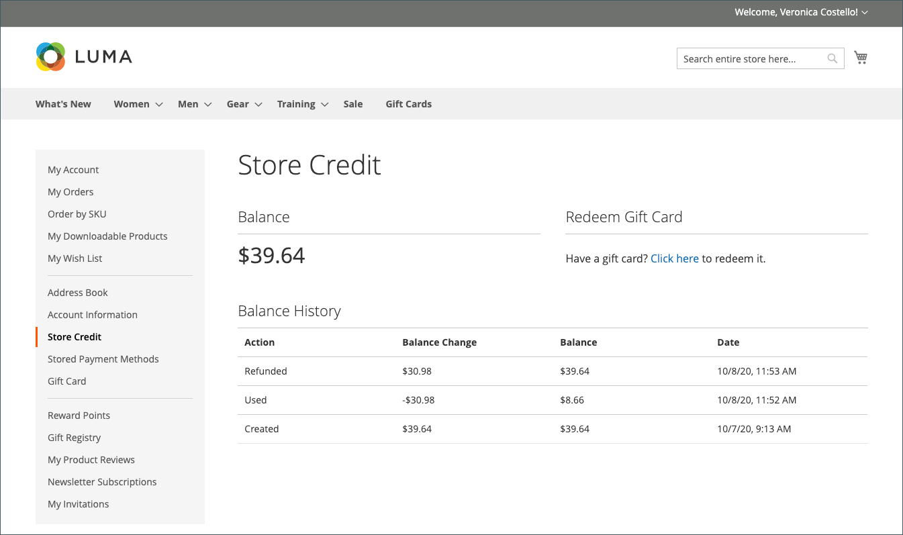

# Reembolsos no painel de conta do cliente

{{ee-feature}}

Se um reembolso tiver sido emitido para um pedido, os clientes poderão exibir as informações de reembolso associadas ao pedido no painel de contas. Se você ativou o [!UICONTROL _Mostrar Histórico de Crédito da Loja para Clientes_] opção para [Configuração de Crédito da Loja](../customers/credit-configure.md), os clientes também poderão acessar seus [Crédito da loja](../customers/store-credit.md) histórico.

## Exibir um reembolso na loja

1. Na loja, o cliente faz logon em sua conta.

1. Localiza a ordem usando um dos seguintes métodos:

   * Encontrar a ordem na lista de **Pedidos recentes** e clicando em **[!UICONTROL View]**.
   * No painel esquerdo, escolha **[!UICONTROL My Orders]**. Em seguida, localize a ordem na lista e clique em **[!UICONTROL View]**.

1. O cliente clica no link **[!UICONTROL Refunds]** para exibir os detalhes do reembolso.

   {width="700" zoomable="yes"}

## Exibir o saldo e o histórico de crédito da loja

Método 1: **No painel de contas do cliente**

1. Na loja, o cliente faz logon na conta do.

1. Se o reembolso foi aplicado ao crédito da loja, o escolhe **[!UICONTROL Store Credit]** no painel esquerdo.

1. O valor reembolsado para o crédito de armazenamento aparece na lista com a data e hora da ação.

   {width="700" zoomable="yes"}

   >[!INFO]
   >
   >A página Crédito da Loja também fornece um link para o cliente resgatar um [cartão-presente](../stores-purchase/product-gift-card-workflow.md#check-status-and-balance-of-the-gift-card).

Método 2: **No _Revisão e Pagamentos_ página**

1. O cliente adiciona um produto ao carrinho.

2. Receita para o _Check-out_ página.

3. Passa o **[!UICONTROL Shipping]** etapa.

4. Se o crédito da loja estiver disponível, o cliente clica em **[!UICONTROL Use Store Credit]**.

   {width="700" zoomable="yes"}

5. Se o cliente mudar de ideia sobre o uso do crédito da loja, clique em **[!UICONTROL Remove]** no _Resumo do pedido_ seção.

## Ações de pagamento no Administrador

É possível configurar ações de pagamento para seus [Método de pagamento](../configuration-reference/sales/payment-methods.md). Cada método de pagamento tem um conjunto diferente de ações de pagamento.

| Ação de pagamento | Descrição |
|--- |---|
| [!UICONTROL Capture Online] | Quando a fatura é enviada, o sistema captura o pagamento do gateway de pagamento de terceiros. Um usuário administrador pode então criar um aviso de crédito e anular a fatura. |
| [!UICONTROL Capture Offline] | Quando a fatura é enviada, o sistema não captura o pagamento. Pressupõe-se que o pagamento seja capturado diretamente pelo gateway e que não possa ser capturado pelo Adobe Commerce. Um usuário administrador pode criar um aviso de crédito, mas não pode anular a fatura. (Mesmo que o pedido tenha utilizado um pagamento online, a fatura é essencialmente uma fatura offline.) |
| [!UICONTROL Not Capture] | Quando a fatura é enviada, o sistema não captura o pagamento. Presume-se que o pagamento seja capturado por meio do Adobe Commerce posteriormente. Existe uma [!UICONTROL _Capture_] na fatura concluída. Antes de capturar, é possível cancelar a NFF. Depois de capturar, você poderá criar um aviso de crédito e anular a NFF. |

{style="table-layout:auto"}

>[!WARNING]
>
>Selecione o [!UICONTROL _Não Capturar_] a menos que você tenha certeza de que capturará o pagamento por meio do Adobe Commerce posteriormente. Você não pode criar um aviso de crédito até que o pagamento tenha sido capturado usando o [!UICONTROL _Capture_] botão.
