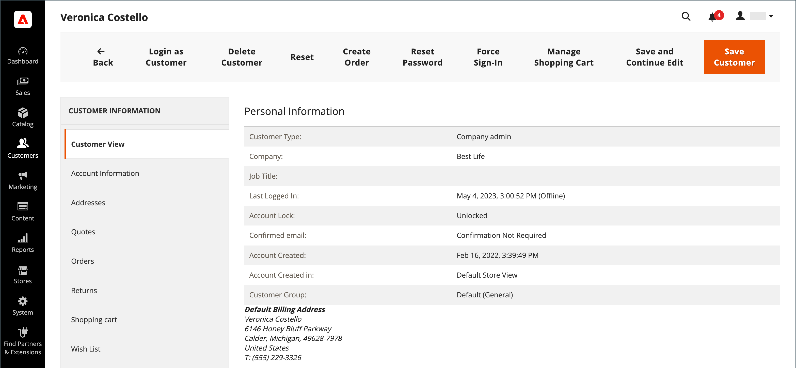

# Atualizar um perfil de cliente

O painel esquerdo da página _[!UICONTROL Customer Information]_inclui informações sobre atividades do cliente, endereços, estatísticas de pedidos, pedidos recentes, conteúdo do carrinho de compras, análises de produtos e assinaturas de boletim informativo.

{width="700" zoomable="yes"}

## Editar uma conta de cliente

Método 1: **_Edição Rápida_**

1. Na primeira coluna, marque a caixa de seleção da conta do cliente que será editada.

1. Defina a coluna **[!UICONTROL Actions]** como `Edit`.

   >[!INFO]
   >
   >O valor de cada valor que pode ser atualizado aparece em uma caixa de texto. Somente alguns valores do registro de cliente selecionado podem ser editados na grade.

   {width="700" zoomable="yes"}

1. Atualize qualquer um dos valores a seguir, conforme necessário:

   * **[!UICONTROL Email]**
   * **[!UICONTROL Web Site]**
   * **[!UICONTROL Tax/VAT Number]**
   * **[!UICONTROL Gender]**

1. Clique em **[!UICONTROL Save]**.

Método 2: **_Edição Completa_**

1. Na grade, localize o registro do cliente a ser editado.

1. Na coluna _Ações_, na extremidade direita, clique em **[!UICONTROL Edit]**.

1. Faça as alterações necessárias nas informações da empresa.

   >[!INFO]
   >
   >Para saber mais, consulte [Atualizar um perfil de cliente](../customers/update-account.md).

1. Quando terminar, clique em **[!UICONTROL Save Customer]**.

>[!INFO]
>
>Para desfazer todas as edições anteriores à gravação, clique em **[!UICONTROL Reset]** na barra de botões superior para retornar todas as alterações feitas na última versão salva.

## Informações do cliente

### [!UICONTROL Customer View]

A guia _Visualização de Cliente_ lista informações sobre o cliente, inclui **[!UICONTROL Personal Information]**, **[!UICONTROL Reward Points Balance]** e **[!UICONTROL Store Credit Balance]**.

### [!UICONTROL Account Information]

A guia [Informações da Conta](../customers/account-dashboard-account-information.md) fornece informações detalhadas sobre o cliente, onde um usuário Administrador pode editar informações pessoais, email, assistência remota a compras, data de nascimento e anexar o cliente ao site ou à empresa.

### [!UICONTROL Addresses]

A guia [Endereços](../customers/account-dashboard-address-book.md) contém os endereços padrão de cobrança e de envio do cliente e quaisquer endereços adicionais usados com frequência.

### [!UICONTROL Orders]

A grade [Pedidos](../stores-purchase/orders.md) contém uma lista de todos os pedidos atuais de clientes; o administrador pode acompanhar seu progresso.

### [!UICONTROL Returns]

{{ee-feature}}

A guia [Devoluções](../stores-purchase/returns.md) lista as solicitações do cliente retornadas no momento.

### [!UICONTROL Shopping cart]

A guia [carrinho de compras](../stores-purchase/cart.md) exibe os produtos que estão atualmente no carrinho, mas, por algum motivo, a compra não foi concluída.

### [!UICONTROL Wish List]

A [lista de desejos](../stores-purchase/wishlists.md) exibe uma lista de produtos que um cliente pode transferir para o carrinho posteriormente.

### [!UICONTROL Gift Registry]

{{ee-feature}}

A seção [Registro de presentes](../merchandising-promotions/gift-registry-storefront.md) lista os registros de presentes atuais do cliente e o evento associado.

### [!UICONTROL Store Credit]

{{ee-feature}}

A guia [Crédito da loja](../customers/store-credit.md) exibe um valor restaurado para uma conta de cliente; o administrador pode gerenciar esse valor.

### [!UICONTROL Newsletter]

A guia [Informativo](../merchandising-promotions/newsletters.md) exibe todos os emails enviados ao cliente atual.

### [!UICONTROL Billing Agreements]

A guia [Contratos de Cobrança](../stores-purchase/paypal-billing-agreements.md) lista todos os contratos de cobrança do PayPal entre a loja e o cliente.

### [!UICONTROL Product Reviews]

A guia [Avaliações do Produto](../catalog/settings-advanced-product-reviews.md) exibe todas as avaliações enviadas por esse cliente.

### [!UICONTROL Reward Points]

{{ee-feature}}

A seção [Pontos de premiação](../merchandising-promotions/rewards-loyalty.md) mostra o saldo atual de pontos de premiação do cliente. Um usuário administrador pode gerenciar esse valor.

## Barra de botões

| Botão | Descrição |
|----------|--------------|
| **[!UICONTROL Back]** | Retorna à página Clientes sem salvar as alterações. |
| **[!UICONTROL Login as Customer]** | Permite que o comerciante faça logon como cliente. |
| **[!UICONTROL Delete Customer]** | Exclui a conta do cliente. |
| **[!UICONTROL Reset]** | Redefine quaisquer alterações não salvas no formulário do cliente para seus valores anteriores. |
| **[!UICONTROL Create Order]** | [Cria um pedido](../stores-purchase/customer-account-create-order.md) que está associado à conta do cliente. |
| **[!UICONTROL Reset Password]** | Redefine a senha do cliente. |
| **[!UICONTROL Force Sign-In]** | Apaga os tokens associados à senha do cliente e fornece ao administrador acesso à conta. |
| **[!UICONTROL Manage Shopping Cart]** | Fornece acesso ao carrinho de compras de um cliente. |
| **[!UICONTROL Save and Continue Edit]** | Salva as alterações e mantém a conta do cliente aberta. |
| **[!UICONTROL Save Customer]** | Salva alterações e fecha a conta do cliente. |

{style="table-layout:auto"}
