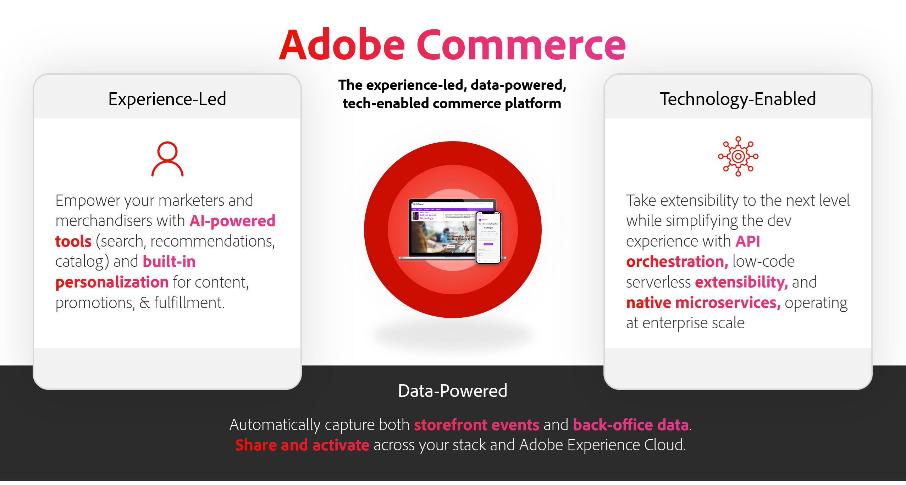
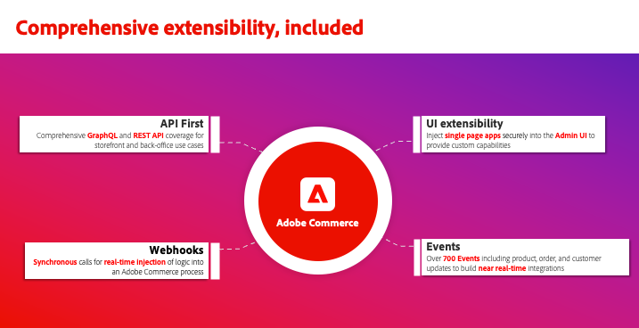

# O que é o Adobe Commerce?

O Adobe Commerce é uma solução comercial corporativa que oferece experiências de comércio eletrônico superiores para consumidores e compradores B2B globalmente. Com milhares de clientes e bilhões em valor anual bruto de mercadorias processados por meio de nossa plataforma em nuvem, a Adobe Commerce está na vanguarda de potencializar as maiores e mais complexas experiências de comércio eletrônico do mundo para varejistas, marcas de consumidor, fabricantes e distribuidores por atacado em todo o mundo.

## As equipes de comércio eletrônico estão enfrentando desafios únicos

Atualmente, as equipes de comércio eletrônico precisam oferecer experiências excepcionais para seus clientes. Uma experiência de comércio rápida, conveniente e personalizada leva ao aumento das vendas, ao aprofundamento das relações com os clientes e à eficiência operacional para sua empresa.

Infelizmente, criar e fornecer experiências comerciais excepcionais está mais difícil do que nunca.

- **A dívida técnica está bloqueando os negócios**— ambientes técnicos complexos e herdados abrangem várias plataformas e são desafiadores de manter. [60%](https://engage.adobe.com/DigComRptWBR-register.html) de profissionais de comércio eletrônico afirmam que lutam para manter e integrar sua tecnologia.
- **As equipes devem fazer mais com menos**— Muitas equipes de comércio eletrônico estão enfrentando altas expectativas de crescimento, mas muitas vezes se esforçam para redefinir a experiência do cliente devido a processos manuais, soluções excessivamente técnicas e dados limitados. [56%](https://engage.adobe.com/DigComRptWBR-register.html) de profissionais de comércio eletrônico dizem que não têm financiamento adequado.
- **Sobrecarga de dados**— os volumes de dados continuam aumentando em quantidade, mas não se traduzem em experiências de qualidade, pois os dados ficam presos em vários sistemas, dificultando a condução dos negócios e a criação de experiências de impacto. [60%](https://engage.adobe.com/DigComRptWBR-register.html) Os profissionais de comércio eletrônico dizem que não têm os dados certos nos sistemas certos.
- **Os consumidores esperam**— a quantidade de canais e modelos de negócios que as empresas devem oferecer suporte continua a se multiplicar, o que adiciona mais custo e complexidade. [53%](https://www.bloomreach.com/en/news/2020/bloomreach-releases-new-global-research-study) consumidores não voltarão a comprar à mesma empresa se tiverem uma má experiência e [90%](https://www.prweb.com/releases/study-90-of-b2b-buyers-will-turn-to-a-competitor-if-a-suppliers-digital-channel-doesn-t-meet-their-needs-811395853.html) de compradores B2B recorrem a um concorrente se um fornecedor não puder satisfazer as suas necessidades digitalmente.

## A visão da Adobe Commerce é o comércio baseado em experiência

A Adobe é fornecer uma plataforma de comércio baseada em experiência, dados e tecnologia.

- [Liderado por experiência](#experience-led-commerce). No Adobe, acreditamos que o crescimento vem das experiências. É por isso que estamos focados em potencializar as vitrines de comércio eletrônico mais rápidas do mundo e capacitar as equipes de comércio eletrônico a criar experiências personalizadas em escala.

- [Alimentado por dados](#data-powered-commerce). O Adobe Commerce fornece compartilhamento de dados ininterrupto em toda a sua pilha de tecnologia de marketing, permitindo que você coloque seus dados comerciais primários em funcionamento, personalizando experiências em todos os pontos de contato e canais.

- [Habilitado para tecnologia](#tech-enabled-commerce). O Adobe Commerce é uma plataforma de comércio eletrônico combinável projetada para lançar recursos de comércio eletrônico com mais rapidez, compartilhar dados facilmente entre sistemas de terceiros e reduzir o custo de propriedade para integrações e personalizações.

## Commerce liderado por experiência

À medida que avançamos para 2024, é essencial que os líderes de comércio eletrônico ofereçam experiências de comércio de alto desempenho e personalizadas aos seus compradores.

### Loja Lightning fast usando Edge Delivery Services

A investigação demonstrou que a [64% dos compradores](https://techreport.com/statistics/website-load-time-statistics-data) ir para o site de um concorrente para comprar um item semelhante se a experiência na web for ruim. Por outro lado, para cada melhoria de 0,1 segundo na velocidade do site, as empresas podem esperar uma [9,2% de aumento no valor médio de pedidos](https://techreport.com/statistics/website-load-time-statistics-data).

[Edge Delivery Services no Adobe Commerce](https://experienceleague.adobe.com/developer/commerce/storefront/) O é um conjunto de serviços combináveis que agregam valor aos negócios fornecendo experiências excepcionais, tanto na criação de conteúdo quanto nas experiências do cliente. Ele combina recursos baseados em negócios, como criação de conteúdo baseado em documentos e testes A/B incorporados, com componentes básicos do Adobe Commerce para a funcionalidade principal de comércio. Tudo isso é fornecido pela borda para experiências de loja com velocidade surpreendente.

Esta nova loja de alto desempenho já foi testada com sucesso por vários comerciantes da Adobe Commerce, como [Maidenform](https://business.adobe.com/blog/perspectives/how-hanesbrands-and-adobe-built-one-of-the-fastest-ecommerce-websites-in-the-world), uma propriedade da HanesBrands. Os resultados falam por si. As páginas Maidenform fornecem pontuações do Google Lighthouse de forma consistente [Resultados do 100 e Core Web Vitals](https://treo.sh/sitespeed/www.maidenform.com) muito acima da média do setor.

{width=&quot;50%&quot; align=center}
{zoomable="yes"}

>[!BEGINSHADEBOX]

Descubra como a HanesBrands e a Adobe desenvolveram uma arquitetura de borda de alto desempenho com recursos de compartilhamento de dados e personalização. [E-Comm Masterclass: Hanesbrand cria a loja mais rápida do mundo](https://business.adobe.com/summit/2024/sessions/ecomm-masterclass-hanesbrands-creates-the-worlds-f-s435.html)

>[!ENDSHADEBOX]

No coração dessa nova loja orientada por experiência está um conjunto de princípios que se concentram em fornecer uma experiência de comércio combinável, com conversão aprimorada, redução de custos e maior velocidade.

A conversão no Commerce está relacionada tanto à sua capacidade de conectar os clientes aos seus produtos fora do site quanto à sua capacidade de personalizar a experiência deles no site, de forma eficiente, mas direcionada. Ao adotar os princípios nos Componentes principais da Web, o Edge Delivery Service no Commerce direciona ambas as métricas.

Isso significa que um site mais rápido e orientado por experiência é classificado em posições mais altas nos mecanismos de pesquisa, reduzindo os custos de SEO e, ao mesmo tempo, aumentando o tráfego orgânico e de palavras-chave. Isso não só aumenta a contagem de visitantes, como também conecta os clientes e produtos mais perfeitamente do que nunca, permitindo uma descoberta, seleção e finalização de produtos mais rápidas.

Você também se beneficia dos custos mais baixos de criação de conteúdo, pois os proprietários de conteúdo da sua empresa podem refinar rápida e facilmente a sua experiência de loja enquanto os seus gerentes de comércio fornecem recursos integrados do Commerce. Chega de bloqueios operacionais de equipes colaborativas!

Tudo isso é obtido por meio de uma arquitetura combinável, que reúne os recursos de publicação e do sistema de gerenciamento de conteúdo (CMS), além dos componentes básicos do Adobe Commerce para criar uma loja verdadeiramente flexível no Commerce. O Adobe fornece uma variedade de funcionalidades comerciais principais como quedas, incluindo páginas de listagem de produtos, páginas de detalhes do produto e uma nova opção de check-out de uma etapa, que permite adicionar uma experiência de check-out contínua às jornadas dos clientes de forma plug-and-play. Os clientes podem começar a usar Edge Delivery Services para partes principais de sua loja em conjunto com sua tecnologia existente e expandir a partir daí ao longo do tempo.

Resultado: Velocidade para suas equipes de criação de conteúdo, velocidade no fornecimento desse conteúdo para seus clientes e velocidade em como seus clientes se envolvem digitalmente com você por meio de sua nova loja orientada por experiência e de alto desempenho.

>[!TIP]
>
>Se você quiser começar a usar o Serviço de entrega de borda na Adobe Commerce, veja como tudo se une [aqui.](https://experienceleague.adobe.com/developer/commerce/storefront/)

### Integração do Adobe Experience Manager Assets

A Adobe está unindo a Adobe Experience Manager Assets à Adobe Commerce para potencializar suas experiências de comércio eletrônico com ativos aprovados na marca em massa, aproveitando os poderosos recursos GenAI.

Isso permite que uma organização use o Experience Manager Assets Cloud Service como a única fonte da verdade para a criação e o gerenciamento de ativos e como um DAM central que impulsiona o Adobe Commerce a novos patamares de escalabilidade de ativos.

Um novo Serviço do mecanismo de regras alimenta os ativos na Experience Manager Assets para produtos correspondentes na Adobe Commerce, com base na SKU ou outros atributos principais, dependendo da estratégia da Commerce. As atualizações são compartilhadas automaticamente para garantir que seu site tenha os ativos de produto e as variações de ativos mais recentes em vigor.

Personalize a experiência do cliente e dê suporte a novos lançamentos de produtos, expansões de mercado ou campanhas sazonais com maior velocidade gerando milhões de variações de ativos de produtos usando os serviços GenAI no Experience Manager Assets.

### Commerce B2B

A Adobe Commerce tem fornecido recursos essenciais de comércio eletrônico B2B há anos, incluindo contas da empresa, regras de aprovação de compras, gerenciamento de cotações e tabelas de preços do cliente. É por isso que os líderes de comércio eletrônico B2B gostam [Watson](https://business.adobe.com/content/dam/dx/us/en/resources/ebooks/building-better-experiences/building-better-experiences-and-bigger-profits.pdf), [SealedAir](https://business.adobe.com/customer-success-stories/sealed-air-case-study.html), [Sunbelt Rentals](https://business.adobe.com/customer-success-stories/sunbelt-rentals-case-study.html), [Transcatar](https://business.adobe.com/customer-success-stories/transcat-case-study.html), [FoodServiceDirect.com](https://business.adobe.com/customer-success-stories/foodservicedirect-case-study.html), e [Soluções Univar](https://business.adobe.com/summit/2023/sessions/debunking-top-b2b-commerce-myths-s517.html) potencialize seus canais de comércio eletrônico B2B globais no Adobe Commerce.

A Adobe está empolgada em compartilhar que novos recursos de cotação e gerenciamento de empresas estarão disponíveis no final de 2024.

Os recursos de gerenciamento da empresa permitem que as empresas configurem qualquer estrutura de empresa compradora de que precisem para dar suporte a B2B2X, conglomerados ou empresas globais usando novas estruturas de conta pai/filho do Adobe. Os compradores também podem alternar entre várias contas-filho para compra simplificada.

Com base na forte ferramenta de cotação integrada do Adobe Commerce, os vendedores B2B podem obter mais receita mais rapidamente com as novas ferramentas de solicitação de cotação (SDC), incluindo cotações preliminares, cotações duplicadas, cotações divididas, modelos de cotação e acesso multiadministrador a cotações.

Ambos os recursos serão compatíveis com a arquitetura nativa da loja da Adobe Commerce e com implantações comerciais headless que usam APIs da GraphQL.

>[!TIP]
>Para saber mais sobre os recursos do Commerce B2B, leia nossa documentação:
>
>- [Guia do usuário B2B do Adobe Commerce](https://experienceleague.adobe.com/en/docs/commerce-admin/b2b/guide-overview)
>- [Guia do desenvolvedor B2B do Adobe Commerce](https://developer.adobe.com/commerce/webapi/rest/b2b/)

### Serviços de pagamento para o Adobe Commerce

[!BADGE Disponível agora]{type=Informative tooltip="Disponível agora"}

[Serviços de pagamento para o Adobe Commerce](https://business.adobe.com/products/magento/payment-services.html) O é um serviço SaaS que simplifica pagamentos e aumenta conversões e receita de vendas. Usado por empresas como a Toyota North America, ele oferece suporte a uma variedade de métodos de pagamento e recursos opcionais de proteção contra fraudes e abusos em vários mercados. Ele permite que os comerciantes gerenciem com segurança os pagamentos e solicitem dados em uma experiência de administrador para obter ganhos de eficiência.

A versão mais recente se baseia em uma série de atualizações de 2023 que adicionaram o Apple Pay, uma integração com o Signifyd para proteção contra fraudes, suporte internacional para o Reino Unido e a França, dimensionamento de infraestrutura para volume corporativo e relatórios de transações. Os novos recursos expandem as opções de pagamento e facilitam a introdução, independentemente da tecnologia de vitrine utilizada.

>[!TIP]
>
>Para saber como começar a usar Serviços de pagamento, leia nossa [documentação](https://experienceleague.adobe.com/en/docs/commerce-merchant-services/payment-services/guide-overview).

#### Suporte headless para serviços de pagamento

[!BADGE Disponível agora]{type=Informative tooltip="Disponível agora"}

Os Serviços de pagamento agora incluem suporte para GraphQL, para que os comerciantes possam aceitar e processar pagamentos em implementações de frente de loja headless, como Adobe Experience Manager e outros front-ends personalizados.

Os Serviços de pagamento também oferecem opções de preços ideais para você, incluindo o Interchange++, para taxas de processamento de pagamento mais competitivas e [integração de autoatendimento](https://experienceleague.adobe.com/en/docs/commerce-merchant-services/payment-services/get-started/production) a Payment Services Basic, que fornece recursos de processamento de pagamentos para quase 200 regiões no mundo inteiro.

>[!TIP]
>
>Para saber como começar a usar APIs de serviços de pagamento, leia nossa [documentação](https://developer.adobe.com/commerce/webapi/graphql/payment-services/).

#### Google Pay for Payment Services

[!BADGE Disponível agora]{type=Informative tooltip="Disponível agora"}

O Adobe Commerce agora é compatível com o Google Pay, uma carteira digital líder que deve alcançar [36 milhões de](https://forecasts-na1.emarketer.com/591373e4aeb8830e3829e400/5efc402eac4d4d07841472f9?_gl=1*qmtm8x*_ga*OTEwMjg4NjExLjE3MDY2MzQ2MTk.*_ga_XXYLHB9SXG*MTcwNjk3NjkzNS44LjAuMTcwNjk3NjkzNS42MC4wLjA.*_gcl_au*MTkwNzgzOTY5OS4xNzA2NjM0NjE5LjQ3MzE4MjY5LjE3MDY3MTcyMjUuMTcwNjcxNzIyNQ.) consumidores a nível mundial. A adição do Google Pay completa o suporte para carteiras digitais populares, incluindo Apple Pay e PayPal.

Essas carteiras digitais fornecem aos compradores o método de pagamento certo para eles, aumentando a confiança na compra e conclusão da compra.

>[!TIP]
>
>Para saber como configurar o Google Pay, leia nossa [documentação](https://experienceleague.adobe.com/en/docs/commerce-merchant-services/payment-services/payments-checkout/payments-options#google-pay-button).

### Live Search, ativado por Adobe Sensei

[!BADGE Disponível agora]{type=Informative tooltip="Disponível agora"}

As empresas estão procurando personalizar cada parte da jornada de compra, ajudando os clientes a encontrar os produtos certos para fornecer campanhas, ofertas e comunicações personalizadas em todos os canais.

[Live Search, ativado por Adobe Sensei](https://business.adobe.com/products/magento/live-search.html)O ajuda você a personalizar como os clientes encontram exatamente o que precisam para que você possa aumentar suas taxas de conversão. Na verdade, os clientes do Live Search aumentam as taxas de conversão em uma média de 7% após o lançamento do Live Search, com 15% dos clientes tendo um aumento de conversão de mais de 40%.

A última versão do Adobe Live Search tem como objetivo facilitar o uso desses recursos e capacitar você a personalizar totalmente a experiência de pesquisa para atender às suas necessidades exclusivas. Agora é possível aplicar [Regras de reclassificação de IA](https://experienceleague.adobe.com/en/docs/commerce-merchant-services/live-search/live-search-admin/rules/rules-add) para suas pesquisas de volume mais altas, complemente essas regras com uma regra de fallback padrão para cobrir a longa cauda do _todas as outras consultas_.

Por exemplo, um comerciante pode definir uma regra para que qualquer consulta de pesquisa contendo a frase &quot;vestido&quot; seja classificada pelo _itens em tendência_ algoritmo. Esse mesmo comerciante pode então usar o _mais comprados_ algoritmo para todas as outras consultas de pesquisa. Com essa atualização, as marcas podem exibir seus principais produtos para cada pesquisa, simplificando o merchandising personalizado.

{align=center zoomable=&quot;yes&quot;}

O Adobe também apresentou novas opções de personalização para o Live Search. Uso do Live Search [Widget do PLP](https://experienceleague.adobe.com/en/docs/commerce-merchant-services/live-search/live-search-storefront/plp-styling) e [Widget do Popover](https://experienceleague.adobe.com/en/docs/commerce-merchant-services/live-search/live-search-storefront/storefront-popover), você pode criar os recursos da interface do usuário do Live Search, incluindo amostras de cores, opções de layout da página de detalhes do produto, botões de adicionar ao carrinho, controles deslizantes de preço e muito mais, usando ferramentas de configuração de baixo código. O Adobe oferece flexibilidade total por meio de uma [abrir repositório de código](https://experienceleague.adobe.com/en/docs/commerce-merchant-services/live-search/install), que serve como uma implementação de referência de práticas recomendadas.

>[!TIP]
>
>Para saber como começar a usar o Live Search, leia nossa [documentação e guia de instalação atualizado](https://experienceleague.adobe.com/en/docs/commerce-merchant-services/live-search/overview)

#### Painel de gerenciamento de dados

A Adobe Commerce fornece um conjunto de recursos de software como um serviço (SaaS) de alto desempenho para oferecer suporte ao merchandising e ao gerenciamento de catálogos, incluindo a Live Search, o Product Recommendations e o Catalog Service. Em nossa versão mais recente, o Adobe está fornecendo um novo [Painel de gerenciamento de dados](https://experienceleague.adobe.com/en/docs/commerce-admin/systems/data-transfer/data-dashboard) para fornecer total transparência sobre como seu catálogo está sendo sincronizado com o Live Search, o Recommendations de produtos e o Serviço de catálogo.

Esse novo painel pode ser acessado diretamente do Administrador do Adobe Commerce ([!UICONTROL System] > [!UICONTROL Data Management Dashboard]) e permite confirmar se todas as atualizações de catálogo são refletidas nos serviços.

## Commerce alimentado por dados

### Integração entre o Adobe Commerce e o Adobe Experience Platform

[!BADGE Disponível em junho de 2024]{type=Informative tooltip="Disponível em junho de 2024"}

No ano passado, a Adobe Commerce lançou [Conexão de dados](https://experienceleague.adobe.com/en/docs/commerce-merchant-services/data-connection/overview), que coleta, mapeia e compartilha automaticamente uma variedade de dados do Commerce, incluindo cliques na loja, status de pedidos no back-office e informações sobre o histórico de pedidos. Atualmente, os líderes do comércio digital estão usando o Data Connection para detalhar silos de dados, criar perfis e públicos unificados do cliente, personalizar jornadas do cliente e análises avançadas.

Este ano, o Adobe compartilhará ainda mais dados, incluindo [Perfis de clientes do Commerce](https://experienceleague.adobe.com/en/docs/commerce-admin/customers/customer-accounts/manage/update-account), comportamento do aplicativo móvel e atributos personalizados para eventos de back-office para personalizar campanhas e experiências em escala.

Por exemplo, os clientes poderão usar registros de clientes em tempo real do Commerce para acionar campanhas de email de boas-vindas no [Adobe Journey Optimizer](https://experienceleague.adobe.com/en/docs/journey-optimizer/using/get-started/get-started).

{align="center" zoomable="yes"}

#### Abandonar emails do carrinho no Adobe Journey Optimizer usando dados de comércio

Informado por centenas de implementações do Adobe Commerce juntamente com outras soluções da Adobe Experience Cloud, o Adobe está sendo lançado [Playbooks de caso de uso](https://experienceleague.adobe.com/en/docs/journey-optimizer/using/get-started/playbooks), que são ativos de implementação prontos para uso que permitem aos clientes experimentar um tempo de implantação imediato.

O manual inicial do Adobe Commerce permite que os clientes iniciem facilmente campanhas de carrinho abandonadas, orientando-os pelo processo de configuração de dados. Depois de conectados, os clientes podem iniciar campanhas rapidamente, economizando tempo e ajudando a aumentar as vendas. Um varejista global obteve 1,9 vezes mais conversões ao clicar, 1.000 pessoas reengajadas por semana e um aumento de dois dígitos na receita com o lançamento de campanhas de abandono com o Adobe Commerce e o Adobe Journey Optimizer.

O Adobe também está adicionando painéis específicos do Commerce no Adobe Experience Platform, como relatórios de recenticidade, frequência e monetização, para ajudar os profissionais de marketing a analisar seus dados do Commerce e identificar estratégias e oportunidades de segmentação para personalização.

{zoomable="yes"}

#### Ativar a personalização usando públicos da Real-time CDP do Adobe

No ano passado, a Adobe Commerce também lançou [Audience Activation](https://experienceleague.adobe.com/en/docs/commerce-admin/customers/audience-activation), que aproveita perfis e públicos-alvo unificados do cliente da Real-Time CDP para personalizar jornadas do comprador. Especificamente, [Adobe Real-Time CDP](https://experienceleague.adobe.com/en/docs/experience-platform/rtcdp/intro/rtcdp-intro/get-started) O une dados do Commerce com dados de outras fontes para criar perfis detalhados do cliente e segmentos de público-alvo para direcionar conteúdo e ofertas promocionais no Adobe Commerce.

O Adobe expandiu esses [Audience Activation](https://experienceleague.adobe.com/en/docs/commerce-admin/customers/audience-activation) recursos para permitir que profissionais de marketing e merchandisers usem públicos definidos no Adobe Real-Time CDP para personalizar mais aspectos da experiência de compras do Adobe Commerce, incluindo [regras de produto relacionadas](https://experienceleague.adobe.com/en/docs/commerce-admin/marketing/promotions/product-relationships/product-related-rules) para recomendações de venda adicional e venda cruzada, além de [promoções](https://experienceleague.adobe.com/en/docs/commerce-admin/marketing/promotions/cart-rules/price-rules-cart) e [blocos de conteúdo](https://experienceleague.adobe.com/en/docs/commerce-admin/content-design/elements/dynamic-blocks/dynamic-blocks).

#### Rastrear e personalizar o comércio em aplicativos móveis nativos

O Adobe também está trazendo experiências hiperpersonalizadas para o comércio de aplicativos móveis. Usar [Conexão de dados](https://experienceleague.adobe.com/en/docs/commerce-merchant-services/data-connection/overview), você pode enviar eventos de aplicativos para dispositivos móveis do Adobe Commerce para outros aplicativos da Adobe Experience Cloud, incluindo Adobe Real-Time CDP, Adobe Journey Optimizer, Customer Journey Analytics, Adobe Analytics e Adobe Target. Usar [Audience Activation](https://experienceleague.adobe.com/en/docs/commerce-admin/customers/audience-activation), você pode personalizar a experiência do aplicativo móvel, incluindo conteúdo dinâmico, promoções e regras de produtos relacionados, com base nos públicos criados e gerenciados no Adobe Real-Time CDP.

>[!TIP]
>
>- Para saber como começar a usar o Adobe Commerce Data Connection, leia nossa [documentação](https://experienceleague.adobe.com/en/docs/commerce-merchant-services/data-connection/overview).
>- Para iniciar sua jornada de personalização e saber mais sobre casos de uso comuns de personalização, revise a [documentação de personalização em escala](https://experienceleague.adobe.com/en/docs/commerce-admin/customers/customers-menu/personalize-scale).

Explore a jornada de transformação digital da Coca-Cola para criar experiências de compra personalizadas em escala usando a Conexão de dados da Adobe Commerce com o Adobe Journey Optimizer e a CDP em tempo real. [Coca-Cola: desbloquear dados para criar experiências do Commerce centradas no consumidor](https://business.adobe.com/summit/2024/sessions/cocacola-unlocking-data-to-create-consumercentric-s434.html).

## Commerce habilitado para tecnologia

### Desenvolvimento combinável simplificado com o App Builder

O Adobe Commerce é uma plataforma de comércio eletrônico combinável projetada para lançar recursos de comércio eletrônico com mais rapidez, compartilhar dados facilmente entre sistemas de terceiros e reduzir o custo de propriedade para integrações e personalizações.

Os aplicativos de composição tradicionais são criados com integrações ponto a ponto entre vários serviços. Esta abordagem conduz a uma camada de integração frágil com uma dívida técnica crescente. O Adobe Commerce fornece aos desenvolvedores pontos de extensão abrangentes, bem como uma plataforma extensível para orquestrar API, eventos e dados, resultando em uma arquitetura de composição flexível. A plataforma Adobe Commerce inclui:

- Abrangente [API](https://developer.adobe.com/commerce/webapi/) cobertura e orquestração de API com [API Mesh](https://developer.adobe.com/graphql-mesh-gateway/)
- [Webhooks](https://developer.adobe.com/commerce/extensibility/webhooks/) para personalizar processos de comércio nativos, como adicionar ao carrinho e finalizar compra
- Controle granular para estender o Commerce [Interface do administrador](https://developer.adobe.com/commerce/extensibility/admin-ui-sdk/) para recursos personalizados do comerciante
- Mais de 700 [events](https://experienceleague.adobe.com/en/docs/commerce-learn/tutorials/adobe-developer-app-builder/io-events/getting-started-io-events) para criar integrações escaláveis orientadas por eventos

### Kit inicial de integração e integrações ERP pré-desenvolvidas

[!BADGE Disponível agora]{type=Informative tooltip="Disponível agora"}

Integrar uma plataforma de comércio eletrônico ao seu ERP, OMS ou CRM é um requisito essencial. As empresas podem gastar dezenas de milhares de dólares criando essas integrações. Para reduzir o custo de integração com sistemas back-office e melhorar a confiabilidade das conexões em tempo real, o Adobe oferece uma [kit inicial de integração](https://developer.adobe.com/commerce/extensibility/starter-kit/create-integration/) para Adobe Commerce.

O kit inclui integrações de referência para dados comerciais usados com frequência, incluindo pedidos, produtos e clientes.  Ele também inclui scripts de integração e uma arquitetura padronizada para que os desenvolvedores se baseiem nas práticas recomendadas a seguir. Espera-se que o kit inicial reduza o esforço de integração em até 50%. Essas integrações de referência podem ser facilmente personalizadas pelos desenvolvedores para atender às necessidades dos negócios, reduzindo o tempo de comercialização e o custo das integrações.

Em junho de 2024, o Adobe lançará o primeiro acelerador de integração de ERP criado com o uso desse kit inicial de integração para [Finanças e operações do Microsoft Dynamics](https://www.microsoft.com/en-us/dynamics-365/products/finance). Esse acelerador de integração para ERP da Microsoft pode ser usado para processar pedidos, atualizar dados de produtos e registros de clientes e sincronizar níveis de inventário do Microsoft Dynamics Finance &amp; Operations com a Adobe Commerce. O Microsoft Dynamics Finance &amp; Operations Accelerator estará disponível no [Commerce Marketplace](https://commercemarketplace.adobe.com/).

### Solução pronta para HIPAA da Adobe Commerce

A Adobe tem ampla experiência na implantação de serviços prontos para HIPAA com clientes de assistência médica de todos os portes. De pagadores a provedores e fornecedores de tecnologia farmacêutica e médica, o Adobe define o padrão para o gerenciamento responsável de dados do consumidor. Essa experiência está se estendendo agora ao mercado de comércio digital da área de saúde, que está em rápido crescimento, com uma versão pronta para HIPAA da plataforma de nuvem da Adobe Commerce.

A oferta pronta para HIPAA está disponível para clientes de serviços gerenciados e em nuvem da Adobe Commerce. Ele inclui controles adicionais de segurança e privacidade para garantir a proteção de ePHI (Electronic Personal Health Information, informações eletrônicas de saúde pessoal) para que as organizações de saúde e ciências biomédicas possam cumprir mais facilmente suas obrigações de conformidade. A solução oferece suporte a uma variedade de casos de uso, incluindo vendas on-line rápidas e convenientes de cobertura da área de saúde, prescrições, dispositivos médicos prescritos e suprimentos médicos. O Adobe Commerce agora entra na [Adobe Experience Cloud para a área de saúde](https://business.adobe.com/solutions/industries/healthcare.html) conjunto de soluções, permitindo que os clientes ofereçam experiências seguras e excepcionais para os pacientes e, ao mesmo tempo, atendam às preferências dos consumidores.

>[!TIP]
>
>Saiba mais sobre a preparação para a HIPAA no Adobe Commerce, leia nossa [documentação](https://experienceleague.adobe.com/en/docs/commerce-admin/start/compliance/hipaa-ready-service).

### Atualização da plataforma principal para o Adobe Commerce

A versão mais recente do [Adobe Commerce](https://experienceleague.adobe.com/en/docs/commerce-operations/release/notes/adobe-commerce/2-4-7) agora está disponível e inclui

- 30% de melhoria nos tempos de resposta da API do GraphQL com o recém-introduzido [Servidor de aplicativos GraphQL](https://experienceleague.adobe.com/en/docs/commerce-operations/performance-best-practices/concepts/application-server).

- Em massa [importar](https://developer.adobe.com/commerce/webapi/rest/modules/import/) até 100 mil registros por minuto no formato JSON.

- Suporte para até 1 milhão de regras de preço de carrinho baseadas em cupom.

## Oportunidades Beta

Visite o [página de versão beta](https://experienceleague.adobe.com/en/docs/commerce-operations/release/beta) para obter um resumo dos programas beta e de acesso antecipado, incluindo o IBM Sterling Order Management, a Conexão de dados com a Adobe Experience Platform e o ERP de back-office, o CRM e o kit inicial de integração do PIM usando o App Builder.

## Conteúdo sob demanda do Adobe Summit

Adobe Summit perdido? A conferência inteira está agora sob demanda!

Leia o [resumo completo](https://experienceleague.adobe.com/en/docs/commerce-operations/events/summit/2024) sobre a Adobe Commerce no Adobe Summit, incluindo o Adobe Commerce Roadmap, apresentações sob demanda para clientes e muito mais!
