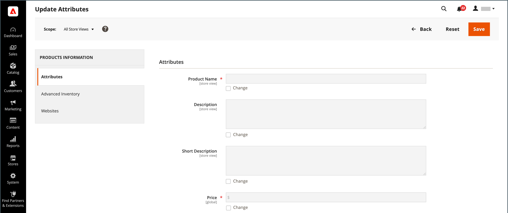

# Controle de ações

Ao trabalhar com uma coleção de registros na grade, você pode usar o controle Ações para aplicar uma operação a um ou mais registros. O controle Actions lista cada operação disponível para o tipo específico de dados. Por exemplo, você pode usar o controle Ações para atualizar os atributos de produtos selecionados, alterar o status de `Disabled` para `Enabled` ou excluir registros do banco de dados.

Você pode fazer quantas alterações forem necessárias e, em seguida, atualizar os registros em uma única etapa. É muito mais eficiente do que alterar as configurações individualmente para cada produto. Aplicar edições a um lote de registros é uma operação assíncrona, executada em segundo plano para que você possa continuar trabalhando no Administrador sem esperar a conclusão da operação. O sistema exibe uma mensagem quando a tarefa é concluída.

A seleção de ações disponíveis varia de acordo com a lista e opções adicionais podem ser exibidas, dependendo da ação selecionada. Por exemplo, ao alterar o status de um grupo de registros, uma caixa _[!UICONTROL Status]_é exibida ao lado do controle Ações com opções adicionais.

## Etapa 1: Selecionar registros

A caixa de seleção na primeira coluna da lista identifica cada registro que é um target para a ação. Os [controles de filtro](admin-grid-controls.md) podem ser usados para restringir a lista aos registros que você deseja direcionar para a ação.

1. Se necessário, defina os filtros na parte superior de cada coluna para mostrar apenas os registros que deseja incluir.

1. Marque a caixa de seleção de cada registro que é um destino da ação ou use o seletor de colunas para escolher uma seleção em massa.

{width="500"}

## Etapa 2: aplicar uma ação aos registros selecionados

1. Defina o controle **[!UICONTROL Actions]** para a operação que deseja aplicar.

   **_Example:_** Atualizar atributos

   - Na lista, marque a caixa de seleção de cada registro a ser atualizado.

   - Defina o controle **[!UICONTROL Actions]** como `Update Attributes`.

     {width="450"}

   - Clique em **[!UICONTROL Submit]**.

     A página Atualizar atributos lista todos os atributos disponíveis, organizados por grupo no painel à esquerda.

     {width="700" zoomable="yes"}

   - Marque a caixa de seleção **[!UICONTROL Change]** ao lado de cada atributo e faça as alterações necessárias.

   - Clique em **[!UICONTROL Save]** para atualizar os atributos do grupo de registros selecionados.

1. Quando terminar, clique em **[!UICONTROL Submit]**.

## Ações da caixa de seleção

| Ação | Descrição |
|--- |--- |
| [!UICONTROL Select All] | Marca a caixa de seleção de todos os registros na lista. |
| [!UICONTROL Unselect All] | Desmarca a caixa de seleção de todos os registros na lista. |
| [!UICONTROL Select All on This Page] | Marca a caixa de seleção de registros exibidos na página atual. |
| [!UICONTROL Deselect All on This Page] | Desmarca a caixa de seleção dos registros exibidos na página atual. |

{style="table-layout:auto"}
