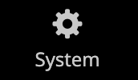

# A barra lateral de administração

A barra lateral à esquerda é o menu principal da loja _Admin_ e foi projetado para dispositivos móveis e desktop. O menu flyout fornece acesso a todas as ferramentas usadas para gerenciar a loja diariamente.

| Ícone do menu | Link | Descrição |
| --------- | ---- | ----------- |
|  | **[Página de inicialização do administrador](../configuration-reference/advanced/admin.md)** | Exibe a página de inicialização do Administrador, que é o Painel por padrão. |
|  | **[[!UICONTROL Dashboard]](admin-dashboard.md)** | O Painel fornece uma visão geral rápida das vendas e da atividade do cliente em sua loja, e geralmente é a primeira página que aparece ao fazer logon no Administrador. |
|  | **[[!UICONTROL Sales]](../stores-purchase/sales-menu.md)** | A variável [!UICONTROL Sales] é onde você pode localizar tudo relacionado às operações de ordens de processamento, NFFs, entregas, avisos de crédito e transações. |
|  | **[[!UICONTROL Catalog]](../catalog/catalog-menu.md)** | A variável [!UICONTROL Catalog] é usado para criar produtos e definir categorias. |
|  | **[[!UICONTROL Customers]](../customers/customers-introduction.md)** | A variável [!UICONTROL Customers] é onde você pode gerenciar contas de clientes e ver quais clientes estão online no momento. |
|  | **[[!UICONTROL Marketing]](../merchandising-promotions/marketing-menu.md)** | A variável [!UICONTROL Marketing] O menu é onde você configura as regras de preço e os cupons do catálogo e do carrinho de compras. As regras de preço acionam ações quando um conjunto de condições específicas é atendido. |
|  | **[[!UICONTROL Content]](../content-design/content-menu.md)** | A variável [!UICONTROL Content] é onde você gerencia os elementos de conteúdo e o design da sua loja. Saiba como criar páginas, blocos e aplicativos de front-end e gerenciar a apresentação da sua loja. |
|  | **[[!UICONTROL Reports]](reports-menu.md)** | A variável [!UICONTROL Reports] O menu fornece uma ampla seleção de relatórios que fornecem informações sobre cada aspecto da loja, incluindo vendas, carrinho de compras, produtos, clientes, tags, análises e termos de pesquisa. |
|  | **[[!UICONTROL Stores]](../stores-purchase/stores-menu.md)** | A variável [!UICONTROL Stores] O menu inclui ferramentas para configurar e manter todos os aspectos da loja, incluindo configurações de instalação de vários sites, impostos, moeda, atributos do produto e grupos de clientes. |
|  | **[[!UICONTROL System]](../systems/system-menu.md)** | A variável [!UICONTROL System] O menu inclui ferramentas para gerenciar operações do sistema, instalar extensões e gerenciar serviços da web para integração com outros aplicativos. |
|  | **[[!UICONTROL Find Partners & Extensions]](commerce-marketplace.md)** | A variável [!DNL Commerce Marketplace] é onde você pode encontrar soluções Adobe Commerce e Magento Open Source para sua loja. |

{style="table-layout:auto"}
