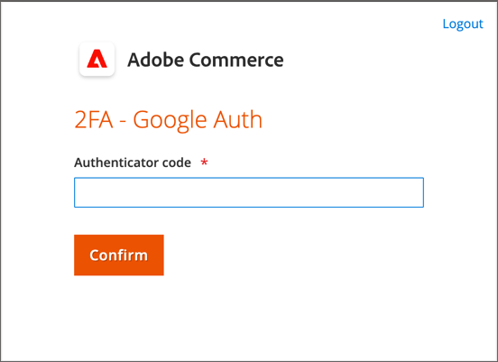
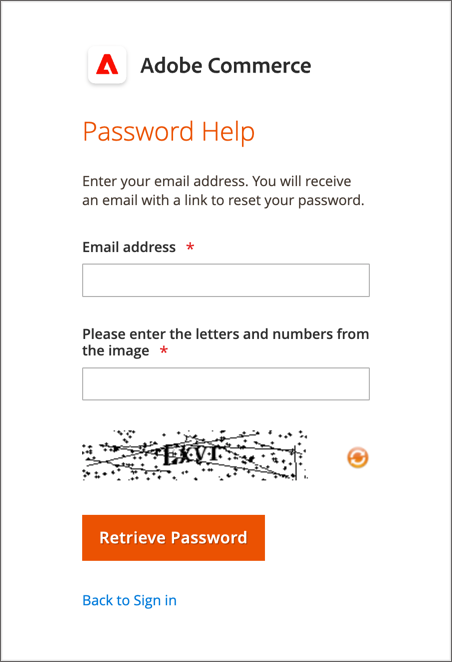

# Sua conta de administrador

A conta Admin primária foi configurada inicialmente durante a instalação e pode conter informações iniciais de espaço reservado ou informações de dados de amostra. O proprietário designado desta conta pode personalizar o nome de usuário e a senha e atualizar o nome, sobrenome e endereço de email a qualquer momento. Essa conta, uma _superusuário_ com todas as permissões por padrão, o normalmente cria as contas de usuário Admin necessárias para a empresa.

- Consulte [Criar um usuário](../systems/permissions-users-all.md#create-a-user) para obter informações sobre como adicionar ou editar usuários.

- Consulte [Permissões](../systems/permissions.md) e [Funções do usuário](../systems/permissions-user-roles.md) para obter informações sobre as funções de administrador e usuário.

{{ims-admin-note}}

## Logon de administrador

A variável [!DNL Commerce] _Admin_ O está protegido por várias camadas de medidas de segurança para impedir o acesso não autorizado ao armazenamento, pedido e dados do cliente. Na primeira vez que você fizer logon na _Admin_, você deverá inserir seu nome de usuário e senha e configurar [autenticação de dois fatores](../systems/security-two-factor-authentication.md) (2-A-A)

Dependendo da configuração de sua loja, pode haver uma [CAPTCHA](../systems/security-google-recaptcha.md) desafio a resolver, como inserir uma série de caracteres de teclado, resolver um quebra-cabeça ou clicar em uma série de imagens com um tema comum. Esses testes foram projetados para identificá-lo como um humano, em vez de um bot automatizado.

Para obter segurança adicional, você pode determinar quais partes da _Admin_ cada usuário tem [permissão](../systems/permissions.md) para acessar e também limitar o número de [tentativas de logon](../configuration-reference/advanced/admin.md). Por padrão, após seis tentativas, a conta é bloqueada e o usuário deve aguardar alguns minutos antes de tentar novamente. [Contas bloqueadas](../systems/permissions-users-all.md#locked-users) também pode ser redefinido no campo _Admin_.

>[!NOTE]
>
>Na primeira vez que você fizer logon na _Admin_, você será solicitado a _Permitir coleta de dados de uso administrativo_. Consulte [Coleta de dados de uso](admin.md#usage-data-collection) para obter mais informações.

{width="400"}

### Etapa 1: configurar autenticação de dois fatores

Antes de fazer logon na _Admin_ de sua loja, você deve ter uma solução de autenticação de dois fatores configurada e pronta para uso. Para saber mais sobre o processo de autenticação usado por cada solução, consulte [Uso da autenticação de dois fatores](../systems/security-two-factor-authentication-use.md). Por padrão, [!DNL Commerce] suporta [Autenticador do Google][1].

Pergunte ao seu [!DNL Commerce] administrador do sistema quais soluções 2FA são compatíveis com a loja. Em seguida, conclua a configuração da solução 2FA de sua preferência, de acordo com as instruções do provedor.

### Etapa 2: Fazer logon com o administrador

1. Insira o _Admin_ O URL que foi especificado durante o [!DNL Commerce] instalação.

   O padrão _Admin_ O URL é semelhante a `https://www.yourdomain.com/your-custom-admin-domain`.

   >[!NOTE]
   >
   >Embora esta documentação use `admin` como o URL base na maioria dos exemplos, é recomendável escolher um URL exclusivo e difícil de adivinhar [URL personalizado](../stores-purchase/store-urls.md) para o _Admin_ da sua loja.

   Você pode adicionar um marcador para a página ou salvar um atalho na área de trabalho para facilitar o acesso.

1. Insira seu _Admin_ **[!UICONTROL Username]** e **[!UICONTROL Password]**.

1. (Opcional) Se um CAPTCHA estiver ativado para sua loja, siga as instruções na tela para resolver o desafio.

   Para saber mais, consulte [CAPTCHA](../systems/security-captcha.md) e [reCAPTCHA](../systems/security-google-recaptcha.md).

1. Clique em **[!UICONTROL Sign in]**.

   Se esta for a primeira vez que você está conectado ao _Admin_ na conta do, você deve receber um email com um link para as instruções de configuração.

### Etapa 3: concluir a configuração 2FA

O exemplo a seguir mostra como emparelhar seus _Admin_ conta com o Google Authenticator.

1. Quando o código QR for exibido, use um dos métodos a seguir para capturar o código e emparelhar o Google Authenticator com sua _Admin_ conta.

   {width="400"}

   - Capturar código QR usando um telefone inteligente

     No smartphone, inicie o Google Authenticator. Toque no _sinal de mais_ (+) no canto superior direito do aplicativo. Em seguida, na parte inferior da tela, toque em **[!UICONTROL Scan Barcode]** e tire uma foto do código QR.

   - Capturar código QR do navegador

     Se o Google Authenticator estiver instalado como uma extensão em seu navegador, clique no link **Autenticador** na barra de ferramentas e capture a página.

   - Insira manualmente o código QR

     Copie a cadeia de caracteres de texto abaixo do código QR. Inicie o Google Authenticator com seu smartphone ou navegador e clique no sinal de mais (+). Em seguida, escolha **[!UICONTROL Manual Entry]**. Em **[!UICONTROL Account]**, insira o endereço de email associado à _Admin_ e cole a sequência de código QR na tag **[!UICONTROL Key]** campo.

1. Para fazer logon na _Admin_ com a autenticação de dois fatores, insira o código de seis dígitos gerado pelo Google Authenticator na caixa **[!UICONTROL Authenticator code]** e clique em **[!UICONTROL Confirm]**.

   {width="400"}

## Redefinir sua senha

Não é permitida a reutilização das quatro últimas senhas atribuídas à conta.

1. Insira o **[!UICONTROL Email Address]** que está associado à variável _Admin_ conta.

   {width="400"}

1. Clique em **[!UICONTROL Retrieve Password]**.

   Se uma conta estiver associada ao endereço de email, um email será enviado para redefinir sua senha.

   >[!NOTE]
   >
   >Um _Admin_ a senha deve ter sete ou mais caracteres e incluir letras e números. Consulte [Configuração _Admin_ Segurança](../systems/security-admin.md) para obter informações sobre opções de senha.

## Sair do Administrador

1. No canto superior direito, clique na guia _Conta_ () ícone.

1. Clique em **[!UICONTROL Sign Out]**.

   {width="700" zoomable="yes"}

A variável _[!UICONTROL Sign In]_exibe uma mensagem informando que você está desconectado. Saia do_ Admin _sempre que você deixar o computador sem supervisão.

## Editar informações da conta

1. Clique em _Conta_ () ícone.

1. Clique em **[!UICONTROL Account Setting]**.

   {width="700" zoomable="yes"}

1. Faça as alterações necessárias nas informações da sua conta.

   Se você alterar suas credenciais de logon, armazene-as em um local seguro.

1. Digite a senha da conta atual.

1. Clique em **[!UICONTROL Save Account]**.

## Permitir vários logons de administrador

O Administrador fornece acesso para gerenciar as funcionalidades de pedidos, clientes, produtos, remessa e pagamentos. A configuração padrão está definida para proibir vários logons para uma conta de usuário administrador como uma prática recomendada de segurança. No entanto, você pode alterar essa configuração para permitir que os usuários Administradores façam logon em vários dispositivos para acomodar os fluxos de trabalho da empresa.

1. No _Admin_ barra lateral, vá para **[!UICONTROL Stores]** > _[!UICONTROL Settings]_>**[!UICONTROL Configuration]**.

1. No painel de navegação esquerdo, expanda **[!UICONTROL Advanced]** e escolha **[!UICONTROL Admin]**.

1. Expandir  o **[!UICONTROL Security]** seção.

1. Para **Compartilhamento de conta de administrador**, selecione `Yes`.

   {width="700" zoomable="yes"}

1. Clique em **[!UICONTROL Save Config]**.

## Definir nomes de logon de usuário administrador como sensíveis a maiúsculas e minúsculas

1. No _Admin_ barra lateral, vá para **[!UICONTROL Stores]** > _[!UICONTROL Settings]_>**[!UICONTROL Configuration]**.

1. No painel de navegação esquerdo, expanda **[!UICONTROL Advanced]** e escolha **[!UICONTROL Admin]**.

1. Expandir  o **[!UICONTROL Security]** seção.

1. Defina o **[!UICONTROL Login is Case Sensitive]** campo para `Yes`.

1. Clique em **[!UICONTROL Save Config]**.

[1]: https://play.google.com/store/apps/details?id=com.google.android.apps.authenticator2&amp;hl=en_US
