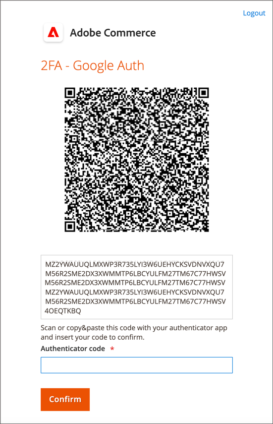
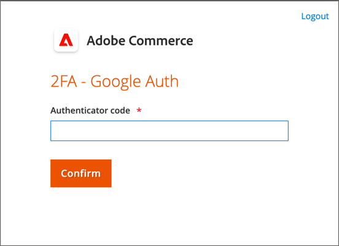
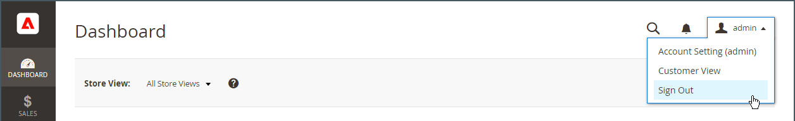

# Sua conta de administrador

A conta Admin primária foi configurada inicialmente durante a instalação e pode conter informações iniciais de espaço reservado ou informações de dados de amostra. O proprietário designado desta conta pode personalizar o nome de usuário e a senha e atualizar o nome, sobrenome e endereço de email a qualquer momento. Esta conta, um _superusuário_ com todas as permissões por padrão, normalmente cria as contas de usuário Administrador necessárias para os negócios.

- Consulte [Criar um usuário](../systems/permissions-users-all.md#create-a-user) para obter informações sobre como adicionar ou editar usuários.

- Consulte [Permissões](../systems/permissions.md) e [Funções do usuário](../systems/permissions-user-roles.md) para obter informações sobre as funções de administrador e usuário.

{{ims-admin-note}}

## Logon de administrador

O [!DNL Commerce] _Administrador_ está protegido por várias camadas de medidas de segurança para impedir o acesso não autorizado ao seu armazenamento, pedido e dados do cliente. Na primeira vez que você entrar no _Admin_, deverá inserir seu nome de usuário e senha e configurar a [autenticação de dois fatores](../systems/security-two-factor-authentication.md) (2FA).

Dependendo da configuração de sua loja, pode haver um desafio de [CAPTCHA](../systems/security-google-recaptcha.md) para resolver, como inserir uma série de caracteres de teclado, resolver um quebra-cabeça ou clicar em uma série de imagens com um tema comum. Esses testes foram projetados para identificá-lo como um humano, em vez de um bot automatizado.

Para maior segurança, você pode determinar quais partes do _Administrador_ cada usuário tem [permissão](../systems/permissions.md) para acessar e também limitar o número de [tentativas de logon](../configuration-reference/advanced/admin.md). Por padrão, após seis tentativas, a conta é bloqueada e o usuário deve aguardar alguns minutos antes de tentar novamente. [Contas bloqueadas](../systems/permissions-users-all.md#locked-users) também podem ser redefinidas pelo _Administrador_.

>[!NOTE]
>
>Na primeira vez que você entrar no _Administrador_, será solicitado a _Permitir coleta de dados de uso administrativo_. Consulte [Coleção de dados de uso](admin.md#usage-data-collection) para obter mais informações.

{width="400"}

### Etapa 1: configurar autenticação de dois fatores

Antes de entrar no _Admin_ de seu armazenamento, você deve ter uma solução de autenticação de dois fatores configurada e pronta para uso. Para saber mais sobre o processo de autenticação usado por cada solução, consulte [Usando a Autenticação de Dois Fatores](../systems/security-two-factor-authentication-use.md). Por padrão, o [!DNL Commerce] oferece suporte ao [Google Authenticator](https://play.google.com/store/apps/details?id=com.google.android.apps.authenticator2&hl=en_US).

Pergunte ao administrador do sistema do [!DNL Commerce] quais soluções 2FA são compatíveis com o armazenamento. Em seguida, conclua a configuração da solução 2FA de sua preferência, de acordo com as instruções do provedor.

### Etapa 2: Fazer logon com o administrador

1. Insira a URL do _Admin_ que foi especificada durante a instalação do [!DNL Commerce].

   A URL padrão _Admin_ é parecida com `https://www.yourdomain.com/your-custom-admin-domain`.

   >[!NOTE]
   >
   >Embora esta documentação use `admin` como a URL base na maioria dos exemplos, é recomendável que você escolha uma [URL personalizada](../stores-purchase/store-urls.md) exclusiva e difícil de adivinhar para o _Administrador_ de sua loja.

   Você pode adicionar um marcador para a página ou salvar um atalho na área de trabalho para facilitar o acesso.

1. Insira seu _Administrador_ **[!UICONTROL Username]** e **[!UICONTROL Password]**.

1. (Opcional) Se um CAPTCHA estiver ativado para sua loja, siga as instruções na tela para resolver o desafio.

   Para saber mais, consulte [CAPTCHA](../systems/security-captcha.md) e [reCAPTCHA](../systems/security-google-recaptcha.md).

1. Clique em **[!UICONTROL Sign in]**.

   Se for a primeira vez que você entra no _Administrador_ por meio da conta, deverá receber um email com um link para as instruções de configuração.

### Etapa 3: concluir a configuração 2FA

O exemplo a seguir mostra como emparelhar a conta do _Administrador_ com o Google Authenticator.

1. Quando o código QR for exibido, use um dos métodos a seguir para capturar o código e emparelhar o Google Authenticator com sua conta de _Administrador_.

   {width="400"}

   - Capturar código QR usando um telefone inteligente

     No smartphone, inicie o Google Authenticator. Toque no _sinal de adição_ (+) no canto superior direito do aplicativo. Em seguida, na parte inferior da tela, toque em **[!UICONTROL Scan Barcode]** e tire uma foto do código QR.

   - Capturar código QR do navegador

     Se o Google Authenticator estiver instalado como uma extensão no seu navegador, clique no ícone **Autenticador** na barra de ferramentas e capture a página.

   - Insira manualmente o código QR

     Copie a cadeia de caracteres de texto abaixo do código QR. Inicie o Google Authenticator com seu smartphone ou navegador e clique no sinal de mais (+). Em seguida, escolha **[!UICONTROL Manual Entry]**. Em **[!UICONTROL Account]**, insira o endereço de email associado à sua conta de _Administrador_ e cole a cadeia de código QR no campo **[!UICONTROL Key]**.

1. Para entrar no _Admin_ com autenticação de dois fatores, insira o código de seis dígitos gerado pelo Google Authenticator no campo **[!UICONTROL Authenticator code]** e clique em **[!UICONTROL Confirm]**.

   {width="400"}

## Redefinir sua senha

Não é permitida a reutilização das quatro últimas senhas atribuídas à conta.

1. Digite o **[!UICONTROL Email Address]** que está associado à conta de _Administrador_.

   {width="400"}

1. Clique em **[!UICONTROL Retrieve Password]**.

   Se uma conta estiver associada ao endereço de email, um email será enviado para redefinir sua senha.

   >[!NOTE]
   >
   >Uma senha de _Administrador_ deve ter sete caracteres ou mais (por padrão) e incluir letras e números. O comprimento mínimo da senha pode ser definido nas configurações de segurança de Admin. Consulte [Configurando a Segurança de _Admin_](../systems/security-admin.md) para obter informações sobre as opções de senha.

## Sair do Administrador

1. No canto superior direito, clique no ícone _Conta_ ().

1. Clique em **[!UICONTROL Sign Out]**.

   {width="700" zoomable="yes"}

A página _[!UICONTROL Sign In]_&#x200B;exibe uma mensagem informando que você está desconectado. Saia do_ Admin _sempre que deixar o computador sem supervisão.

## Editar informações da conta

1. Clique no ícone _Conta_ ().

1. Clique em **[!UICONTROL Account Setting]**.

   {width="700" zoomable="yes"}

1. Faça as alterações necessárias nas informações da sua conta.

   Se você alterar suas credenciais de logon, armazene-as em um local seguro.

1. Digite a senha da conta atual.

1. Clique em **[!UICONTROL Save Account]**.

## Permitir vários logons de administrador

O Administrador fornece acesso para gerenciar as funcionalidades de pedidos, clientes, produtos, remessa e pagamentos. A configuração padrão está definida para proibir vários logons para uma conta de usuário administrador como uma prática recomendada de segurança. No entanto, você pode alterar essa configuração para permitir que os usuários Administradores façam logon em vários dispositivos para acomodar os fluxos de trabalho da empresa.

1. Na barra lateral _Admin_, vá para **[!UICONTROL Stores]** > _[!UICONTROL Settings]_>**[!UICONTROL Configuration]**.

1. No painel de navegação esquerdo, expanda **[!UICONTROL Advanced]** e escolha **[!UICONTROL Admin]**.

1. Expandir  a seção **[!UICONTROL Security]**.

1. Para **Compartilhamento de Conta de Administrador**, selecione `Yes`.

   {width="700" zoomable="yes"}

1. Clique em **[!UICONTROL Save Config]**.

## Definir nomes de logon de usuário administrador como sensíveis a maiúsculas e minúsculas

1. Na barra lateral _Admin_, vá para **[!UICONTROL Stores]** > _[!UICONTROL Settings]_>**[!UICONTROL Configuration]**.

1. No painel de navegação esquerdo, expanda **[!UICONTROL Advanced]** e escolha **[!UICONTROL Admin]**.

1. Expandir  a seção **[!UICONTROL Security]**.

1. Defina o campo **[!UICONTROL Login is Case Sensitive]** como `Yes`.

1. Clique em **[!UICONTROL Save Config]**.

## Manter acesso seguro ao Administrador

Para garantir a segurança do seu administrador, faça auditorias regulares de usuários e funções com acesso de administrador.

Além disso, considere [atualizar a configuração da URL Base do Administrador](https://experienceleague.adobe.com/pt-br/docs/commerce-admin/config/advanced/admin#admin-base-url) para alterar o ponto de extremidade padrão `/admin` para um caminho personalizado. A configuração de um caminho personalizado oferece os seguintes benefícios de segurança:

**Segurança aprimorada**: o caminho &quot;admin&quot; padrão é amplamente conhecido e frequentemente alvo de ataques à força bruta por parte de agentes mal-intencionados. Ao alterá-lo para um valor único e personalizado, você reduz significativamente o risco de tentativas de acesso não autorizadas.

**Vulnerabilidade reduzida**: os bots automatizados verificam frequentemente caminhos comuns, como &quot;administrador&quot;, para explorar vulnerabilidades. Um caminho personalizado dificulta a localização da página de logon do administrador por esses bots, reduzindo a probabilidade de ataques.

**Privacidade aprimorada**: um caminho de administrador personalizado adiciona uma camada extra de obscuridade, dificultando a identificação e o direcionamento da página de logon do administrador por possíveis invasores.

**Conformidade com as Práticas Recomendadas**: as práticas recomendadas de segurança a seguir, como personalizar o caminho do administrador, demonstram uma abordagem proativa para proteger o site de comércio eletrônico e os dados do cliente.

>[!NOTE]
>
>Se houver suspeita de violação, remova todos os usuários administradores desconhecidos, redefina todas as senhas de administradores e examine o [Plano de ação de segurança](https://experienceleague.adobe.com/pt-br/docs/commerce-admin/systems/security/security) para obter mais etapas.
