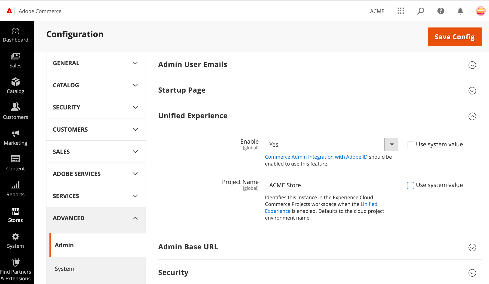

# Gerenciar a integração de Experience Cloud

Após a ativação inicial, gerencie o status da integração do Experience Cloud habilitando ou desabilitando a extensão Commerce Admin Unified Experience.

- Se a extensão Commerce Admin Unified Experience estiver habilitada e as contas de administrador forem [provisionadas corretamente](#manage-admin-user-accounts), os administradores do Commerce poderão exibir e acessar os projetos Commerce disponíveis no Adobe Experience Cloud. Os administradores ainda podem acessar projetos individuais usando o URL do administrador para o ambiente de projetos do Commerce.

- Se a extensão Commerce Admin Unified Experience estiver desativada, o acesso por meio do Experience Cloud será desativado. Os administradores devem fazer logon em projetos individuais usando o URL do administrador para o ambiente de projeto do Commerce.

>[!WARNING]
>
>Se a integração do IMS (Adobe Identity Management Service) estiver desativada, a integração do Experience Cloud será desativada automaticamente.

## Gerenciar a integração do Administrador

1. No Administrador do Commerce, abra o menu Configuração de armazenamento selecionando **[!UICONTROL Stores]** no menu de navegação esquerdo e selecione **[!UICONTROL Configuration]**.

1. No menu Configuração, selecione **[!UICONTROL Advanced > Admin]** e expanda a **[!UICONTROL Unified Experience option]**.

   {width="600" zoomable="yes"}

1. Ative ou desative a integração selecionando o valor **[!UICONTROL Enable]**.

1. Altere o nome do projeto que é exibido no espaço de trabalho do Commerce Projects adicionando ou atualizando o valor **[!UICONTROL Project Name]**.

1. Salve a configuração.

1. Limpe o cache.

## Gerenciar a integração usando a CLI do Adobe Commerce

Os administradores de sistema do Commerce com acesso de administrador ao projeto de nuvem do Commerce podem usar comandos da CLI do Adobe Commerce para gerenciar a integração de Experience Cloud.

1. Faça logon no projeto de nuvem a partir do ambiente de desenvolvimento local.

   ```bash
   magento-cloud login
   ```

1. No diretório raiz do ambiente do projeto na nuvem, conecte-se ao servidor de aplicativos do Commerce.

   ```bash
   ssh magento-cloud
   ```

1. Verifique o status da extensão Admin Unified Experience:

   ```bash
   bin/magento admin:uex:status
   ```

1. Altere o status da extensão para desativar a integração

   - **Habilitar**—`bin/magento config:set admin/unified_experience/enabled 1`

   - **Desabilitar**—`bin/magento config:set admin/unified_experience/enabled 0`

## Gerenciar contas de usuário Admin

Todos os usuários administradores do Commerce devem ter uma conta de administrador na instância do Commerce e uma conta de usuário Adobe (Adobe ID) para acessar produtos e serviços Adobe. Ambas as contas devem ser associadas ao mesmo endereço de email.

- **Conta de administrador do Commerce**—[Gerenciar usuários administradores do Commerce](../systems/permissions-users-all.md) por meio do Administrador da instância do Commerce. As contas de usuário para administradores do Commerce devem receber a função de Administrador.

  Os administradores de sistema no projeto do Commerce podem usar o [SSH para se conectar ao ambiente remoto](https://experienceleague.adobe.com/docs/commerce-cloud-service/user-guide/develop/secure-connections.html#connect-to-a-remote-environment) e usar os comandos `admin:user:create` e `admin:user:unlock` da CLI do Commerce para adicionar ou desbloquear contas de usuário administrador.

- **conta de usuário Adobe** — Um administrador da organização Adobe associada à instância do Commerce deve fazer logon na Adobe Admin Console e adicionar o Adobe ID para cada administrador do Commerce à organização. Em seguida, eles devem atribuir direitos e permissões de produto para acessar o aplicativo do Commerce. Consulte [Configurar usuários do Adobe Commerce na Adobe Admin Console](adobe-ims-config.md#step-4-configure-adobe-commerce-users-in-the-adobe-admin-console).

Os administradores que gerenciam a configuração para a integração de Experience Cloud do Adobe Developer Console devem ter uma conta de usuário Adobe com acesso de Administrador do sistema ou Desenvolvedor.

>[!NOTE]
>
>Uma Adobe ID é uma conta criada por meio do Adobe, necessária para acessar produtos e serviços por meio do Experience Cloud. Os administradores do Commerce que não têm uma Adobe ID podem [criar uma conta gratuita](https://helpx.adobe.com/manage-account/using/create-update-adobe-id.html) usando o mesmo endereço de email que usam para entrar no Administrador do Commerce.
