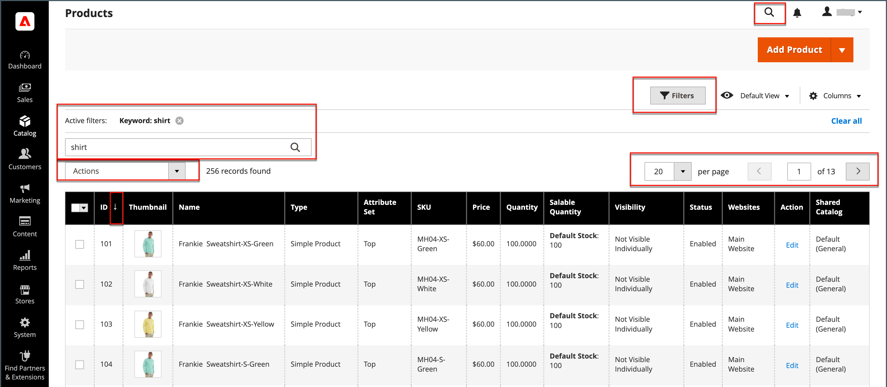

# As ferramentas e o espaço de trabalho do administrador

O espaço de trabalho de Administrador fornece acesso a todas as ferramentas, dados e conteúdo usados para executar sua loja. A página de inicialização padrão pode ser definida na configuração. Muitas páginas de Administrador têm uma grade que lista os dados da seção, com um conjunto de ferramentas para pesquisar, classificar, filtrar, selecionar e aplicar ações. Por padrão, a variável [Painel](admin-dashboard.md) é a página de inicialização do Administrador. No entanto, você pode escolher qualquer outra página para aparecer como a página de inicialização ao fazer logon. Você pode clicar no logotipo na barra lateral Admin para retornar à página de inicialização do Admin.

{zoom=&quot;yes&quot;}

## Controles do Workspace

| Controle | Descrição |
|--- |--- |
| [!UICONTROL Global Search] | O ícone de pesquisa na parte superior direita pode ser usado para localizar qualquer valor no banco de dados, incluindo registros de produto, cliente e pedido. |
| [!UICONTROL Grid Search] | A caixa de pesquisa acima da grade pode ser usada para filtrar rapidamente a exibição da grade com base nas palavras-chave encontradas nos registros. |
| [!UICONTROL Sort] | O cabeçalho de cada coluna pode ser usado para classificar a lista em ordem crescente ou decrescente. |
| [!UICONTROL Filters] | Define um conjunto de parâmetros de pesquisa que determina os registros que aparecem na grade. Além disso, os filtros no cabeçalho de algumas colunas podem ser usados para limitar a lista a valores específicos. Alguns filtros têm opções adicionais que podem ser selecionadas em uma caixa de listagem. |
| [!UICONTROL Default View] | Determina o layout de coluna padrão da grade. |
| [!UICONTROL Columns] | Determina a seleção de [colunas](admin-grid-controls.md) e sua ordem na grade. O layout da coluna pode ser alterado e salvo como _exibir_. Por padrão, apenas algumas colunas são incluídas na grade. |
| [!UICONTROL Paginate] | Os controles de paginação são usados para exibir as páginas adicionais de resultados. |
| [!UICONTROL Actions] | O controle Actions aplica uma operação a todos os registros selecionados. |
| [!UICONTROL Select] | O controle Select é usado para selecionar vários registros que devem ser o destino da ação. Opções: `Select All` / `Deselect All` |

{style="table-layout:auto"}

## Pesquisa no Workspace

Para localizar qualquer registro no banco de dados, use o ícone de lupa no cabeçalho da _Admin_. Os resultados podem incluir clientes, produtos, pedidos ou qualquer atributo relacionado. Por exemplo, se você informar um nome de cliente, os resultados poderão incluir o registro do cliente e quaisquer ordens associadas ao nome.

{width="700" zoomable="yes"}

1. No cabeçalho, clique no botão _Pesquisar_ () para abrir a caixa de pesquisa.

1. Siga um destes procedimentos:

   - Para localizar uma correspondência aproximada, insira as primeiras letras do que deseja localizar.
   - Para localizar uma correspondência exata, digite a palavra ou várias palavras que deseja localizar.

1. Nos resultados da pesquisa exibidos, clique em qualquer item para abrir o registro.

## Alterar a página de inicialização do administrador

A variável [painel](admin-workspace.md#the-dashboard) é a página de inicialização padrão para o Administrador, embora você possa configurar uma página de inicialização diferente.

1. No _Admin_ barra lateral, vá para **[!UICONTROL Stores]** > _[!UICONTROL Settings]_>**[!UICONTROL Configuration]**.

1. No painel de navegação esquerdo, em **[!UICONTROL Advanced]**, escolha **[!UICONTROL Admin]**.

1. Expandir  o **[!UICONTROL Startup Page]** seção.

   {width="600"}

1. Definir **[!UICONTROL Startup Page]** à página que você deseja que apareça primeiro depois de fazer logon no Administrador.

   Para obter uma lista detalhada de todas as opções de Administrador, consulte [Admin](../configuration-reference/advanced/admin.md) no _Referência de configuração_.

1. Quando terminar, clique em **[!UICONTROL Save Config]**.
