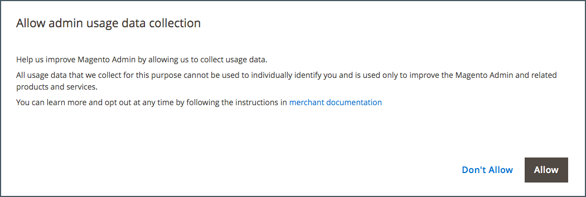

# O que é o administrador?

A loja _Admin_ é o back office protegido por senha onde você, como comerciante, configura produtos e promoções, gerencia pedidos e executa outras tarefas administrativas. Todas as tarefas básicas de configuração e operações de gerenciamento de repositório são executadas pelo _Administrador_.

Para maior segurança, o logon de _Administrador_ é protegido por [autenticação de dois fatores](../systems/security-two-factor-authentication.md) e pode ser configurado para exigir um [CAPTCHA](../systems/security-captcha.md). Para saber mais, acesse [Configurando a Segurança do Administrador](../systems/security-admin.md).

{width="700" zoomable="yes"}

Suas credenciais iniciais de [entrada](admin-signin.md) foram configuradas durante a instalação do Adobe Commerce ou do Magento Open Source. Se você esquecer a senha, uma senha temporária poderá ser enviada para o endereço de email associado à conta. Para aumentar a segurança, configure seu armazenamento para exigir um nome de usuário com diferenciação de maiúsculas e minúsculas e uma senha forte.

Além da conta de usuário Admin padrão, sua empresa pode criar quantas [contas adicionais](../systems/permissions-users-all.md) forem necessárias para gerenciar as contas de cliente de armazenamento e suporte. Cada conta pode ser associada a uma [função](../systems/permissions-user-roles.md) específica e a um nível de acesso, com base na empresa _que você precisa saber_. O endereço de email associado a cada conta de usuário Administrador deve ser exclusivo.

{{ims-admin-note}}

## Coleta de dados de uso

Na primeira vez que você fizer logon no _Administrador_, será solicitado a conceder permissão Adobe para coletar dados de uso para todos os usuários Administradores. Ao permitir a coleta de dados de uso pelo administrador, você ajuda a Adobe a melhorar a experiência de uso do administrador do Adobe Commerce e de produtos e serviços relacionados.

{width="600"}

Os usuários individuais não são identificados nos dados de uso. A configuração de coleta de dados pode ser alterada a qualquer momento a partir da configuração de [Uso do Administrador](../configuration-reference/advanced/admin.md#admin-usage).

Para o Adobe Commerce, permitir a coleta de dados também habilita o _Guia no Produto_, que foi projetado para trazer conteúdo interativo para o _Administrador_. Ele fornece ajuda, dicas de ferramentas, guias passo a passo, informações de integração, anúncios de recursos e muito mais.
