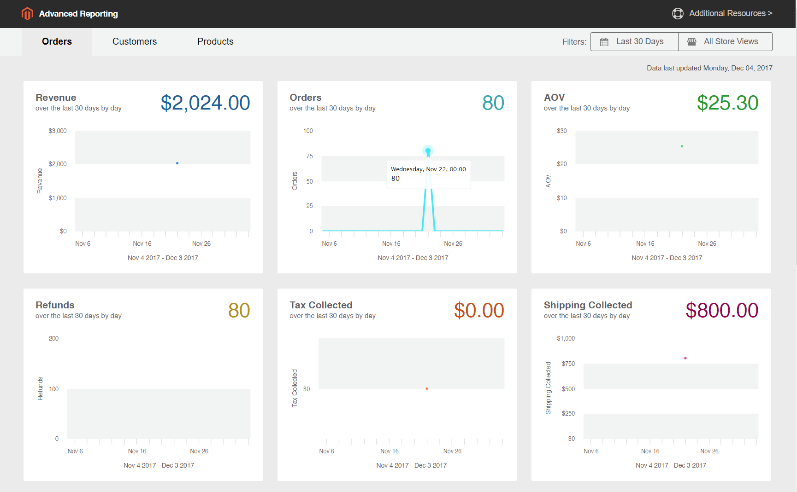

# [!DNL Commerce Intelligence] ferramentas

Use as ferramentas do Commerce Intelligence para obter a insight usada para tomar decisões comerciais sólidas.

## Conta [!DNL Commerce Intelligence]

Ao ativar uma conta do [!DNL Commerce Intelligence] por meio do Adobe, você obtém acesso a cinco painéis com aproximadamente 70 relatórios. Esses relatórios foram projetados para fornecer insights sobre seus dados e responder a perguntas como &quot;Como meus pedidos estão crescendo mês a mês?&quot;, &quot;Quem são meus clientes mais fiéis?&quot; e &quot;Minha estratégia de cupom está funcionando?&quot; Para obter informações detalhadas sobre este conjunto de ferramentas, consulte o [Guia do Usuário do Commerce Intelligence](https://experienceleague.adobe.com/docs/commerce-business-intelligence/mbi/guide-overview.html).

## [!DNL Advanced Reporting]

[!DNL Advanced Reporting] está incluído no Adobe Commerce e no Magento Open Source. Esse recurso oferece acesso a um conjunto de relatórios dinâmicos com base em seus produtos, pedidos e dados do cliente, com um painel personalizado adaptado às suas necessidades comerciais. Enquanto [!DNL Advanced Reporting] usa [!DNL Commerce Intelligence] para análise, não é necessário ter uma conta do Commerce Intelligence para usar [!DNL Advanced Reporting].

Para obter informações técnicas, consulte o tópico [[!DNL Advanced Reporting]](https://developer.adobe.com/commerce/php/development/advanced-reporting/){:target="_blank"} na documentação do desenvolvedor.

>[!NOTE]
>
>Devido a problemas de compatibilidade com o [!DNL Adobe Commerce Intelligence], o Commerce está temporariamente incapaz de oferecer suporte aos Relatórios Avançados usando o AWS S3 Bucket como uma mídia para o arquivo de dados de origem no [!DNL Commerce Intelligence].

{width="700"}

### Requisitos

* O site deve ser executado em um servidor Web público.

* O domínio deve ter um certificado de segurança (SSL) válido.

* [!DNL Commerce] deve ter sido instalado ou atualizado com êxito sem erros.

* Na configuração [!DNL Commerce] de [URLs de repositório](../stores-purchase/store-urls.md), a configuração **[!UICONTROL Base URL (Secure)]** da exibição de repositório deve apontar para a URL segura. Por exemplo: `https://yourdomain.com`.

* Na configuração [!DNL Commerce] das URLs de armazenamento, **[!UICONTROL Use Secure URLs on Storefront]** e **[!UICONTROL Use Secure URLs in Admin]** devem ser definidos como `Yes`.

* [[!DNL Commerce] crontab](https://experienceleague.adobe.com/docs/commerce-operations/configuration-guide/cli/configure-cron-jobs.html) foi criado e os trabalhos cron estão em execução no servidor instalado.

>[!NOTE]
>
>[!DNL Advanced Reporting] pode ser usado apenas com [!DNL Commerce] instalações que usaram continuamente uma única [moeda base](../stores-purchase/currency-configuration.md).


### Etapa 1: Habilitar [!DNL Advanced Reporting]

Na configuração [!DNL Commerce], [[!DNL Advanced Reporting]](../configuration-reference/general/advanced-reporting.md) é habilitado por padrão e será iniciado automaticamente se o cron estiver [configurado](../configuration-reference/advanced/system.md) e em execução. Uma tentativa de estabelecer a assinatura é iniciada no início de cada hora nas próximas 24 horas até ser bem-sucedida. O status da assinatura é &quot;pendente&quot; até que a assinatura seja estabelecida com êxito.

1. Na barra lateral _Admin_, vá para **[!UICONTROL Stores]** > _[!UICONTROL Settings]_>**[!UICONTROL Configuration]**.

1. No painel de navegação esquerdo, onde **[!UICONTROL General]** é expandido, escolha **[!UICONTROL Advanced Reporting]** e faça o seguinte:

   * Verifique se **[!UICONTROL Advanced Reporting Service]** está definido como `Enable` (a configuração padrão).

   * Defina o **[!UICONTROL Time of day to send data]** como hora, minuto e segundo, de acordo com um relógio de 24 horas, que você deseja que o serviço receba dados atualizados do seu armazenamento. Por padrão, os dados são enviados às 2:00 AM.

   * Em **[!UICONTROL Industry Data]**, escolha a **[!UICONTROL Industry]** que melhor descreve sua empresa.

   {width="400"}

1. Quando terminar, clique em **[!UICONTROL Save Config]**.

1. Quando solicitado, clique em **[[!UICONTROL Cache Management]](../systems/cache-management.md)** na mensagem na parte superior da página e atualize todos os caches inválidos.

1. Aguarde durante a noite ou até depois do horário da próxima atualização agendada. Em seguida, verifique o status da sua assinatura. Se o status ainda for _pendente_, verifique se a sua instalação atende a todos os requisitos.

### Etapa 2: acessar [!DNL Advanced Reporting]

1. Siga um destes procedimentos:

   * Na barra lateral _Admin_, escolha **[!UICONTROL Dashboard]**. Em seguida, clique em **[!UICONTROL Go to Advanced Reporting]**.
   * Na barra lateral _Admin_, vá para **[!UICONTROL Reports]** > _[!UICONTROL Business Intelligence]_>**[!UICONTROL Advanced Reporting]**.

   O painel do [!DNL Advanced Reporting] fornece um resumo rápido de seus pedidos, clientes e produtos. Não deixe de rolar para baixo para ver o painel completo.

1. Para obter uma melhor visualização dos dados, defina o **[!UICONTROL Filters]** no canto superior direito para o período e armazene a visualização que deseja incluir no relatório. Em seguida, faça o seguinte:

   * Passe o mouse sobre qualquer ponto de dados para obter mais informações.
   * Para visualizar todos os relatórios do painel, clique em cada guia.

   {width="600" zoomable="yes"}

## Acessar [!DNL Advanced Reporting] recursos de dados

No canto superior direito do painel Relatórios Avançados, clique em **[!UICONTROL Additional Resources]**.

{width="600" zoomable="yes"}

## Solução de problemas

Se você receber a mensagem 404 &quot;Página Não Encontrada&quot;, verifique se seu armazenamento atende aos requisitos para [!DNL Advanced Reporting]. Em seguida, siga as instruções para verificar se a integração está instalada.

### Verificar se a integração está ativa

1. Na barra lateral _Admin_, vá para **[!UICONTROL System]** > _[!UICONTROL Extensions]_>**[!UICONTROL Integration]**.

1. Verifique se a integração **[!UICONTROL Magento Analytics user]** aparece na lista e se **[!UICONTROL Status]** é `Active`.

1. Para restabelecer o usuário, clique em **[!UICONTROL Reauthorize]** e faça o seguinte:

   {width="600"}

   * Quando solicitado, clique em **[!UICONTROL Reauthorize]** para aprovar o acesso aos recursos da API.

     {width="600"}

   * Verifique se a lista de Tokens de integração para extensões está concluída. Clique em **Concluído**.

     {width="600"}

1. Procure a mensagem que indica que a integração `Magento Analytics user` foi reautorizada.

1. Aguarde durante a noite ou até depois da hora da próxima atualização agendada.

### Verificar moeda de base única

[!DNL Advanced Reporting] pode ser usado apenas com [!DNL Commerce] instalações que usaram apenas uma única [moeda base](../stores-purchase/currency-configuration.md) desde o momento da instalação. O resultado é que, no histórico, todos os pedidos usam a mesma moeda base. [!DNL Advanced Reporting] não funciona se você tiver, a qualquer momento, alterado sua moeda base e tiver pedidos em seu histórico que foram processados com moedas base diferentes.

Para determinar se o armazenamento tem várias moedas base, você pode consultar o banco de dados [!DNL Commerce] na linha de comando usando o exemplo MySQL a seguir. Talvez seja necessário alterar os nomes das tabelas para corresponder à estrutura de dados:

```sql
select distinct base_currency_code from sales_order;
```

### Discrepância de dados

Se você observar que a legenda `Data last updated...` exibe a data de ontem e não a de hoje, pode haver um atraso de até um dia nas atualizações dos Relatórios avançados. Esse atraso é devido a um tamanho de fila maior do que o esperado.

## Relatórios do painel

**[!UICONTROL Orders]**

| Campo | Descrição |
|--- |--- |
| [!UICONTROL Revenue] | Mostra toda a receita recebida pela exibição de loja durante o período definido. |
| [!UICONTROL Orders] | Mostra todas as ordens feitas por meio da exibição de armazenamento durante o período definido. |
| [!UICONTROL AOV] | Mostra o valor médio de pedido feito por meio da exibição de loja durante o período definido. |
| [!UICONTROL Refunds] | Mostra todos os reembolsos processados pela exibição de armazenamento durante o período definido. |
| [!UICONTROL Tax Collected] | Mostra todos os impostos coletados pela exibição de armazenamento durante o período definido. |
| [!UICONTROL Shipping Collected] | Mostra todas as taxas de remessa coletadas por meio da exibição de loja durante o período definido. |
| [!UICONTROL Orders by Status] | Mostra o número de pedidos por status, para a exibição de armazenamento durante o período definido. |
| [!UICONTROL Orders by Status] | Lista um resumo do número de pedidos por status. |
| [!UICONTROL Coupon Usage] | Lista todos os códigos de cupom e o número de usuários para cada um, resgatados por meio da exibição de armazenamento durante o período definido. |
| [!UICONTROL Orders and Revenue by Billing Region] | Lista o número de ordens e receita por região para a exibição de armazenamento durante o período definido. |
| [!UICONTROL Tax Collected by Billing Region] | Lista a quantia de imposto coletado por região para a exibição de armazenamento durante o período definido. |
| [!UICONTROL Shipping Fees Collected by Shipping Region] | Lista as taxas de remessa coletadas por região para a exibição de loja durante o período definido. |

{style="table-layout:auto"}

**[!UICONTROL Customers]**

| Campo | Descrição |
|--- |--- |
| [!UICONTROL Unique Customers] | Mostra o número de contas de clientes exclusivas associadas à exibição de loja durante o período definido. |
| [!UICONTROL New Registered Accounts] | Mostra o número de novas contas de clientes registradas com a exibição de loja durante o período definido. |
| [!UICONTROL Top Coupon Users] | Lista os principais usuários de cupom por ID do cliente e o número de pedidos feitos com cupons para a exibição de loja durante o período definido. |
| [!UICONTROL Customer KPI Table] | Lista o número de pedidos, a receita e o valor médio de pedido por ID do cliente para a exibição de armazenamento durante o período definido. |

{style="table-layout:auto"}

**[!UICONTROL Products]**

| Campo | Descrição |
|--- |--- |
| [!UICONTROL Quantity of Products Sold] | Mostra o número de produtos vendidos por meio da exibição de loja durante o período definido. |
| [!UICONTROL Products Added to Wishlists] | Lista todos os produtos adicionados às listas de desejos por meio da exibição de loja durante o período definido. |
| [!UICONTROL Best Selling Products by Quantity] | Lista os produtos mais vendidos e a quantidade vendida por meio da exibição de loja durante o período definido. |
| [!UICONTROL Best Selling Products by Revenue] | Lista os produtos mais vendidos e a receita gerada pela venda do produto por meio da exibição da loja durante o período definido. |

{style="table-layout:auto"}
