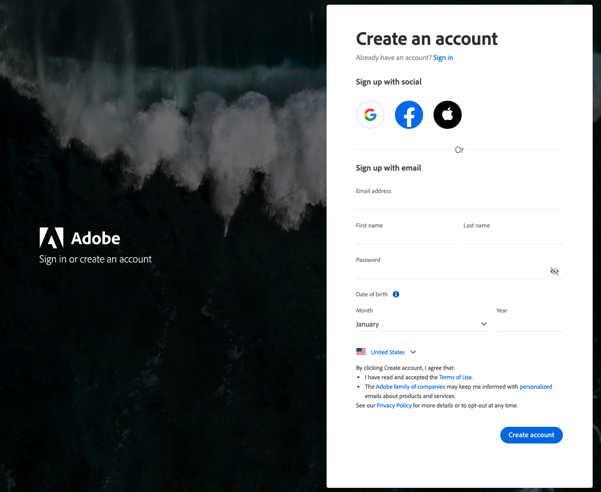
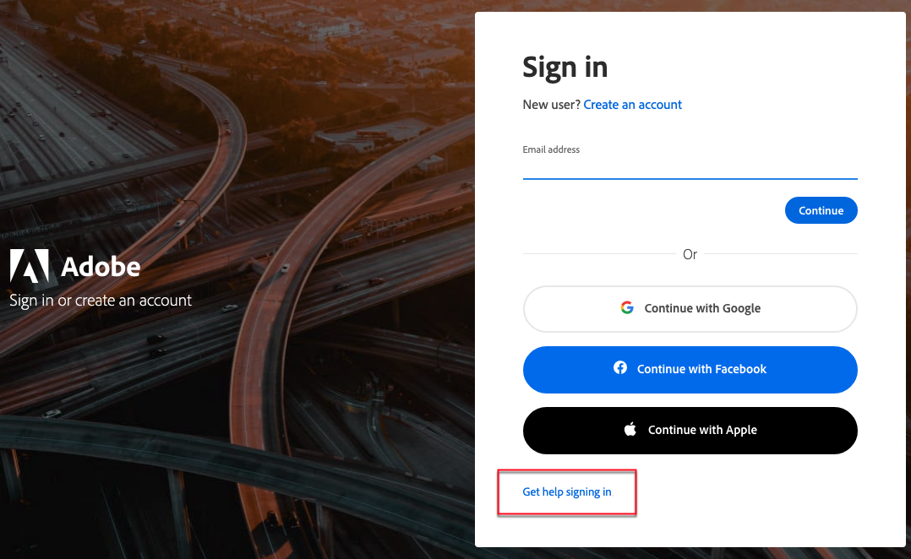
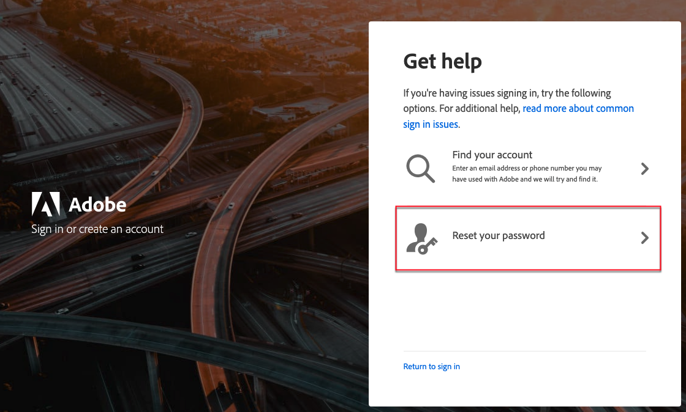

# Acessar sua conta [!DNL Commerce]

Uma conta do [!DNL Commerce] é seu ponto de acesso central para gerenciar serviços da Adobe Commerce para projetos da Adobe Commerce implantados na infraestrutura em nuvem ou no local. No painel de conta, é possível exibir assinaturas, gerenciar chaves de API de serviços da Commerce, revisar informações históricas de faturamento e colaborar com outros usuários em sua organização.

Se precisar [enviar seu primeiro tíquete](https://experienceleague.adobe.com/en/docs/commerce-knowledge-base/kb/help-center-guide/magento-help-center-user-guide#support-case) ou gerenciar sua relação com o Adobe Commerce, em vez de trabalhar em uma vitrine específica, comece criando ou acessando sua conta do [!DNL Commerce].

Você pode acessar sua conta [!DNL Commerce] do site [!DNL Commerce]. No painel de conta, você pode exibir informações relacionadas aos produtos e serviços que adquiriu e fornecer o [Acesso Compartilhado](https://experienceleague.adobe.com/en/docs/support-resources/adobe-support-tools-guide/adobe-commerce-support/adobe-commerce-help-center-user-guide#provide-shared-access) a outros usuários. Algumas informações, como chaves da API de serviços da Commerce, estão visíveis somente para proprietários de licenças.

>[!NOTE]
>
>A seção **[!UICONTROL Billing History]** na página de conta [!DNL Commerce] exibe somente faturas criadas antes da atualização do sistema de cobrança.
>
>Se as faturas mais recentes não estiverem listadas, elas foram migradas para o novo sistema e não podem ser acessadas nesta página.

![Sua conta [!DNL Commerce]](./assets/home-acct.png){width="700"}

O logon da conta [!DNL Commerce] é separado do logon de Administrador da loja. Normalmente, você usará credenciais diferentes para cada um, e o acesso a cada sistema é gerenciado de forma independente.

No entanto, um usuário que deseja simplificar seu logon nos produtos Adobe Commerce e Adobe Business pode configurar seu Adobe ID para fazer logon no Administrador da loja: [Configurar a Integração do Administrador da Commerce com o Adobe ID](https://experienceleague.adobe.com/en/docs/commerce-admin/start/admin/ims/adobe-ims-config) no *Guia de Integração do IMS para o Commerce*.

>[!NOTE]
>
>Após criar sua conta, é recomendável usar a TFA (Autenticação de Dois Fatores) para [proteger sua conta](commerce-account-secure.md).

## Faça logon em sua conta [!DNL Commerce]

Uma Adobe ID é necessária para acessar sua conta do [!DNL Commerce]. Se você tiver uma conta existente do [!DNL Commerce], mas não tiver feito logon desde agosto de 2022, deverá criar uma Adobe ID durante o processo de logon. Você deve concluir esta etapa antes de fazer logon em sua conta.

>[!WARNING]
>
>Se você não conseguir encontrar a organização da Commerce ao enviar um [caso de suporte](https://experienceleague.adobe.com/en/docs/support-resources/adobe-support-tools-guide/adobe-commerce-support/adobe-commerce-help-center-user-guide#support-case) do Adobe Commerce, geralmente significa uma das seguintes opções: o Proprietário da conta não criou uma Adobe ID ou existe uma Adobe ID, mas ela não está vinculada à conta da Commerce.

1. Vá para o site [[!DNL Commerce]](https://account.magento.com/customer/account/login/).

1. Clique em **[!UICONTROL Sign in with Adobe ID]**.

   {width="700"}

1. Digite seu endereço de email e clique em **[!UICONTROL Continue]**.

   >[!TIP]
   >
   >Se você usou um endereço de email associado a uma MAGEID de conta existente do Commerce, o processo de logon o vinculará automaticamente à sua Adobe ID.

## Criar uma conta [!DNL Commerce]

Qualquer pessoa pode criar uma conta gratuita do [!DNL Commerce]. O endereço de email que você usa só pode ser associado a uma conta do Commerce.

>[!NOTE]
>
>Use uma Adobe ID para criar e acessar uma conta do Commerce.
>- Se você não tiver uma conta da Commerce, crie uma durante o processo de inscrição.
>- Se você já tiver uma conta da Commerce, mas não tiver uma Adobe ID, consulte [fazer logon em uma conta da Commerce](#log-in-to-your-dnl-commerce-account).

1. Vá para o [[!DNL Commerce] site](https://account.magento.com/customer/account/login/).

1. Clique em **[!UICONTROL Sign in with Adobe ID]**.

1. Se você não tiver uma Adobe ID, clique em **[!UICONTROL Create an account]**. Caso contrário, pule para a etapa 7.

   {width="700"}

1. Preencha o formulário de inscrição.

   {width="700"}

1. Clique em **[!UICONTROL Create account]**.

1. Insira o código de verificação enviado para seu endereço de email.

   {width="700"}

1. Após criar e verificar sua Adobe ID, volte para https://account.magento.com/. Uma ID de IMAGEM será gerada e vinculada automaticamente à sua Adobe ID.

## Redefinir sua senha

1. Vá para o [[!DNL Commerce] site](https://account.magento.com/customer/account/login/).

1. Clique em **[!UICONTROL Sign in with Adobe ID]**.

1. Clique em **[!UICONTROL Get help signing in]**.

   {width="700"}

1. Clique em **[!UICONTROL Reset your password]**.

   {width="700"}

1. Insira seu endereço de email.

1. Clique em **[!UICONTROL Continue]**.

## Fornecer acesso compartilhado à sua conta do Commerce

O Acesso Compartilhado permite que você conceda a usuários confiáveis, como colegas, parceiros ou administradores, permissão para gerenciar seu relacionamento com a Adobe Commerce em seu nome sem usar seu logon pessoal. Isso inclui permitir que outras pessoas abram e rastreiem casos de suporte.

Consulte a seção [Compartilhar uma conta do Commerce](https://experienceleague.adobe.com/en/docs/commerce-admin/start/commerce-account/commerce-account-share?lang=en) do Guia de Introdução do Adobe Commerce para obter as etapas detalhadas sobre como configurar uma conta compartilhada.

Para obter instruções detalhadas sobre como enviar um caso de suporte do Commerce, consulte o [guia do usuário da Central de Ajuda da Adobe Commerce](https://experienceleague.adobe.com/en/docs/support-resources/adobe-support-tools-guide/adobe-commerce-support/adobe-commerce-help-center-user-guide#support-case).

## Resumo

| Cenário | O que está acontecendo | O que fazer com o Adobe ID | O que fazer para a ID MAGE / conta do Commerce | Resultado |
| --- | --- | --- | --- | --- |
| Novo no Adobe e no Commerce | Sem Adobe ID, sem ID MAGE | Crie uma Adobe ID quando solicitado durante o logon em https://account.magento.com | Depois que o Adobe ID for criado, faça logon novamente em https://account.magento.com | Uma conta do Commerce é criada e uma ID de IMAGEM é gerada e vinculada à Adobe ID |
| Tem Adobe ID, mas nenhuma ID de IMAGEM ainda | Usa apenas outros produtos da Adobe | Faça logon com o Adobe ID em https://account.magento.com | Primeiro logon bem-sucedido cria a conta da Commerce e a ID de MAGE | A ID da MAGE é criada e vinculada automaticamente |
| Cliente herdado do Commerce com ID MAGE antiga | Tem uma ID de MAGE histórica, mas nenhuma Adobe ID | Crie uma Adobe ID em https://account.adobe.com usando o mesmo email que a ID de MAGE existente | Faça logon em https://account.magento.com usando &quot;Fazer logon com a Adobe ID&quot; | A ID da MAGE existente está vinculada à nova Adobe ID |
| A Adobe ID e a MAGE ID existem, mas não estão vinculadas | Os emails do Adobe ID e do Commerce são diferentes | Alinhe o email do Adobe ID para corresponder ao email da conta do Commerce (ou vice-versa, dependendo da propriedade) | Depois que os emails corresponderem, faça logon por &quot;Fazer logon com o Adobe ID&quot; em https://account.magento.com | O Adobe ID se torna o logon; a ID do MAGE permanece o identificador de direito |
| Tem Adobe ID, mas &quot;sem ID de IMAGEM&quot; | Nunca entrou no https://account.magento.com | Usar o Adobe ID existente | Fazer logon em https://account.magento.com pela primeira vez | Este primeiro logon gera e vincula uma ID de IMAGEM |
| Usa somente o logon de projeto na nuvem (accounts.magento.cloud) | Pode acessar o projeto na nuvem, mas não a conta clássica do Commerce | Continuar usando o Adobe ID para projeto na nuvem | Se as licenças/o Marketplace forem necessários, faça logon também em https://account.magento.com com a mesma Adobe ID | Uma conta clássica do Commerce (com ID do MAGE) é criada e vinculada |

Se um usuário acreditar que deve ter direitos da Commerce, mas não vir uma ID de MAGE, a próxima etapa padrão é fazer logon em https://account.magento.com usando a Adobe ID para que uma conta da Commerce e uma ID de MAGE possam ser criadas ou vinculadas corretamente.
