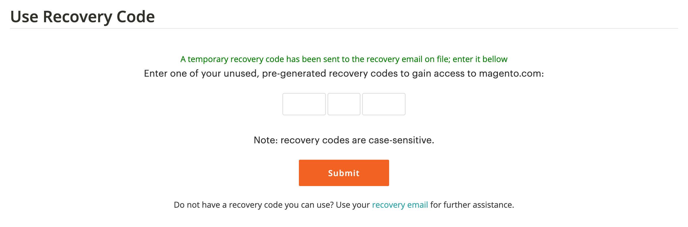

# Proteja sua conta do [!DNL Commerce]

A Autenticação de Dois Fatores (TFA ou 2FA) é uma camada adicional de segurança para proteger melhor sua conta do [!DNL Commerce] contra acesso não autorizado. Para concluir o processo de logon, o TFA requer um _segundo fator_ além das credenciais padrão de nome de usuário e senha. Esse segundo fator assume a forma de códigos de verificação temporários que são gerados continuamente por um aplicativo do TFA instalado em seu dispositivo móvel e emparelhado com sua conta do [!DNL Commerce].

Com o TFA ativado, sua conta fica mais segura. Um usuário não autorizado não pode fazer logon, a menos que tenha suas credenciais de nome de usuário e senha (primeiro fator) e um código de verificação válido do aplicativo TFA em seu dispositivo pessoal (segundo fator).

>[!NOTE]
>
>A autenticação de dois fatores que protege o _Administrador_ de seu armazenamento tem uma configuração separada. Para saber mais, consulte [Autenticação de Dois Fatores](../systems/security-two-factor-authentication.md).

## Antes de começar

Para usar o TFA, você deve ter um aplicativo TFA instalado em seu dispositivo pessoal (como smartphone, tablet, computador). Há muitos disponíveis, mas algumas opções populares e gratuitas incluem:

- Autenticador Google (iOS, Android™, BlackBerry®)

- Authy (iOS, Android™)

- Autenticador Microsoft® (iOS, Android™, Windows Phone)

## Habilitar autenticação de dois fatores

1. Faça logon em sua [[!DNL Commerce] conta][1]{:target=&quot;_blank&quot;}.

1. No painel de navegação esquerdo, selecione **[!UICONTROL Account Settings]** e **[!UICONTROL Two-factor Authentication]**.

   {width="600" zoomable="yes"}

1. Selecione **[!UICONTROL Enable]** para iniciar o processo de configuração da autenticação de dois fatores.

1. Digite o **[!UICONTROL Verification Code]** enviado ao seu email e selecione **[!UICONTROL Verify Code]** para continuar.

   {width="400"}

1. Abra o aplicativo de autenticação de dois fatores que você baixou e instalou em seu dispositivo pessoal.

1. No formulário [!UICONTROL SETUP TWO-FACTOR AUTHENTICATION], use **[!UICONTROL Setup Code]** para adicionar o Adobe Commerce ao seu aplicativo TFA.

   {width="400"}

   Você pode adicionar o código digitalizando o código QR usando o aplicativo TFA ou inserindo-o manualmente. Esse código emparelha seu aplicativo do TFA com sua conta do [!DNL Commerce] e permite que as permissões gerem o aplicativo do TFA para gerar códigos de verificação para acesso seguro à conta.

1. Conclua a configuração.

   - No formulário [!UICONTROL SETUP TWO FACTOR-AUTHENTICATION], insira o código de verificação do aplicativo de autenticação de dois fatores.

   - Selecione **[!UICONTROL Verify Code]**.

   >[!NOTE]
   >
   >Por questões de segurança, os códigos de verificação em seu aplicativo TFA expiram e regeneram continuamente. **_Sempre_** use o código exibido no momento.

1. Salve o **[!UICONTROL Recovery Codes]** apresentado em um local seguro e acessível.

   {width="400"}

   Se você não puder fornecer um código de verificação ao fazer logon na conta do [!DNL Commerce], deverá usar um código de recuperação para recuperar o acesso à conta.

   Cada código de recuperação pode ser usado apenas uma vez, mas você pode [gerar](#generate-new-recovery-codes) novos. Os códigos de recuperação fazem distinção entre maiúsculas e minúsculas.

1. Marque a caixa de seleção de confirmação e selecione **[!UICONTROL Submit]** para continuar.

1. Para garantir que você possa recuperar o acesso à sua conta, insira um **[!UICONTROL Recovery Email]**.

   Esse endereço de e-mail será necessário se você não puder gerar um código de verificação a partir do aplicativo de autenticação de dois fatores e não tiver acesso a um código de recuperação pré-gerado não utilizado.

   Uma vez a cada 24 horas, você pode gerar e enviar um código de recuperação temporário para o endereço de e-mail de recuperação designado. Use esse código para recuperar o acesso à conta.

   >[!IMPORTANT]
   >
   >Mantenha o acesso à sua conta de email de recuperação. Caso contrário, você não poderá usar códigos de recuperação temporários enviados para essa conta.

   {width="400"}

1. Marque a caixa de seleção de confirmação e selecione **[!UICONTROL Submit]** para concluir o processo de configuração da autenticação de dois fatores.

   - Uma notificação é enviada ao endereço de email associado à sua conta do [!DNL Commerce] para confirmar que você habilitou com êxito a autenticação de dois fatores.

   - Uma notificação é enviada para sua conta de email de recuperação para confirmar a configuração.

>[!TIP]
>
>Se você perder seu dispositivo pessoal ou obter um novo, poderá [alterar seu aplicativo de autenticação de dois fatores](#change-your-two-factor-authentication-application) e gerar novos códigos de recuperação.

## Fazer logon usando um código de verificação

1. Vá para o [!DNL Commerce] [logon da conta][1]{:target=&quot;_blank&quot;}.

1. Digite suas credenciais de nome de usuário e senha e selecione **[!UICONTROL Login]**.

1. Digite a **[!UICONTROL Verification Code]** exibida no aplicativo de autenticação de dois fatores quando solicitado.

   {width="600"}

1. Selecione **[!UICONTROL Submit]** para concluir o processo de logon.

## Fazer logon usando um código de recuperação

1. Vá para o [!DNL Commerce] [logon da conta][1]{:target=&quot;_blank&quot;}.

1. Digite suas credenciais de nome de usuário e senha e selecione **[!UICONTROL Login]**.

1. Selecione **[!UICONTROL Use recovery code]** para ignorar o prompt de código de verificação.

1. Digite um **[!UICONTROL Recovery Code]** não utilizado quando solicitado.

   {width="600"}

1. Selecione **[!UICONTROL Submit]** para concluir o processo de logon.

## Fazer logon usando seu email de recuperação

1. Faça logon em sua [[!DNL Commerce] conta][1]{:target=&quot;_blank&quot;}.

1. Digite suas credenciais de nome de usuário e senha e selecione **[!UICONTROL Login]**.

1. Selecione **[!UICONTROL Use recovery code]** para ignorar o prompt de código de verificação.

1. Para obter um código de recuperação temporário por email, selecione o link **[!UICONTROL recovery email]**.

   {width="600"}

1. Abra a conta de email de recuperação para obter o código temporário e insira o código nos campos designados.

1. Selecione **[!UICONTROL Submit]** para concluir o processo de logon.

Depois de usar um código de recuperação temporário para acessar sua conta, [gere novos códigos de recuperação](#generate-new-recovery-codes) e salve-os para evitar mais problemas de acesso à conta.

## Exibir seus códigos de recuperação

1. Vá para o [!DNL Commerce] [logon da conta][1]{:target=&quot;_blank&quot;}.

1. Digite suas credenciais de nome de usuário e senha e selecione **[!UICONTROL Login]**.

1. Conclua o processo de logon usando um dos métodos de autenticação de dois fatores descritos anteriormente.

1. No painel de navegação esquerdo, selecione **[!UICONTROL Account Settings]** e **[!UICONTROL Two-factor Authentication]**.

   {width="600" zoomable="yes"}

1. Para exibir os códigos de recuperação pré-gerados, selecione **Exibir Códigos de Recuperação**.

1. Digite o **[!UICONTROL Verification Code]** enviado ao seu email e selecione **[!UICONTROL Verify Code]** para continuar.

   {width="400"}

1. Salve os **Códigos de Recuperação** apresentados em um local seguro e acessível.

   Se você não puder fornecer um código de verificação para fazer logon na conta do [!DNL Commerce], usar um código de recuperação é a única maneira de recuperar o acesso à conta.

   Cada código de recuperação é de uso único, mas você sempre pode [gerar](#generate-new-recovery-codes) novos. Os códigos de recuperação fazem distinção entre maiúsculas e minúsculas.

   {width="400"}

1. Marque a caixa de seleção de confirmação e selecione **[!UICONTROL Submit]** para fechar a caixa de diálogo.

## Gerar novos códigos de recuperação

1. Vá para o [!DNL Commerce] [logon da conta][1]{:target=&quot;_blank&quot;}.

1. Digite suas credenciais de nome de usuário e senha e selecione **[!UICONTROL Login]**.

1. Conclua o processo de logon usando um dos métodos de autenticação de dois fatores descritos anteriormente.

1. No painel de navegação esquerdo, selecione **[!UICONTROL Account Settings]** e **[!UICONTROL Two-factor Authentication]**.

1. Para gerar novos Códigos de Recuperação pré-gerados, selecione **Gerar Novos Códigos de Recuperação**.

1. Digite o **[!UICONTROL Verification Code]** enviado ao seu email e selecione **[!UICONTROL Verify Code]** para continuar.

1. Salve os **Códigos de Recuperação** apresentados em um local seguro e acessível.

   Se você não puder fornecer um código de verificação ao fazer logon na conta do [!DNL Commerce], usar um código de recuperação será a única maneira de recuperar o acesso à conta.

   Todos os códigos de recuperação gerados anteriormente agora são renderizados como inválidos e devem ser descartados (somente o conjunto atual de códigos de recuperação gerados é funcional). Os códigos de recuperação fazem distinção entre maiúsculas e minúsculas.

1. Marque a caixa de seleção de confirmação e selecione **[!UICONTROL Submit]** para fechar a caixa de diálogo.

## Alterar email de recuperação

1. Vá para o [!DNL Commerce] [logon da conta][1]{:target=&quot;_blank&quot;}.

1. Digite suas credenciais de nome de usuário e senha e selecione **[!UICONTROL Login]**.

1. Conclua o processo de logon usando um dos métodos de autenticação de dois fatores descritos anteriormente.

1. No painel de navegação esquerdo, selecione **[!UICONTROL Account Settings]** e **[!UICONTROL Two-factor Authentication]**.

1. Selecione **Alterar Email de Recuperação** para alterar o email de recuperação no arquivo da sua conta.

1. Digite o **[!UICONTROL Verification Code]** enviado ao seu email e selecione **[!UICONTROL Verify Code]** para continuar.

1. Para ajudar a garantir que você possa recuperar o acesso à sua conta, insira um **Email de Recuperação**.

   Esse endereço de e-mail será necessário se você não puder gerar um código de verificação a partir do aplicativo de autenticação de dois fatores e não tiver acesso a um código de recuperação pré-gerado não utilizado.

   Uma vez a cada 24 horas, você pode gerar e enviar um código de recuperação temporário para o endereço de e-mail de recuperação designado. Você pode usar esse código para recuperar o acesso à conta.

   >[!IMPORTANT]
   >
   >Mantenha o acesso à sua conta de email de recuperação. Caso contrário, você não poderá usar códigos de recuperação temporários enviados para essa conta.

1. Marque a caixa de seleção de confirmação e selecione **[!UICONTROL Submit]** para fechar a caixa de diálogo.

   O sistema envia uma notificação por e-mail para o e-mail de recuperação que você designou para confirmar que um endereço de e-mail específico está no arquivo como seu e-mail de recuperação para receber códigos de recuperação temporários.

## Alterar o aplicativo de autenticação de dois fatores

1. Vá para o [!DNL Commerce] [logon da conta][1]{:target=&quot;_blank&quot;}.

1. Digite suas credenciais de nome de usuário e senha e selecione **[!UICONTROL Login]**.

1. Conclua o processo de logon usando um dos métodos de autenticação de dois fatores descritos anteriormente.

1. No painel de navegação esquerdo, selecione **[!UICONTROL Account Settings]** e **[!UICONTROL Two-factor Authentication]**.

1. Selecione **Alterar Aplicativo TFA** para usar um aplicativo TFA diferente com sua conta magento.com.

1. Digite o **[!UICONTROL Verification Code]** enviado ao seu email e selecione **[!UICONTROL Verify Code]** para continuar.

1. Abra o aplicativo de autenticação de dois fatores no seu dispositivo pessoal.

1. Insira o **Código de Instalação** no aplicativo de autenticação de dois fatores.

   Você pode adicionar o código digitalizando o código QR usando o aplicativo TFA ou inserindo-o manualmente. Esse código emparelha seu aplicativo do TFA com sua conta do [!DNL Commerce] e permite que as permissões do aplicativo do TFA gerem códigos de verificação para acesso seguro à conta.

   >[!NOTE]
   >
   >Por questões de segurança, os códigos de verificação em seu aplicativo TFA expiram e regeneram continuamente. **_Sempre_** use o código exibido no momento.

1. Com seu aplicativo TFA agora emparelhado com sua conta [!DNL Commerce], digite o **[!UICONTROL Verification Code]** exibido no aplicativo TFA e selecione **[!UICONTROL Verify Code]** para continuar.

1. Salve os **Códigos de Recuperação** apresentados em um local seguro e acessível.

   Se você não puder fornecer um código de verificação ao fazer logon na conta do [!DNL Commerce], a única maneira de recuperar o acesso à conta será usar um código de recuperação.

   Cada código de recuperação é de uso único, mas você sempre pode [gerar](#generate-new-recovery-codes) novos. Os códigos de recuperação fazem distinção entre maiúsculas e minúsculas. Os códigos de recuperação fazem distinção entre maiúsculas e minúsculas.

1. Marque a caixa de seleção para confirmar e selecione **[!UICONTROL Submit]** para continuar.

1. Para ajudar a garantir que você possa recuperar o acesso à sua conta, insira um **Email de Recuperação**.

   Esse endereço de e-mail será necessário se você não puder gerar um código de verificação a partir do aplicativo de autenticação de dois fatores e não tiver acesso a um código de recuperação pré-gerado não utilizado.

   Uma vez a cada 24 horas, você pode gerar e enviar um código de recuperação temporário para o endereço de e-mail de recuperação designado. Use esse código para recuperar o acesso à conta.

   >[!IMPORTANT]
   >
   >Mantenha o acesso à sua conta de email de recuperação. Caso contrário, você não poderá usar códigos de recuperação temporários enviados para essa conta.

1. Marque a caixa de seleção de confirmação e selecione **[!UICONTROL Submit]** para concluir o processo de configuração da autenticação de dois fatores.

   Uma notificação por e-mail é enviada ao e-mail de recuperação que você designou para confirmar que um endereço de e-mail específico está no arquivo como seu e-mail de recuperação para receber um código de recuperação temporário.

## Desabilitar autenticação de dois fatores

>[!IMPORTANT]
>
>Se sua política de segurança organizacional exigir a autenticação multifator em contas do Adobe Commerce, não será possível desabilitar a autenticação de dois fatores.

1. Vá para o [!DNL Commerce] [logon da conta][1]{:target=&quot;_blank&quot;}.

1. Digite suas credenciais de nome de usuário e senha e selecione **[!UICONTROL Login]**.

1. Conclua o processo de logon usando um dos métodos de autenticação de dois fatores descritos anteriormente.

1. No painel de navegação esquerdo, selecione **[!UICONTROL Account Settings]** e selecione **[!UICONTROL Two-factor Authentication]** abaixo.

1. Selecione **[!UICONTROL Disable]** para iniciar o processo de desativação do TFA.

1. Digite o **[!UICONTROL Verification Code]** enviado ao seu email e selecione **[!UICONTROL Verify Code]** para continuar.

1. Marque a caixa de seleção de confirmação e selecione **[!UICONTROL Submit]** para concluir a desativação da autenticação de dois fatores.

   O sistema envia uma confirmação por email indicando que o TFA foi desabilitado na sua conta [!DNL Commerce].

   {width="400"}

[1]: https://account.magento.com/customer/account/login
