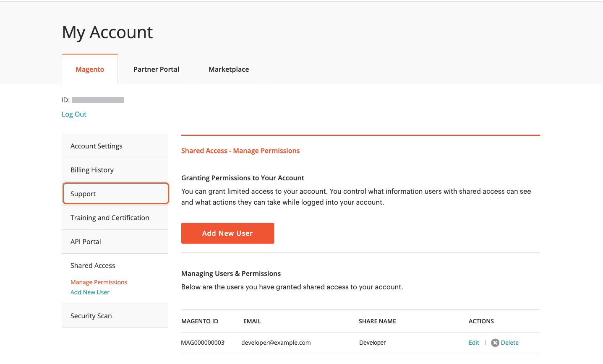

# Compartilhar um [!DNL Commerce] account

Seu [!DNL Commerce] a conta contém informações que você pode disponibilizar para funcionários confiáveis e provedores de serviços que ajudam a gerenciar seu site. Como titular primário da conta, você tem autoridade para conceder acesso limitado a outros [!DNL Commerce] titulares de contas. O acesso compartilhado pode ser revogado, mas não pode ser transferido de um usuário para outro.

A variável [!DNL Commerce] A equipe de suporte não tem acesso à conta e não pode configurar o acesso compartilhado para você. Somente o titular primário da conta com as permissões apropriadas pode configurar o acesso compartilhado. Quando sua conta é compartilhada, todas as informações confidenciais, como seu histórico de cobrança ou informações de cartão de crédito, permanecem protegidas e não são compartilhadas a qualquer momento com outros usuários.

>[!NOTE]
>
>Todas as ações tomadas por usuários com acesso compartilhado são de exclusiva responsabilidade do titular principal da conta. O Adobe não é responsável por nenhuma ação tomada pelos usuários que têm acesso compartilhado à sua conta.

{width="600" zoomable="yes"}

## Configurar uma conta compartilhada

1. Antes de começar, obtenha as seguintes informações do [!DNL Commerce] conta do **novo favorecido de acesso compartilhado**:

   - O usuário já deve ter se registrado em uma conta em account.adobe.com e estar conectado por meio de account.magento.com.
   - A variável `Account ID` que é exibido no canto superior esquerdo da _[!UICONTROL Magento]_, logo acima da guia **Fazer logoff**link.
   - A variável `Email` endereço associado à conta.

1. Faça logon no [[!DNL Commerce] account](commerce-account-create.md).

1. No painel de navegação esquerdo, clique em **[!UICONTROL Shared Access]**.

1. Clique em **[!UICONTROL Add New User]**.

   {width="600" zoomable="yes"}

1. Em [!UICONTROL _New User Information]_, faça o seguinte:

   - Insira o **[!UICONTROL Account ID]** do novo usuário [!DNL Commerce] conta.
   - Insira o **[!UICONTROL Email]** endereço associado ao do novo usuário [!DNL Commerce] conta.

   {width="600"}

1. Em _[!UICONTROL Shared Information]_, faça o seguinte:

   - Para identificar a conta compartilhada, insira um **[!UICONTROL Share Name]**. Esse nome serve para referência interna e é visível apenas para você e para a pessoa com quem você compartilha sua conta. (Não insira um nome de compartilhamento que comece com `CLOUD SHARED ACCESS FROM MAG XYX`.)
   - Se quiser compartilhar suas informações pessoais de contato com o novo usuário, digite **[!UICONTROL Your Email]** e **[!UICONTROL Your Phone]**.

1. Em _[!UICONTROL Grant Account Permissions]_, marque a caixa de seleção de cada [!DNL Commerce] produto e serviço que você deseja compartilhar.

   {width="600"}

1. Quando terminar, clique em **[!UICONTROL Create Shared Access]**.

   As novas informações do usuário aparecem na variável _[!UICONTROL Manage Permissions]_da página Acesso compartilhado, e um convite por email com instruções para acessar a conta compartilhada é enviado ao novo usuário.

   {width="600" zoomable="yes"}

## Acessar uma conta compartilhada

As instruções a seguir são escritas da perspectiva de um usuário compartilhado que recebe um convite para uma conta compartilhada.

1. Ao receber um convite para uma conta compartilhada, siga as instruções no email para fazer logon na sua conta [!DNL Commerce] conta.

   O painel de navegação esquerdo de sua conta tem um novo _[!UICONTROL Shared with me]_guia. A variável_[!UICONTROL Switch Accounts]_ no canto superior direito tem opções para `My Account` e o nome da conta compartilhada.

   {width="600" zoomable="yes"}

1. Para obter acesso à conta compartilhada, defina **[!UICONTROL Switch Accounts]** ao nome da conta compartilhada.

   {width="600" zoomable="yes"}

   A conta compartilhada exibe uma mensagem de boas-vindas e informações de contato. O painel de navegação esquerdo inclui apenas os itens que você tem permissão para usar.

1. Para conectar a conta compartilhada ao Centro de ajuda, clique em **[!UICONTROL Support]** no painel de navegação esquerdo da conta compartilhada.

   {width="600" zoomable="yes"}

   Você pode usar o [Centro de ajuda do Adobe Commerce](https://experienceleague.adobe.com/docs/commerce-knowledge-base/kb/overview.html) da conta compartilhada para procurar artigos e informações de solução de problemas, encontrar patches para problemas conhecidos e criar tíquetes de suporte.

   >[!NOTE]
   >
   >Depois de receber acesso compartilhado, o usuário deve fazer logon na [[!DNL Commerce] account](https://account.magento.com/customer/account/login), navegue até _Acesso compartilhado_ e clique no botão **[!UICONTROL Support]** guia. Esta ação só é necessária na primeira vez, a fim de assegurar que a [Knowledge base de suporte do Adobe Commerce](https://experienceleague.adobe.com/docs/commerce-knowledge-base/kb/overview.html) O está configurado corretamente por meio da `SSO` chame.

1. Para voltar para sua própria conta, clique em **Voltar** nos controles do seu navegador e defina **[!UICONTROL Switch Accounts]** para `My Account`.

## Revogar acesso compartilhado

1. Faça logon em sua conta do Commerce.

1. No painel de navegação esquerdo, clique em **[!UICONTROL Shared Access]**.

1. Localizar a conta a ser revogada em _[!UICONTROL Managing Users & Permissions]_e clique em **[!UICONTROL Delete]**.

   >[!NOTE]
   >
   > Se  **[!UICONTROL Delete]** não for exibida, verifique se a variável **[!UICONTROL Share Name]** começa com `Cloud Shared Access from MAG XYZ` - [essas contas](https://experienceleague.adobe.com/docs/commerce-knowledge-base/kb/help-center-guide/magento-help-center-user-guide.html?lang=en#remove-cloud-shared-access-users) não pode ser excluído.
   > 
   > Em caso afirmativo, peça ao proprietário da conta para modificar a conta de Acesso compartilhado e limpar as permissões da conta. Após essa atualização, o acesso compartilhado a qualquer um dos recursos não estará disponível para o usuário.
   >
   > Além disso, verifique se os usuários foram removidos do projeto para que não recebam mais notificações por email: [Ex-membros da equipe recebem emails de notificação na nuvem do Adobe Commerce](https://experienceleague.adobe.com/docs/commerce-knowledge-base/kb/troubleshooting/miscellaneous/former-teammembers-receive-cloud-notification-emails.html)

1. Quando for solicitada a confirmação, clique em **[!UICONTROL Delete User]**.

>[!NOTE]
>
>Não é possível excluir usuários com o nome de compartilhamento de _Acesso compartilhado na nuvem do MAG[XYZ]_ nesta interface. Para obter mais detalhes, consulte [Como excluir usuários que receberam acesso compartilhado por meio de um projeto na nuvem?](https://experienceleague.adobe.com/docs/commerce-knowledge-base/kb/help-center-guide/magento-help-center-user-guide.html?lang=en#remove-cloud-shared-access-users).
