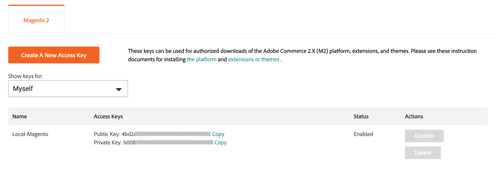

# Adobe Commerce Marketplace

[Adobe Commerce Marketplace][1] O é a loja de aplicativos que oferece aos comerciantes uma seleção de soluções com curadoria e fornece aos desenvolvedores qualificados as ferramentas, a plataforma e o local ideal para criar um negócio próspero. [!DNL Commerce Marketplace] O oferece uma seleção de extensões disponíveis gratuitamente e outras que estão à venda. As compras podem ser pagas com cartão de crédito ou [PayPal][2].

Todas as extensões disponíveis em [!DNL Commerce Marketplace] foram aprovados numa análise aprofundada. A variável [Programa de qualidade de extensão][3] (EQP) combina [!DNL Commerce] experiência, diretrizes de desenvolvimento e ferramentas de verificação para garantir que todas as extensões no Commerce Marketplace atendam aos padrões de codificação e às práticas recomendadas. O processo de revisão inclui uma verificação automatizada e uma revisão manual de controle de qualidade. Durante o processo, a estrutura e o código de cada extensão são examinados e testados em busca de evidências de infecção por vírus/malware e qualquer indicação de plágio. A revisão inclui um exame técnico aprofundado e uma verificação de sanidade realizada por um [!DNL Commerce] com foco na documentação, estrutura de codificação, desempenho, escalabilidade, segurança e compatibilidade com o [!DNL Commerce] principal.

Embora seja possível comprar extensões de outras fontes, somente as extensões que estão disponíveis em [!DNL Commerce Marketplace] são verificados por meio de ampla revisão técnica e de marketing dentro do Programa de qualidade de extensão.

## Recursos do aplicativo

Os desenvolvedores tradicionalmente usam o PHP para criar extensões em andamento para adicionar recursos, funcionalidades, serviços e integrações ao Adobe Commerce. Ao criar aplicativos com extensibilidade fora do processo, em vez de extensões, você pode evitar problemas de compatibilidade.

Os seguintes recursos fornecem um ponto de partida para que os novos participantes se familiarizem com os aplicativos:

### Recursos do Commerce

- [Configuração de eventos de E/S para o Adobe Commerce](https://developer.adobe.com/commerce/extensibility/events/)
- [Configuração de eventos para o Adobe Commerce](https://developer.adobe.com/commerce/extensibility/events/configure-commerce/)
- [Configuração do SDK da interface do administrador](https://developer.adobe.com/commerce/extensibility/admin-ui-sdk/)
- [Conversão de uma extensão em um aplicativo](https://developer.adobe.com/commerce/extensibility/app-development/#how-do-i-port-an-extension-into-an-app)

### Recursos do Construtor de aplicativos

- [Visão geral do Construtor de aplicativos Commerce](https://developer.adobe.com/commerce/extensibility/app-development/)
- [Configuração da malha de API para o Construtor de aplicativos do Adobe Developer](https://developer.adobe.com/graphql-mesh-gateway/gateway/getting-started/)
- [Implantar aplicativos do App Builder](https://developer.adobe.com/app-builder/docs/guides/deployment/)
- [CI/CD para aplicativos do App Builder](https://developer.adobe.com/app-builder/docs/guides/deployment/ci_cd_for_firefly_apps/)
- Introdução ao App Builder/Developer Console
   - [Introdução ao App Builder](https://developer.adobe.com/app-builder/docs/getting_started/)
   - [Noções básicas sobre projetos e espaços de trabalho](https://developer.adobe.com/app-builder/docs/resources/videos/exploring/projects-and-workspaces/)

## [!DNL Marketplace] credenciais

Antes de instalar uma extensão adquirida do [!DNL Commerce Marketplace], faça logon no [!DNL Commerce] e verifique se você tem uma chave de acesso ativa. Você pode entrar no seu [!DNL Commerce] conta no cabeçalho de [[!DNL Marketplace]][1] ou [Magento.com][6].

Sua chave de acesso é um conjunto de chaves públicas e privadas usadas para sincronizar sua [!DNL Commerce] instalação com o seu [!DNL Commerce] e verifique suas credenciais. Depois que sua conta for sincronizada, você deverá inserir sua chave privada sempre que instalar uma extensão ou um módulo do Commerce Marketplace ou atualizar sua [!DNL Commerce] instalação.

Você pode criar várias chaves de acesso para diferentes propósitos e ativá-las ou desativá-las conforme necessário. No entanto, você deve usar a mesma chave de acesso usada para instalar o [!DNL Commerce] software. Por exemplo, você não pode usar uma chave de acesso Magento Open Source para atualizar ou atualizar o Adobe Commerce, ou vice-versa. Você também não pode usar uma chave de acesso que pertença a outro usuário ou que seja de um [conta compartilhada](commerce-account-share.md).

### Criar uma chave de acesso

1. Faça logon no [!DNL Commerce] conta.

1. No _[!UICONTROL My Account]_escolha a **[!UICONTROL Marketplace]**guia.

1. No canto superior direito próximo ao seu nome, clique na seta para baixo e escolha **[!UICONTROL My Profile]**.

   ![Seu [!DNL Marketplace] perfil](./assets/marketplace-profile.png){width="600"}

1. No _[!UICONTROL Marketplace]_em_[!UICONTROL My Products]_, clique em **[!UICONTROL Access Keys]**, e siga um destes procedimentos:

   - Verifique se você já tem um conjunto de chaves de acesso para suas compras do Marketplace. É possível criar vários conjuntos de chaves de acesso para diferentes propósitos.

   {width="600"}

   - Clique em **[!UICONTROL Create a New Access Key]**. Insira um nome para o novo par de chaves e clique em **[!UICONTROL OK]**. Os caracteres válidos incluem caracteres maiúsculos e minúsculos e hifens em vez de espaços.

1. Quando terminar, clique em **[!UICONTROL OK]**.

   Sua nova chave de acesso está ativada e aparece na lista.

   Observe a _Copiar_ após cada chave pública e privada. Na próxima etapa, você copiará e colará esses valores para sincronizar o armazenamento com o Commerce Marketplace.

## Processo de instalação

>[!IMPORTANT]
>
>A partir do Adobe Commerce e do Magento Open Source 2.4.0, o Assistente de configuração da Web será removido e você deverá usar a linha de comando para [instalar](https://experienceleague.adobe.com/docs/commerce-operations/installation-guide/advanced.html) ou [atualização](https://experienceleague.adobe.com/docs/commerce-operations/upgrade-guide/implementation/perform-upgrade.html) sua instância. Este requisito também inclui [módulos](https://experienceleague.adobe.com/docs/commerce-operations/upgrade-guide/modules/upgrade.html) e [extensões](https://experienceleague.adobe.com/docs/commerce-operations/installation-guide/tutorials/extensions.html).

O processo de instalação do [!DNL Marketplace] compras é diferente para _no local_ instalações do Commerce do que as instalações hospedadas em [a arquitetura de nuvem do Adobe][4].

{width="600"}

## Suporte

Se precisar de ajuda com a instalação do ou com o uso de uma extensão, verifique primeiro na documentação que acompanha a extensão. Se não conseguir encontrar a resposta para sua pergunta, use as informações de contato na lista de extensões para entrar em contato diretamente com o desenvolvedor. Se o que você comprar no Marketplace não atender às suas necessidades, você poderá [solicitar reembolso](#refund-requests) no prazo de 25 dias a contar da data de compra. A Adobe revisa todas as solicitações de reembolso e (se aprovada) emite o reembolso apropriado. Para questões de suporte relacionadas ao Commerce Marketplace, consulte [[!DNL Marketplace] Centro de ajuda][5].

### Problemas de check-out

Os campos de endereço no perfil da conta devem ser preenchidos para fins de verificação no sistema de compras do Marketplace.

1. Adicione os campos de endereço no perfil da conta do Marketplace.
1. Salve o perfil atualizado.
1. Continue com o check-out.

### Problemas de logon

Problemas de logon normalmente estão relacionados a uma incompatibilidade entre sua MAGEID e o endereço de email no banco de dados da conta. Entre em contato com o Suporte do Marketplace para obter assistência.

>[!INFO]
>
>As compras de aplicativos e extensões não podem ser [transferido](#purchase-transfers) para uma nova conta.

### Perguntas sobre código aberto

A equipe de suporte do Marketplace resolve problemas relacionados à [commerce.adobe.com/](https://commercemarketplace.adobe.com/) e [commercedeveloper.adobe.com/](https://commercedeveloper.adobe.com/) somente sites. Faça perguntas diretas sobre o Magento Open Source para o [Fórum da comunidade](https://community.magento.com/) ou [entrar em contato com um parceiro](https://business.adobe.com/products/magento/partners.html) quem pode ajudar com o Magento Open Source.

### Solicitações de reembolso

Para solicitar um reembolso para uma compra no Marketplace, faça logon em sua conta e siga estas etapas:

1. Clique em [!UICONTROL **Meu perfil**] > [!UICONTROL **Histórico de compras**].
1. Localize a compra e clique em [!UICONTROL **Solicitar um reembolso**].
1. Preencha o formulário de ordem de reembolso.

O Suporte do Marketplace solicitará informações após a solicitação de reembolso ser gerada. A opção de reembolso está disponível por 25 dias após a data de compra. Consulte a [Contrato de cliente do Marketplace](https://www.adobe.com/legal/terms/enterprise-licensing/magento-legacy-terms.html).

### Faturas de ordem

É possível baixar NFFs de ordem na [!UICONTROL **Histórico de compras**] na sua conta do Marketplace. A fatura não fornece o IVA ou o endereço do vendedor porque não é um requisito do Marketplace neste momento.

Para baixar uma fatura de pedido para uma compra do Marketplace, faça logon em sua conta do Marketplace e siga estas etapas:

1. Clique em [!UICONTROL **Meu perfil**] > [!UICONTROL **Histórico de compras**].
1. Localize a compra.
1. Clique no ícone da impressora no canto superior direito do pedido.

### Transferências de compra

A equipe de suporte do Marketplace não pode transferir compras para uma conta diferente. Você deve comprar todos os aplicativos e extensões na conta principal do Commerce para evitar problemas de instalação e implantação. O Adobe Commerce tem direito a um identificador exclusivo. Como o Composer é usado para instalação, somente um conjunto de [chaves de acesso](#create-an-access-key) vinculada à conta principal. A única solução disponível é [solicitar reembolso](#refund-requests) na conta do Marketplace purchasing (se permitido pela política de reembolso do Adobe Commerce).

Você pode [compartilhar](commerce-account-share.md) uma instância do Commerce por meio da conta principal. O acesso compartilhado concede permissões especiais a uma conta subordinada de uma conta principal. O ponto de acesso compartilhado é gerado a partir da conta principal. A conta principal pode ser a conta qualificada da Commerce, a conta principal do comerciante ou uma conta compartilhada em uma organização.

Essas permissões especiais concedem o mesmo nível de acesso ao Adobe Commerce que o principal, no entanto, ele não é transferido para o Adobe Commerce Marketplace ou para o Portal do desenvolvedor. Isso significa que a compra de uma extensão de uma conta subordinada no Marketplace não pode ser compartilhada com a conta principal. O acesso compartilhado é uma rua unidirecional (conta principal a ser subordinada). Ele não funciona quando uma conta subordinada está tentando compartilhar de volta com a conta principal.

[1]: https://marketplace.magento.com/
[2]: https://www.paypal.com/us/home
[3]: https://developer.adobe.com/commerce/marketplace/guides/sellers/extension-quality-program/
[4]: https://www.adobe.com/commerce/magento/enterprise.html
[5]: https://marketplacesupport.magento.com/hc/en-us
[6]: https://business.adobe.com/products/magento/magento-commerce.html
