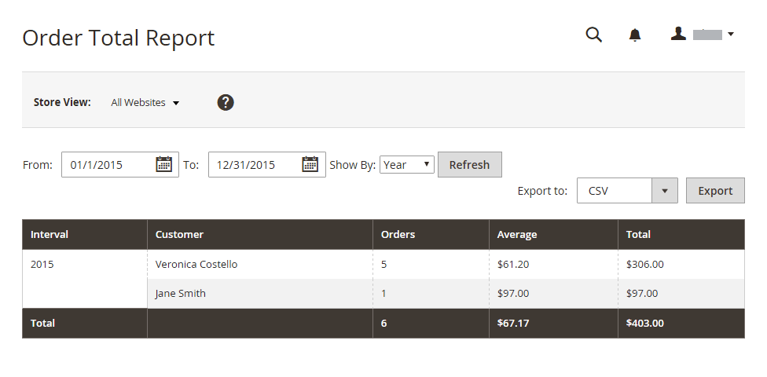

# Relatórios de cliente

Os relatórios do cliente fornecem informações sobre a atividade do cliente durante um período ou intervalo de datas especificado.

## [!UICONTROL Order Total Report]

A variável [!UICONTROL Order Total Report] mostra as ordens do cliente para um intervalo de tempo ou intervalo de datas especificado. O relatório inclui o número de pedidos por cliente, o valor médio de pedido e o valor total.

No _Admin_ barra lateral, vá para **[!UICONTROL Reports]** > _[!UICONTROL Customers]_>**[!UICONTROL Order Total]**.

{width="600"}

### Controles do Workspace

| Controle | Descrição |
|--- |--- |
| [!UICONTROL From / To] | Usado para definir uma pesquisa para os pedidos com base nas datas inicial e final. |
| [!UICONTROL Show By] | Define a granularidade da divisão do registro de pedido. Opções: `Month` / `Day` / `Year` |
| [!UICONTROL Refresh] | Atualiza a grade para os filtros especificados. |
| [!UICONTROL Export] | Exporta os registros selecionados como um arquivo CSV ou XML do Excel. |
| [!UICONTROL Scope] | Usado para definir o site ou armazenamento para o qual o relatório é gerado. |

{style="table-layout:auto"}

### Descrições da coluna

| Coluna | Descrição |
|--- |--- |
| [!UICONTROL Interval] | O intervalo total da ordem, por `Month` / `Day` / `Year`. |
| [!UICONTROL Customer] | O nome do cliente que fez os pedidos. |
| [!UICONTROL Orders] | O número de pedidos para o intervalo especificado. |
| [!UICONTROL Average] | Valor médio do pedido. |
| [!UICONTROL Total] | A soma de todas as ordens do período. |

{style="table-layout:auto"}

## [!UICONTROL Order Count Report]

A variável [!UICONTROL Order Count Report] mostra o número de pedidos por cliente para um intervalo de tempo ou intervalo de datas especificado. O relatório inclui o número de pedidos por cliente, o valor médio de pedido e o valor total.

No _Admin_ barra lateral, vá para **[!UICONTROL Reports]** > _[!UICONTROL Customers]_>**[!UICONTROL Order Count]**.

{width="600"}

### Controles do Workspace

| Controle | Descrição |
|--- |--- |
| [!UICONTROL From / To] | Usado para definir uma pesquisa para os pedidos com base nas datas inicial e final. |
| [!UICONTROL Show By] | Define a granularidade da divisão do registro de pedido. Opções: `Month` / `Day` / `Year` |
| [!UICONTROL Refresh] | Atualiza a grade para os filtros especificados. |
| [!UICONTROL Export] | Exporta os registros selecionados como um arquivo CSV ou XML do Excel. |
| [!UICONTROL Scope] | Usado para definir o site ou armazenamento para o qual o relatório é gerado. |

{style="table-layout:auto"}

### Descrições da coluna

| Coluna | Descrição |
|--- |--- |
| [!UICONTROL Interval] | O intervalo de contagem da ordem, por `Month` / `Day` / `Year`. |
| [!UICONTROL Customer] | O cliente que fez o pedido. |
| [!UICONTROL Orders] | O número de pedidos para o intervalo especificado. |
| [!UICONTROL Average] | Valor médio do pedido. |
| [!UICONTROL Total] | A soma de todas as ordens do período. |

{style="table-layout:auto"}

## [!UICONTROL New Accounts Report]

A variável [!UICONTROL New Accounts Report] mostra o número de novas contas de clientes abertas durante um intervalo de tempo ou intervalo de datas especificado.

No _Admin_ barra lateral, vá para **[!UICONTROL Reports]** > _[!UICONTROL Customers]_>**[!UICONTROL New]**.

{width="600"}

### Controles do Workspace

| Controle | Descrição |
|--- |--- |
| [!UICONTROL From / To] | Usado para definir uma pesquisa para as novas contas com base nas datas inicial e final. |
| [!UICONTROL Show By] | Define a granularidade da divisão do registro de pedido. Opções: mês/dia/ano |
| [!UICONTROL Refresh] | Atualiza a grade para os filtros especificados. |
| [!UICONTROL Export] | Exporta os registros selecionados como um arquivo CSV ou XML do Excel. |
| [!UICONTROL Scope] | Usado para definir o site ou armazenamento para o qual o relatório é gerado. |

{style="table-layout:auto"}

### Descrições da coluna

| Coluna | Descrição |
|--- |--- |
| [!UICONTROL Interval] | Intervalo de criação de novas contas, por mês/dia/ano. |
| [!UICONTROL New Accounts] | O número de novas contas criadas em um determinado intervalo. |

{style="table-layout:auto"}

## [!UICONTROL Customer Wish List Report]

 (somente Adobe Commerce)

A variável [!UICONTROL Customer Wish List Report] fornece informações sobre as listas de desejos do cliente.

No _Admin_ barra lateral, vá para **[!UICONTROL Reports]** > _[!UICONTROL Customers]_>**[!UICONTROL Wish Lists]**.

{width="600"}

### Controles do Workspace

| Controle | Descrição |
|--- |--- |
| [!UICONTROL Scope] | Usado para definir o site ou armazenamento para o qual o relatório é gerado. |
| [!UICONTROL Search] | Inicia uma pesquisa pelos parâmetros especificados. |
| [!UICONTROL Reset Filter] | Inicia uma redefinição de todos os parâmetros de pesquisa. |
| [!UICONTROL Per Page] | Define o número de registros exibidos em uma única página. |
| [!UICONTROL Export] | Exporta os registros selecionados como um arquivo CSV ou XML do Excel. |
| [!UICONTROL From / To] | Usado para definir uma pesquisa para as listas de desejos com base nas datas inicial e final. |
| [!UICONTROL Wishlist] | Inicia uma pesquisa da lista de desejos por nome. |
| [!UICONTROL Status] | O status da lista de desejos. Opções: `Private` / `Public` |
| [!UICONTROL Comment] | Inicia uma pesquisa por texto nos comentários da lista de desejos. |

{style="table-layout:auto"}

### Descrições da coluna

| Coluna | Descrição |
|--- |--- |
| [!UICONTROL Added] | Data em que a lista de desejos foi criada. |
| [!UICONTROL Customer] | Nome e sobrenome do cliente que criou a lista de desejos. |
| [!UICONTROL Wishlist] | Nome da lista de desejos. |
| [!UICONTROL Status] | O status da lista de desejos. Opções: `Private` / `Public` |
| [!UICONTROL Product] | Nome do produto adicionado à lista de desejos. |
| [!UICONTROL SKU] | SKU do produto adicionado à lista de desejos. |
| [!UICONTROL Comment] | O texto de comentário inserido quando a lista de desejos foi criada. |

{style="table-layout:auto"}

## [!UICONTROL Customer Segment Report]

 (somente Adobe Commerce)

A variável [!UICONTROL Customer Segment Report] O fornece informações sobre o número de clientes em cada segmento.

No _Admin_ barra lateral, vá para **[!UICONTROL Reports]** > _[!UICONTROL Customers]_>**[!UICONTROL Segments]**.

{width="600"}

### Controles do Workspace

| Controle | Descrição |
|--- |--- |
| [!UICONTROL Search] | Inicia uma pesquisa pelos parâmetros especificados. |
| [!UICONTROL Reset Filter] | Inicia uma redefinição de todos os parâmetros de pesquisa. |
| [!UICONTROL Action] | Inicia a exibição de segmentos por parâmetros. Opções: `Action` / `View Combined Report` |
| [!UICONTROL Per Page] | Define o número de registros exibidos em uma única página. |

{style="table-layout:auto"}

### Descrições da coluna

| Coluna | Descrição |
|--- |--- |
| [!UICONTROL ID] | Um identificador numérico exclusivo atribuído a cada segmento. |
| [!UICONTROL Segment] | Nome do segmento. |
| [!UICONTROL Status] | Status do segmento. Opções: `Active` / `Inactive` |
| [!UICONTROL Website] | Site ao qual o segmento é atribuído. |
| [!UICONTROL Customers] | Número de clientes atribuídos ao segmento. |

{style="table-layout:auto"}
