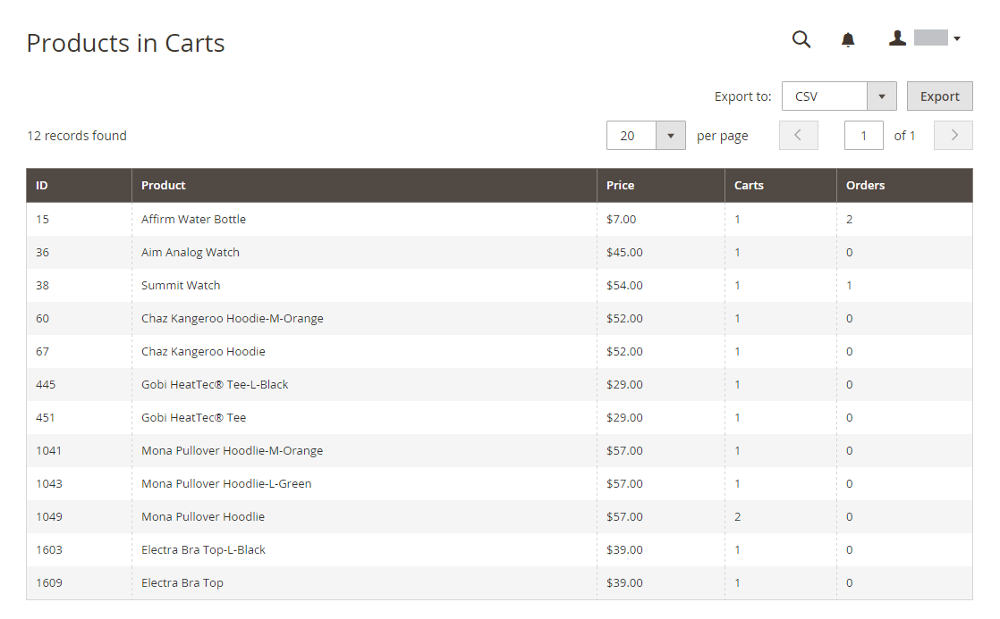

# Relatórios de marketing

Os relatórios de marketing fornecem informações sobre o status dos carrinhos de compras, o uso de termos de pesquisa e as transmissões de boletins informativos.

## [!UICONTROL Products in Cart]

A variável [!UICONTROL Products in Cart] Este relatório fornece uma lista de todos os produtos que estão atualmente nos carrinhos de compras. Inclui o nome e o preço de cada item, o número de carrinhos com o item e o número de vezes que cada item foi solicitado.

{width="600"}

## [!UICONTROL Search Terms Report]

A variável [Pesquisar termos](../catalog/search-terms.md#search-terms-report) O relatório de mostra o que seus clientes estão procurando em cada visualização de loja. O relatório inclui o número de itens correspondentes encontrados no catálogo e quantas vezes o termo de pesquisa foi usado.

{width="600"}

## [!UICONTROL Abandoned Carts]

A variável [!UICONTROL Abandoned Carts] O relatório lista todos os clientes registrados que abandonaram carrinhos que ainda não expiraram. O relatório inclui o nome do cliente e o endereço de email, o número de produtos no carrinho e o subtotal, a data de criação e a última atualização.

{width="600"}

## [!UICONTROL Newsletter Problems Report]

A variável [!UICONTROL Newsletter Problems Report] inclui informações sobre qualquer fila de informativos que não foi transmitida com êxito. O relatório inclui o nome de cada assinante, a data e o assunto da fila, além das informações sobre o erro.

{width="600"}
