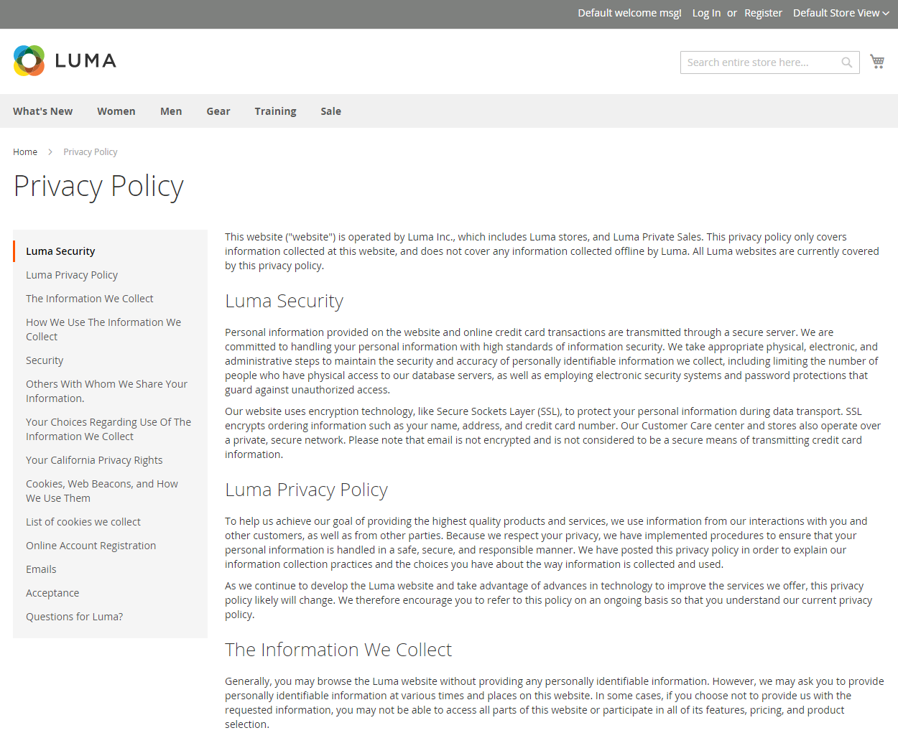

# Política de privacidade da loja

Sua loja inclui um exemplo de política de privacidade que deve ser atualizada com suas próprias informações. Sua política de privacidade deve descrever o tipo de informações coletadas por sua empresa e como elas são usadas. Ele também deve listar os nomes de arquivo dos [cookies](compliance-cookie-law.md#default-cookies) que são colocados nos computadores das pessoas que visitam sua loja. Quaisquer cookies adicionais associados a extensões e complementos de terceiros devem ser incluídos na lista.

## Dados pessoais

Há duas classificações amplamente aceitas de dados pessoais, que são comumente abreviadas como PI e PII. O exemplo de Política de privacidade nos dados de amostra do Luma se refere às Informações pessoais identificáveis (PII). Além disso, há inúmeras variações dessas definições que estão associadas a regulamentos legais de diferentes países, regiões e estados. As definições a seguir podem ser usadas para esta discussão geral:

### Informações pessoais (PI)

Qualquer informação que identifique ou possa ser usada razoavelmente para identificar direta ou indiretamente um indivíduo. As informações pessoais podem estar relacionadas a qualquer indivíduo, como cliente, empregador, fornecedor ou contratado.

### Informações pessoais identificáveis (PII)

Qualquer representação da informação que permita determinar a identidade de uma pessoa a quem se aplica a informação pode ser razoavelmente inferida por meios diretos ou indiretos. A PII é definida como informação que identifica diretamente um indivíduo (como nome, endereço, número de seguridade social ou outro número de identificação). Também são informações pelas quais uma agência pretende identificar indivíduos específicos com outros elementos de dados (identificação indireta). Esses elementos de dados podem incluir uma combinação de gênero, raça, data de nascimento, indicador geográfico e outros descritores. Além disso, inclui informações que permitem o contato físico ou online de um indivíduo específico é o mesmo que informações de identificação pessoal. Essas informações podem ser mantidas em papel, eletrônico ou em outra mídia.

{width="600" zoomable="yes"}

## Editar sua política de privacidade

>[!TIP]
>
>Os dados de amostra do Luma incluem um exemplo de política de privacidade que você pode modificar para uso.

1. Na barra lateral _Admin_, vá para **[!UICONTROL Content]** > _[!UICONTROL Elements]_>**[!UICONTROL Pages]**.

1. Na grade, localize **[!UICONTROL Privacy Policy]**. Em seguida, na coluna _[!UICONTROL Action]_, clique em **[!UICONTROL Select]**e escolha **[!UICONTROL Edit]**.

   >[!NOTE]
   >
   >Se você alterar a chave da URL da página da política de privacidade, também deverá criar uma [regravação personalizada da URL](../merchandising-promotions/url-rewrite-custom.md) para redirecionar o tráfego para a nova chave da URL. Caso contrário, o link no rodapé retornará `404 Page Not Found`.

1. Expanda a seção **[!UICONTROL Content]** e faça as alterações necessárias no conteúdo.

   Para saber mais sobre como usar as ferramentas de conteúdo da página, consulte [Concluir o conteúdo](../content-design/page-add.md#step-2-complete-the-content) no _Guia de Conteúdo e Design_.

   {width="600" zoomable="yes"}

1. Quando terminar, clique em **[!UICONTROL Save Page]**.
