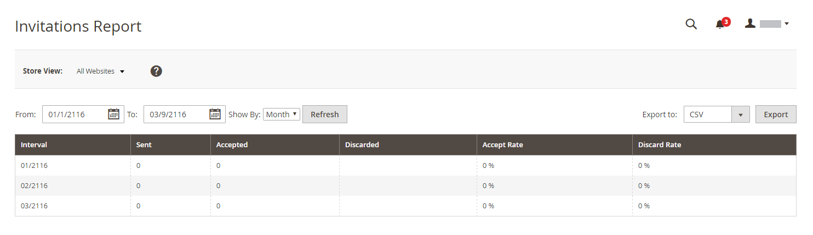

# Relatórios de vendas privadas

{{ee-feature}}

Os relatórios de vendas privadas fornecem informações sobre [eventos e vendas privadas](../merchandising-promotions/events-private-sales.md).

## [!UICONTROL Invitations Report]

O [!UICONTROL Invitations Report] mostra o número de [convites](../merchandising-promotions/invitations.md) enviados durante o período de tempo especificado, além do número de aceitos e descartados.

Na barra lateral _Admin_, vá para **[!UICONTROL Reports]** > _[!UICONTROL Private Sales]_>**[!UICONTROL Invitations]**.

{width="600"}

## [!UICONTROL Invited Customers Report]

O [!UICONTROL Invited Customers Report] mostra todos os clientes que receberam convites para uma venda ou evento particular. Inclui o nome e o endereço de email, o grupo de clientes, o número de convites enviados e o número de aceitos.

Na barra lateral _Admin_, vá para **[!UICONTROL Reports]** > _[!UICONTROL Private Sales]_>**[!UICONTROL Invited Customers]**.

{width="600"}

## [!UICONTROL Conversion Rate Report]

O [!UICONTROL Conversion Rate Report] mostra o número de convites enviados e aceitos, o número de convites que levaram a uma compra e a taxa de conversão como uma porcentagem.

Na barra lateral _Admin_, vá para **[!UICONTROL Reports]** > _[!UICONTROL Private Sales]_>**[!UICONTROL Conversions]**.

{width="600"}
