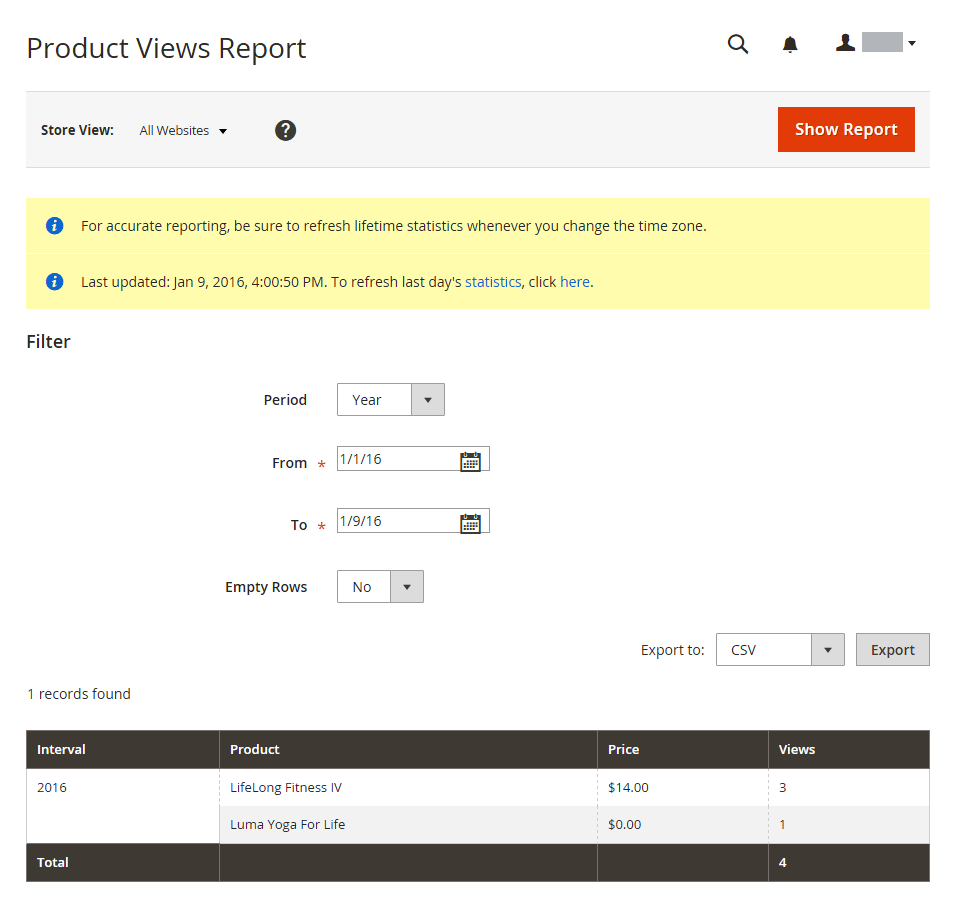

# Relatórios de produto

Os relatórios de produtos fornecem informações sobre produtos visualizados e solicitados, best-sellers, níveis de estoque e downloads.

## [!UICONTROL Product Views Report]

A variável [!UICONTROL Product Views Report] mostra os produtos que foram visualizados durante um intervalo de tempo ou intervalo de datas. O relatório inclui o nome do produto, o preço e o número de visualizações.

No _Admin_ barra lateral, vá para **[!UICONTROL Reports]** > _[!UICONTROL Products]_>**[!UICONTROL Views]**.

{width="600"}

## [!UICONTROL Bestsellers Report]

A variável [!UICONTROL Bestsellers Report] mostra os cinco mais vendidos durante um intervalo de tempo ou intervalo de datas. O relatório inclui o nome do produto, o preço e a quantidade solicitada.

No _Admin_ barra lateral, vá para **[!UICONTROL Reports]** > _[!UICONTROL Products]_>**[!UICONTROL Bestsellers]**.

{width="600"}

## [!UICONTROL Low Stock Report]

A variável [!UICONTROL Low Stock Report] lista todos os produtos com níveis de estoque dentro de um intervalo especificado. Com [[!DNL Inventory Management]](../inventory-management/introduction.md) ativado, o relatório inclui valores baixos de estoque por origem com o código-fonte listado.

No _Admin_ barra lateral, vá para **[!UICONTROL Reports]** > _[!UICONTROL Products]_>**[!UICONTROL Low Stock]**.

{width="600"}

## [!UICONTROL Ordered Products Report]

A variável [!UICONTROL Ordered Products Report] lista todos os produtos solicitados por um intervalo de tempo ou intervalo de datas especificado. O relatório inclui o nome do produto e a quantidade solicitada.

No _Admin_ barra lateral, vá para **[!UICONTROL Reports]** > _[!UICONTROL Products]_>**[!UICONTROL Ordered]**.

{width="600"}

## [!UICONTROL Downloads Report]

A variável [!UICONTROL Downloads Report] lista todos os downloads durante o intervalo de tempo ou intervalo de datas especificado. O relatório inclui o nome do produto, o link de download e a SKU, além do número de compras e downloads.

No _Admin_ barra lateral, vá para **[!UICONTROL Reports]** > _[!UICONTROL Products]_>**[!UICONTROL Downloaded]**.

{width="600"}
