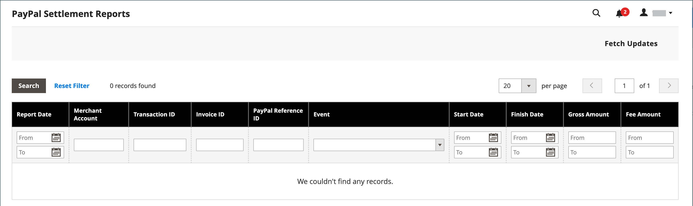

# Relatórios de vendas

A seleção de relatórios de vendas inclui Pedidos, Impostos, Faturados, Envio, Reembolsos, Cupons e Liquidação PayPal.

## Filtros de relatório

Você pode gerar um relatório de vendas para um site inteiro ou para uma loja. Os relatórios de vendas podem ser filtrados por intervalo de tempo, data e status.

{width="600"}

Para filtrar um relatório de vendas, defina as seguintes opções:

| Opção | Descrição |
|--- |--- |
| [!UICONTROL Date Used] | Define os dados a serem usados para o relatório. |
| [!UICONTROL Period] | O período para o qual os dados são usados: Dia/Mês/Ano. |
| [!UICONTROL From/To] | Usado para definir dados de pesquisa por data de início e término. |
| [!UICONTROL Order Status] | Indica o status do pedido |
| [!UICONTROL Empty Rows] | Indica se devem ser adicionadas linhas em branco ao relatório. |

## [!UICONTROL Orders Report]

O [!UICONTROL Orders Report] inclui o número de pedidos feitos e cancelados, com totais de vendas, valores faturados, reembolsados, impostos coletados, frete cobrado e descontos.

1. Na barra lateral _Admin_, vá para **[!UICONTROL Reports]** > _[!UICONTROL Sales]_>**[!UICONTROL Orders]**.

1. Na seção **[!UICONTROL Filter]**, selecione as opções do período de relatório e o status do pedido usado para preencher o relatório.

1. Clique em **[!UICONTROL Show Report]**.

{width="600"}

## [!UICONTROL Tax Report]

O [!UICONTROL Tax Report] inclui a regra de imposto aplicada, a alíquota do imposto, o número de pedidos e o valor do imposto cobrado.

1. Na barra lateral _Admin_, vá para **[!UICONTROL Reports]** > _[!UICONTROL Sales]_>**[!UICONTROL Tax]**.

1. Na seção **[!UICONTROL Filter]**, selecione as opções do período de relatório e o status do pedido usado para preencher o relatório.

1. Clique em **[!UICONTROL Show Report]**.

{width="600"}

## [!UICONTROL Invoice Report]

O [!UICONTROL Invoice Report] inclui o número de pedidos e faturas durante o período de tempo, com valores faturados, pagos e não pagos.

1. Na barra lateral _Admin_, vá para **[!UICONTROL Reports]** > _[!UICONTROL Sales]_>**[!UICONTROL Invoiced]**.

1. Na seção **[!UICONTROL Filter]**, selecione as opções do período de relatório e o status do pedido usado para preencher o relatório.

1. Clique em **[!UICONTROL Show Report]**.

{width="600"}

## [!UICONTROL Shipping Report]

O [!UICONTROL Shipping Report] inclui o número de pedidos da transportadora ou o método de envio usado, incluindo valores para o total de vendas e o total de envio.

1. Na barra lateral _Admin_, vá para **[!UICONTROL Reports]** > _[!UICONTROL Sales]_>**[!UICONTROL Shipping]**.

1. Na seção **[!UICONTROL Filter]**, selecione as opções do período de relatório e o status do pedido usado para preencher o relatório.

1. Clique em **[!UICONTROL Show Report]**.

{width="600"}

## [!UICONTROL Refunds Report]

O [!UICONTROL Refunds Report] inclui o número de pedidos reembolsados e o valor total reembolsado online e offline.

1. Na barra lateral _Admin_, vá para **[!UICONTROL Reports]** > _[!UICONTROL Sales]_>**[!UICONTROL Refunds]**.

1. Na seção **[!UICONTROL Filter]**, selecione as opções do período de relatório e o status do pedido usado para preencher o relatório.

1. Clique em **[!UICONTROL Show Report]**.

{width="600"}

## [!UICONTROL Coupons Report]

O [!UICONTROL Coupons Report] inclui cada código de cupom usado durante o intervalo de tempo especificado, a regra de preço relacionada e o número de vezes usado, com totais e subtotais para vendas e descontos.

1. Na barra lateral _Admin_, vá para **[!UICONTROL Reports]** > _[!UICONTROL Sales]_>**[!UICONTROL Coupons]**.

1. Na seção **[!UICONTROL Filter]**, selecione as opções do período de relatório e o status do pedido usado para preencher o relatório.

1. Clique em **[!UICONTROL Show Report]**.

Para obter mais informações sobre como usar o [!UICONTROL Coupons Report] para coletar dados para suas campanhas promocionais, consulte [Relatórios de cupons](../merchandising-promotions/price-rules-cart-coupon.md#coupons-report) no _Guia de Merchandising e Promoções_.

<!---  need coupon data  -->

## [!UICONTROL PayPal Settlement Reports]

A página [Relatórios de Liquidação do PayPal] inclui o tipo de evento, como uma transação de cartão de débito, as datas de início e término, o valor bruto e as taxas relacionadas. O relatório pode ser atualizado automaticamente com os dados mais atuais do PayPal. Há opções de filtro para intervalo de datas, conta de comerciante, ID de transação, ID de fatura ou ID de referência do PayPal.

Na barra lateral _Admin_, vá para **[!UICONTROL Reports]** > _[!UICONTROL Sales]_>**[!UICONTROL PayPal Settlement]**.

{width="600"}

Para obter mais informações sobre como usar o [!UICONTROL PayPal Settlement Reports] para recuperar informações sobre cada transação do PayPal que afeta a liquidação de fundos, consulte [Relatórios de Liquidação do PayPal](../stores-purchase/paypal-settlement-reports.md) no _Guia da Experiência de Compras e Lojas_.

## [!UICONTROL Braintree Settlement Report]

O Relatório de Liquidação do [Braintree](../stores-purchase/braintree.md) pode ser filtrado de acordo com a data de criação, o valor, o status, o tipo de transação, o tipo de pagamento, a ID da transação, a ID do pedido, a ID de pagamento do PayPal, o tipo, a ID da conta do comerciante ou a ID do lote de liquidação. O relatório contém a ID da transação, a ID do pedido, a ID do pagamento do PayPal, o tipo, a data de criação, o valor, o código de liquidação, o status, o texto da resposta da liquidação, as IDs de reembolso, a ID da conta do comerciante, a ID do lote de liquidação e a moeda.

Na barra lateral _Admin_, vá para **[!UICONTROL Reports]** > _[!UICONTROL Sales]_>**[!UICONTROL Braintree Settlement]**.

<!---  need a Braintree connection to update report screen -->

## Exportar relatórios

1. Para exportar, selecione o tipo de arquivo: `Excel XML` ou `CSV`

1. Clique em **[!UICONTROL Export]**.

## Atualizar estatísticas

[!BADGE Somente PaaS]{type=Informative url="https://experienceleague.adobe.com/pt-br/docs/commerce/user-guides/product-solutions" tooltip="Aplica-se somente a projetos do Adobe Commerce na nuvem (infraestrutura do PaaS gerenciada pela Adobe) e a projetos locais."}

Para reduzir o impacto no desempenho da geração de relatórios de vendas, o [!DNL Commerce] calcula e armazena as estatísticas necessárias para cada relatório. Em vez de recalcular as estatísticas sempre que um relatório for gerado, as estatísticas armazenadas serão usadas, a menos que você atualize as estatísticas. Para incluir os dados mais recentes, as estatísticas do relatório devem ser atualizadas antes de um relatório de vendas ser gerado.

{width="700"}

1. Na barra lateral _Admin_, vá para **[!UICONTROL Reports]** > _[!UICONTROL Statistics]_>**[!UICONTROL Refresh Statistics]**.

1. Na lista, marque a caixa de seleção para cada relatório a ser atualizado.

1. Defina o controle **[!UICONTROL Actions]** como um dos seguintes:

   - `Refresh Lifetime Statistics`
   - `Refresh Statistics for the Last Day`

1. Clique em **[!UICONTROL Submit]**.
