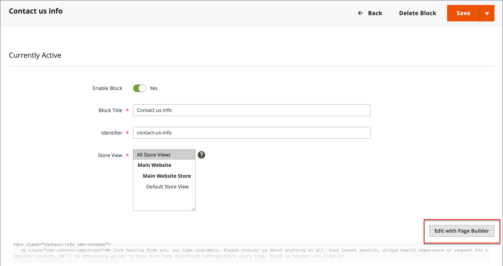

# Detalhes da loja

As informações básicas da loja incluem o nome e o endereço da loja, o número de telefone e o endereço de email que aparecem nas mensagens de email, faturas e outras comunicações enviadas aos clientes.

{width="900" zoomable="yes"}

## [!UICONTROL Store Information]

A seção _[!UICONTROL Store Information]_&#x200B;fornece as informações básicas que aparecem nos documentos de vendas e em outras comunicações.

1. Na barra lateral _Admin_, vá para **[!UICONTROL Stores]** > _[!UICONTROL Settings]_>**[!UICONTROL Configuration]**.

1. Em **[!UICONTROL General]**, no painel de navegação esquerdo, escolha **[!UICONTROL General]**.

1. Expandir  a seção **[!UICONTROL Store Information]**.

   {width="700"}

1. Defina as opções de acordo com os detalhes da loja:

   - Digite o **[!UICONTROL Store Name]** que você deseja usar em todas as comunicações.

   - Insira o **[!UICONTROL Store Phone Number]**, formatado conforme você quer que ele seja exibido.

   - Para **[!UICONTROL Store Hours of Operation]**, insira o horário comercial da sua loja. Por exemplo: `Mon - Fri, 9-5, Sat 9-noon PST`.

   - Selecione o **[!UICONTROL Country]** onde sua empresa está localizada.

   - Selecione o **[!UICONTROL Region/State]** com o país.

   - Insira o **[!UICONTROL Store Address]**. Se o endereço for longo, continue o endereço na **Linha de Endereço de Armazenamento 2**.

   - Se aplicável, insira o **[!UICONTROL VAT Number]** do seu armazenamento.

     Para verificar o número, clique no botão **[!UICONTROL Validate VAT Number]**. Para saber mais, consulte [Validação de ID de IVA](../stores-purchase/vat.md#vat-id-validation).

1. Quando terminar, clique em **[!UICONTROL Save Config]**.

Para obter mais informações sobre as opções de configuração de informações de armazenamento, consulte o [_Guia de Referência de Configuração_](../configuration-reference/general/general.md#store-information).

## [!UICONTROL Locale Options]

O local determina o número de configurações que são usadas em todo o armazenamento. Alguns deles são:

- Idioma
- País
- Alíquota de imposto
- Moeda
- Preço
- Formato de número

A configuração de local determina o fuso horário e o idioma usados para cada loja e identifica os dias da semana de trabalho na área.

1. Na barra lateral _Admin_, vá para **[!UICONTROL Stores]** > _[!UICONTROL Settings]_>**[!UICONTROL Configuration]**.

1. No painel de navegação esquerdo, em **[!UICONTROL General]**, escolha **[!UICONTROL General]**.

1. Expandir  a seção **[!UICONTROL Locale Options]**.

   {width="700"}

1. Selecione seu **[!UICONTROL Timezone]** na lista.

1. Defina **[!UICONTROL Locale]** para o idioma do armazenamento.

1. Defina **[!UICONTROL Weight Unit]** como a unidade de medida que é normalmente usada para remessas da sua localidade.

1. Ajuste **[!UICONTROL First Day of the Week]** para o dia que é considerado o primeiro dia da semana na sua área.

1. Na lista **[!UICONTROL Weekend Days]**, selecione os dias que caem em um fim de semana na sua área.

   Para selecionar vários dias, mantenha pressionada a tecla Ctrl (PC) ou a tecla Command (Mac) e clique em cada item.

1. Quando terminar, clique em **[!UICONTROL Save Config]**.

Para obter mais informações sobre as opções de configuração de localidade, consulte o [Guia de Referência de Configuração](../configuration-reference/general/general.md#locale-options).

## [!UICONTROL State Options]

Em muitos países, o estado, a província ou a região é uma parte obrigatória de um endereço postal. As informações são usadas para envio e informações de faturamento, para calcular alíquotas de imposto e assim por diante. Para países onde o estado não é obrigatório, o campo pode ser omitido totalmente do endereço ou incluído como um campo opcional.

Como os formatos de endereço padrão variam de um país para outro, você também pode editar o modelo usado para formatar o endereço para faturas, guias de remessa e etiquetas de remessa.

1. Na barra lateral _Admin_, vá para **[!UICONTROL Stores]** > _[!UICONTROL Settings]_>**[!UICONTROL Configuration]**.

1. Em **[!UICONTROL General]**, no painel de navegação esquerdo, escolha **[!UICONTROL General]**.

1. Expandir  a seção **[!UICONTROL State Options]**.

   {width="700"}

1. Use a lista **[!UICONTROL State is required for]** para selecionar cada país onde Região/Estado é uma entrada necessária.

1. Defina **[!UICONTROL Allow to Choose State if it is Optional for Country]** como um dos seguintes:

   `Yes` - Em países onde o campo de estado não é obrigatório, inclui o campo Estado como uma entrada opcional.

   `No` - Em países onde o campo de estado não é obrigatório, omite o campo Estado.

1. Quando terminar, clique em **[!UICONTROL Save Config]**.

Para obter mais informações sobre as opções de configuração de estado, consulte o [Guia de Referência de Configuração](../configuration-reference/general/general.md#state-options).

## [!UICONTROL Country Options]

As opções de país identificam o país onde sua empresa está localizada e os países dos quais você aceita o pagamento.

### Definir as opções de país para sua loja

1. Na barra lateral _Admin_, vá para **[!UICONTROL Stores]** > _[!UICONTROL Settings]_>**[!UICONTROL Configuration]**.

1. No painel de navegação esquerdo, em **[!UICONTROL General]**, escolha **[!UICONTROL General]**.

1. Expandir  a seção **[!UICONTROL Country Options]**.

   >[!NOTE]
   >
   >Se necessário, desmarque a caixa de seleção **[!UICONTROL Use system value]** para cada configuração que você deseja alterar.

   {width="700"}

1. Escolha o **[!UICONTROL Default Country]** onde sua empresa está localizada.

1. Na lista **[!UICONTROL Allow Countries]**, selecione cada país do qual você aceita pedidos.

   Por padrão, todos os países na lista são selecionados. Para selecionar vários países, mantenha pressionada a tecla Ctrl (PC) ou a tecla Command (Mac) e clique em cada item.

1. Use a lista **[!UICONTROL Zip/Postal Code is Optional for]** para selecionar cada país onde você conduz os negócios que não exigem a inclusão de um CEP ou código postal como parte do endereço.

1. Na lista **[!UICONTROL European Union Countries]**, selecione cada país da UE onde você faz negócios.

   Por padrão, todos os países da UE são selecionados. Para selecionar os países necessários, mantenha pressionada a tecla Ctrl (PC) ou a tecla Command (Mac) e clique em cada item.

1. Na lista **[!UICONTROL Top Destinations]**, selecione os principais países que deseja vender.

1. Quando terminar, clique em **[!UICONTROL Save Config]**.

### Definir as opções de país/região para o método de entrega específico

Você também pode configurar o envio para países específicos para cada [método de entrega](../stores-purchase/delivery.md) disponível (UPS, FedEx, etc).

1. Na barra lateral _Admin_, vá para **[!UICONTROL Stores]** > _[!UICONTROL Settings]_>**[!UICONTROL Configuration]**.

1. No painel de navegação esquerdo, expanda **[!UICONTROL Sales]** e escolha **[!UICONTROL Delivery Methods]**.

1. Selecione a transportadora à qual deseja aplicar países específicos.

1. Para **[!UICONTROL Ship to Applicable Countries]**, desmarque a caixa de seleção **[!UICONTROL Use system value]** e selecione a opção **[!UICONTROL Specific Countries]**.

1. Na lista **[!UICONTROL Top Destinations]**, selecione os países principais que você deseja enviar.

   {width="700"}

1. Quando terminar, clique em **[!UICONTROL Save Config]**.

### Solução de problemas de recursos

Para obter ajuda com a solução de problemas de configuração do país, consulte os seguintes artigos da Base de Dados de Conhecimento de Suporte do [!DNL Commerce]:

- [Como adicionar um país](https://experienceleague.adobe.com/docs/commerce-knowledge-base/kb/how-to/how-to-add-a-new-country-to-magento-2.html)

## [!UICONTROL Merchant Location]

[!BADGE Somente PaaS]{type=Informative url="https://experienceleague.adobe.com/en/docs/commerce/user-guides/product-solutions" tooltip="Aplica-se somente a projetos do Adobe Commerce na nuvem (infraestrutura do PaaS gerenciada pela Adobe) e a projetos locais."}

A configuração Localização do Comerciante é usada para configurar [métodos de pagamento](../stores-purchase/payments.md). Se não houver valor para esta configuração, a configuração [País Padrão](#uicontrol-country-options) será usada.

1. Na barra lateral _Admin_, vá para **[!UICONTROL Stores]** > _[!UICONTROL Settings]_>**[!UICONTROL Configuration]**.

1. No painel de navegação esquerdo, expanda **[!UICONTROL Sales]** e escolha **[!UICONTROL Payment Methods]**.

1. Expanda o  a seção **Localização do Comerciante** e escolha o **[!UICONTROL Merchant Country]**.

   {width="600"}

1. Quando terminar, clique em **[!UICONTROL Save Config]**.

Para obter mais informações sobre as opções de configuração de Métodos de Pagamento, consulte o [Guia de Referência de Configuração](../configuration-reference/sales/payment-methods.md).

## Moeda

Configuração de Moeda - Define a [moeda](../stores-purchase/currency-configuration.md) base e quaisquer moedas adicionais aceitas como pagamento. Também estabelece a conexão de importação e o agendamento usados para atualizar automaticamente as taxas de câmbio.

Símbolos de Moeda - Define os [símbolos de moeda](../stores-purchase/currency-configuration.md#step-5-customize-currency-symbols-optional) que aparecem nos preços dos produtos e nos documentos de venda, como pedidos e faturas. O [!DNL Commerce] oferece suporte a moedas de mais de 200 países no mundo todo.

Atualizando Taxas de Moeda - As taxas de moeda podem ser [atualizadas](../stores-purchase/currency-update.md) manualmente ou importadas para seu armazenamento conforme necessário ou de acordo com um agendamento predefinido.

Seletor de moedas - Se várias moedas estiverem disponíveis, o [seletor de moedas](../stores-purchase/currency.md) estará disponível no cabeçalho do armazenamento.

## [!UICONTROL Store Email Addresses]

Você pode ter até cinco endereços de email diferentes para representar funções ou departamentos distintos para cada loja ou visualização. Além das seguintes identidades de email predefinidas, há algumas identidades personalizadas que você pode configurar de acordo com suas necessidades.

- Contato geral
- Representante de Vendas
- Suporte ao cliente

Cada identidade e seu endereço de email associado podem ser associados a mensagens de email automatizadas específicas e aparecem como remetentes de mensagens de email enviadas da sua loja.

### Etapa 1: configurar os endereços de email do seu domínio

Antes de configurar endereços de email para o armazenamento, cada um deve ser configurado como um endereço de email válido para o seu domínio. Para criar cada endereço de email necessário, siga as instruções do administrador do servidor ou do provedor de hospedagem de email.

### Etapa 2: definir o URL de base para links gerados

[!BADGE Somente SaaS]{type=Positive url="https://experienceleague.adobe.com/en/docs/commerce/user-guides/product-solutions" tooltip="Aplicável somente a projetos do Adobe Commerce as a Cloud Service (infraestrutura SaaS gerenciada pela Adobe)."}

Alguns emails voltados para o cliente incluem links para a loja, como aqueles que ajudam os clientes a redefinir suas senhas. Para garantir que os links para a loja funcionem, você deve definir a URL base para sua loja.

1. Na barra lateral _Admin_, vá para **[!UICONTROL Stores]** > _[!UICONTROL Settings]_>**[!UICONTROL Configuration]**.

1. Em **[!UICONTROL General]**, no painel de navegação esquerdo, escolha **[!UICONTROL Store Email Addresses]**.

1. Na seção **[!UICONTROL General]** do campo **[!UICONTROL Storefront Base URL]**, insira a URL raiz do seu armazenamento, como `https://www.example.com/`. O URL deve terminar com uma barra.

   {width="600"}

### Etapa 3: configurar os endereços de email da sua loja

1. Na barra lateral _Admin_, vá para **[!UICONTROL Stores]** > _[!UICONTROL Settings]_>**[!UICONTROL Configuration]**.

1. Em **[!UICONTROL General]**, no painel de navegação esquerdo, escolha **[!UICONTROL Store Email Addresses]**.

1. Expanda  a seção **[!UICONTROL General Contact]** e faça o seguinte:

   {width="600"}

   - Para **[!UICONTROL Sender Name]**, insira o nome da pessoa associada à identidade de Contato Geral para ser exibida como remetente de qualquer mensagem de email.

   - Para **[!UICONTROL Sender Email]**, insira o endereço de email associado.

1. Repita esse processo para cada endereço de email de armazenamento que você planeja usar.

1. Quando terminar, clique em **[!UICONTROL Save Config]**.

### Etapa 4: atualizar a configuração de email de vendas

Se você usar endereços de email personalizados, atualize a configuração de todas as mensagens de email relacionadas para que a identidade correta apareça como remetente.

1. No painel de navegação esquerdo, expanda **[!UICONTROL Sales]** e escolha **[!UICONTROL Sales Emails]**.

   A página tem uma seção separada para cada um dos itens a seguir:

   - Pedido e comentários do pedido
   - Fatura e comentários da fatura
   - Comentários da Remessa e da Remessa
   - Aviso de Crédito e Comentários do Aviso de Crédito
   - RMA, Autorização RMA, Comentários do Administrador RMA e Comentários do Cliente RMA  (somente Adobe Commerce)

1. A partir de **[!UICONTROL Order]**, expanda a seção para cada mensagem e verifique se o remetente correto está selecionado.

   {width="600"}

1. Quando terminar, clique em **[!UICONTROL Save Config]**.

Para obter mais informações sobre as opções de configuração de emails de vendas, consulte o [_Guia de Referência de Configuração_](../configuration-reference/sales/sales-emails.md).

## Formulário Fale Conosco

O link _Fale Conosco_ no rodapé da loja é uma maneira fácil para os clientes manterem contato com você. Os clientes podem preencher o formulário para enviar uma mensagem à sua loja. Uma instalação padrão do [!DNL Commerce] exibe o formulário padrão _Fale Conosco_. Depois de enviar o formulário, uma mensagem de agradecimento é exibida

É importante entender que o formulário padrão Fale conosco é renderizado diretamente do código, em vez de ser renderizado a partir de uma página do CMS.

{width="700"}

O rodapé da loja inclui um link para a página Fale Conosco disponível em toda a loja.

{width="700"}

Os dados de amostra do Luma incluem informações adicionais na página Fale conosco, que demonstra como você pode personalizar a página da sua loja.

{width="700"}

### Configurar o formulário de contato

1. Na barra lateral _Admin_, vá para **[!UICONTROL Stores]** > _[!UICONTROL Settings]_>**[!UICONTROL Configuration]**.

1. No painel de navegação esquerdo, em **[!UICONTROL General]**, escolha **[!UICONTROL Contacts]**.

1. Expanda  a seção **[!UICONTROL Contact Us]** e defina **[!UICONTROL Enable Contact Us]** como `Yes`.

   {width="600"}

1. Expandir  a seção **[!UICONTROL Email Options]** e definir as opções de contato de email:

   {width="600"}

   - Para **[!UICONTROL Send Emails to]**, insira o endereço de email para o qual as mensagens do formulário Fale Conosco são enviadas.

   - Defina **[!UICONTROL Email Sender]** para a identidade de armazenamento que aparece como remetente da mensagem do formulário Fale Conosco. Por exemplo: Email personalizado 2.

   - Defina **[!UICONTROL Email Template]** como o modelo usado para mensagens enviadas do formulário Fale Conosco.

1. Quando terminar, clique em **[!UICONTROL Save Config]**.

### Personalizar o conteúdo

Você pode personalizar o conteúdo no formulário _Contate-nos_ para atender às necessidades da sua loja e das políticas de atendimento ao cliente.

### Método 1: utilização de dados de amostra

Os dados de amostra do Luma incluem um bloco _Informações para contato_ que pode ser personalizado para sua loja. O `contact-us-info` [bloco](../content-design/blocks.md) pode ser facilmente modificado para adicionar seu próprio conteúdo à página Fale Conosco.

1. Na barra lateral _Admin_, vá para **[!UICONTROL Content]** > _[!UICONTROL Elements]_>**[!UICONTROL Blocks]**.

1. Localize o bloco **[!UICONTROL Contact Us Info]** na lista e abra-o no modo **[!UICONTROL Edit]**.

   {width="700"}

1. Na parte inferior da página de bloqueio, clique em **[!UICONTROL Edit with Page Builder]**.

   {width="700"}

   >[!NOTE]
   >
   >Se você tiver o [[!DNL Page Builder] desabilitado](../page-builder/setup.md#disable-dnl-page-builder), poderá usar a [barra de ferramentas](../content-design/editor.md) do editor para formatar o texto e adicionar [imagens](../content-design/editor-insert-image.md) e [links](../content-design/editor-insert-link.md).

1. Passe o mouse sobre o contêiner HTML para exibir a caixa de ferramentas e escolher o ícone _Configurações_ (  ).

1. Edite o código HTML de acordo com as informações de contato da sua loja e clique em **[!UICONTROL Save]**.

   {width="700"}

1. Saia do estágio [!DNL Page Builder] e clique em **[!UICONTROL Save Block]**.

### Método 2: sem dados de amostra

>[!IMPORTANT]
>
>A partir da versão 2.4.0, o formulário de contato não poderá mais chamar dentro de um bloco do CMS ou de uma página do CMS. Toda personalização do formulário de contato deve ser feita usando o xml de layout ou modelos de tema personalizados.

Por padrão, os compradores acessam o formulário de contato usando o _link de contato_ no rodapé das páginas de frente da loja. Para obter mais informações sobre como personalizar a página de contato, consulte o [Guia do Desenvolvedor de Front-end][theme-guide].

[theme-guide]: https://developer.adobe.com/commerce/frontend-core/guide/themes/
