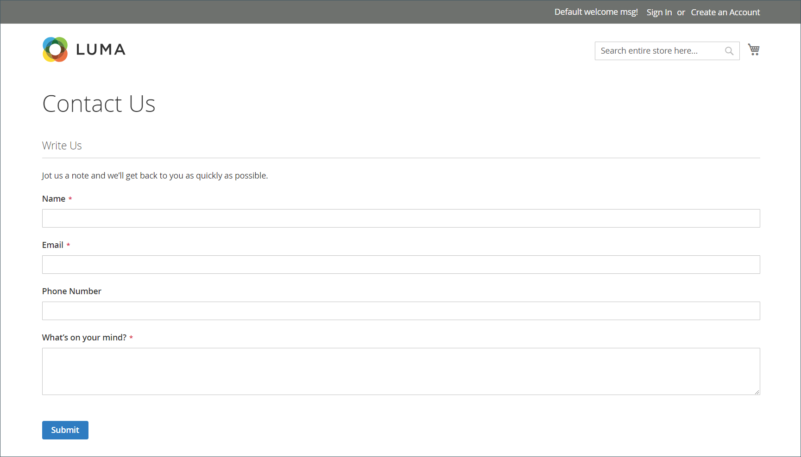
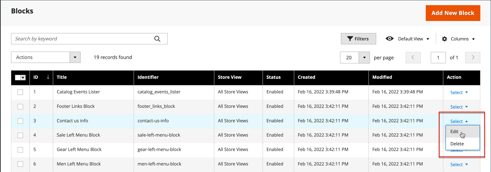

# Detalhes da loja

As informações básicas da loja incluem o nome e o endereço da loja, o número de telefone e o endereço de email que aparecem nas mensagens de email, faturas e outras comunicações enviadas aos clientes.

{width="900" zoomable="yes"}

## [!UICONTROL Store Information]

A variável _[!UICONTROL Store Information]_fornece as informações básicas que aparecem nos documentos de vendas e em outras comunicações.

1. No _Admin_ barra lateral, vá para **[!UICONTROL Stores]** > _[!UICONTROL Settings]_>**[!UICONTROL Configuration]**.

1. Em **[!UICONTROL General]** no painel de navegação esquerdo, escolha **[!UICONTROL General]**.

1. Expandir  o **[!UICONTROL Store Information]** seção.

   {width="700"}

1. Defina as opções de acordo com os detalhes da loja:

   - Insira o **[!UICONTROL Store Name]** que você deseja usar em todas as comunicações.

   - Insira o **[!UICONTROL Store Phone Number]**, formatado conforme você quer que ele seja exibido.

   - Para **[!UICONTROL Store Hours of Operation]**, insira o horário de funcionamento da loja. Por exemplo: `Mon - Fri, 9-5, Sat 9-noon PST`.

   - Selecione o **[!UICONTROL Country]** onde sua empresa está localizada.

   - Selecione o **[!UICONTROL Region/State]** com o país.

   - Insira o **[!UICONTROL Store Address]**. Se o endereço for longo, continue o endereço em **Linha de Endereço 2 da Loja**.

   - Se aplicável, insira o **[!UICONTROL VAT Number]** da sua loja.

     Para verificar o número, clique no link **[!UICONTROL Validate VAT Number]** botão. Para saber mais, consulte [Validação de ID de IVA](../stores-purchase/vat.md#vat-id-validation).

1. Quando terminar, clique em **[!UICONTROL Save Config]**.

Para obter mais informações sobre as opções de configuração de informações da loja, consulte a seção [_Guia de referência de configuração_](../configuration-reference/general/general.md#store-information).

## [!UICONTROL Locale Options]

O local determina o número de configurações que são usadas em todo o armazenamento. Alguns deles são:

- Idioma
- País
- Alíquota de imposto
- Moeda
- Preço
- Formato de número

A configuração de local determina o fuso horário e o idioma usados para cada loja e identifica os dias da semana de trabalho na área.

1. No _Admin_ barra lateral, vá para **[!UICONTROL Stores]** > _[!UICONTROL Settings]_>**[!UICONTROL Configuration]**.

1. No painel de navegação esquerdo, em **[!UICONTROL General]**, escolha **[!UICONTROL General]**.

1. Expandir  o **[!UICONTROL Locale Options]** seção.

   {width="700"}

1. Selecione o **[!UICONTROL Timezone]** da lista.

1. Definir **[!UICONTROL Locale]** para o idioma da loja.

1. Definir **[!UICONTROL Weight Unit]** para a unidade de medida normalmente usada para remessas do seu local.

1. Definir **[!UICONTROL First Day of the Week]** ao dia considerado o primeiro dia da semana na área.

1. No **[!UICONTROL Weekend Days]** selecione os dias que caem em um fim de semana na sua área.

   Para selecionar vários dias, mantenha pressionada a tecla Ctrl (PC) ou a tecla Command (Mac) e clique em cada item.

1. Quando terminar, clique em **[!UICONTROL Save Config]**.

Para obter mais informações sobre as opções de configuração de local, consulte a [Guia de referência de configuração](../configuration-reference/general/general.md#locale-options).

## [!UICONTROL State Options]

Em muitos países, o estado, a província ou a região é uma parte obrigatória de um endereço postal. As informações são usadas para envio e informações de faturamento, para calcular alíquotas de imposto e assim por diante. Para países onde o estado não é obrigatório, o campo pode ser omitido totalmente do endereço ou incluído como um campo opcional.

Como os formatos de endereço padrão variam de um país para outro, você também pode editar o modelo usado para formatar o endereço para faturas, guias de remessa e etiquetas de remessa.

1. No _Admin_ barra lateral, vá para **[!UICONTROL Stores]** > _[!UICONTROL Settings]_>**[!UICONTROL Configuration]**.

1. Em **[!UICONTROL General]** no painel de navegação esquerdo, escolha **[!UICONTROL General]**.

1. Expandir  o **[!UICONTROL State Options]** seção.

   {width="700"}

1. Use o **[!UICONTROL State is required for]** para selecionar cada país onde a Região/Estado é uma entrada obrigatória.

1. Definir **[!UICONTROL Allow to Choose State if it is Optional for Country]** a um dos seguintes:

   `Yes` - Em países onde o campo State não é obrigatório, inclui o campo State como uma entrada opcional.

   `No` - Em países onde o campo State não é obrigatório, o omite o campo State.

1. Quando terminar, clique em **[!UICONTROL Save Config]**.

Para obter mais informações sobre as opções de configuração de estado, consulte [Guia de referência de configuração](../configuration-reference/general/general.md#state-options).

## [!UICONTROL Country Options]

As opções de país identificam o país onde sua empresa está localizada e os países dos quais você aceita o pagamento.

### Definir as opções de país para sua loja

1. No _Admin_ barra lateral, vá para **[!UICONTROL Stores]** > _[!UICONTROL Settings]_>**[!UICONTROL Configuration]**.

1. No painel de navegação esquerdo, em **[!UICONTROL General]**, escolha **[!UICONTROL General]**.

1. Expandir  o **[!UICONTROL Country Options]** seção.

   >[!NOTE]
   >
   >Se necessário, limpe a caixa de seleção **[!UICONTROL Use system value]** para cada configuração que você deseja alterar.

   {width="700"}

1. Escolha o **[!UICONTROL Default Country]** onde sua empresa está localizada.

1. No **[!UICONTROL Allow Countries]** selecione cada país a partir do qual você aceita pedidos.

   Por padrão, todos os países na lista são selecionados. Para selecionar vários países, mantenha pressionada a tecla Ctrl (PC) ou a tecla Command (Mac) e clique em cada item.

1. Use o **[!UICONTROL Zip/Postal Code is Optional for]** para selecionar cada país onde você realiza negócios que não exigem que um CEP ou código postal seja incluído como parte do endereço.

1. No **[!UICONTROL European Union Countries]** selecione cada país da UE onde você faz negócios.

   Por padrão, todos os países da UE são selecionados. Para selecionar os países necessários, mantenha pressionada a tecla Ctrl (PC) ou a tecla Command (Mac) e clique em cada item.

1. No **[!UICONTROL Top Destinations]** selecione os principais países que deseja vender.

1. Quando terminar, clique em **[!UICONTROL Save Config]**.

### Definir as opções de país/região para o método de entrega específico

Você também pode configurar o envio para países específicos para cada país disponível [método de entrega](../stores-purchase/delivery.md) (UPS, FedEx e assim por diante).

1. No _Admin_ barra lateral, vá para **[!UICONTROL Stores]** > _[!UICONTROL Settings]_>**[!UICONTROL Configuration]**.

1. No painel de navegação esquerdo, expanda **[!UICONTROL Sales]** e escolha **[!UICONTROL Delivery Methods]**.

1. Selecione a transportadora à qual deseja aplicar países específicos.

1. Para **[!UICONTROL Ship to Applicable Countries]**, desmarque a opção **[!UICONTROL Use system value]** e selecione a opção **[!UICONTROL Specific Countries]** opção.

1. No **[!UICONTROL Top Destinations]** selecione os países principais que deseja enviar.

   {width="700"}

1. Quando terminar, clique em **[!UICONTROL Save Config]**.

### Solução de problemas de recursos

Para obter ajuda com a solução de problemas de configuração de países, consulte o seguinte [!DNL Commerce] Artigos da Base de conhecimento de suporte:

- [Como adicionar um país](https://experienceleague.adobe.com/docs/commerce-knowledge-base/kb/how-to/how-to-add-a-new-country-to-magento-2.html)
- [A countryId fornecida não existe](https://experienceleague.adobe.com/docs/commerce-knowledge-base/kb/support-tools/patches/v1-0-15/mdva-33393-magento-patch-provided-countryid-does-not-exist.html)

## [!UICONTROL Merchant Location]

A configuração Localização do comerciante é usada para configurar [métodos de pagamento](../stores-purchase/payments.md). Se não houver valor para essa configuração, a variável [País Padrão](#uicontrol-country-options) é usada.

1. No _Admin_ barra lateral, vá para **[!UICONTROL Stores]** > _[!UICONTROL Settings]_>**[!UICONTROL Configuration]**.

1. No painel de navegação esquerdo, expanda **[!UICONTROL Sales]** e escolha **[!UICONTROL Payment Methods]**.

1. Expandir  o **Local do Comerciante** e escolha o seu **[!UICONTROL Merchant Country]**.

   {width="600"}

1. Quando terminar, clique em **[!UICONTROL Save Config]**.

Para obter mais informações sobre as opções de configuração de Métodos de pagamento, consulte [Guia de referência de configuração](../configuration-reference/sales/payment-methods.md).

## Moeda

Configuração de moeda - Define a base [moeda](../stores-purchase/currency-configuration.md) e quaisquer moedas adicionais que sejam aceitas como pagamento. Também estabelece a conexão de importação e o agendamento usados para atualizar automaticamente as taxas de câmbio.

Símbolos de moeda - Define o [símbolos de moeda](../stores-purchase/currency-configuration.md#step-5-customize-currency-symbols-optional) que aparecem nos preços dos produtos e documentos de venda, como pedidos e faturas. [!DNL Commerce] O oferece suporte a moedas de mais de 200 países em todo o mundo.

Atualizando Taxas de Moeda - as taxas de moeda podem ser [atualizado](../stores-purchase/currency-update.md) manualmente ou importado para o armazenamento conforme necessário ou de acordo com um agendamento predefinido.

Seletor de Moeda - Se várias moedas estiverem disponíveis, a variável [seletor de moeda](../stores-purchase/currency.md) está disponível no cabeçalho da loja.

## [!UICONTROL Store Email Addresses]

Você pode ter até cinco endereços de email diferentes para representar funções ou departamentos distintos para cada loja ou visualização. Além das seguintes identidades de email predefinidas, há algumas identidades personalizadas que você pode configurar de acordo com suas necessidades.

- Contato geral
- Representante de Vendas
- Suporte ao cliente

Cada identidade e seu endereço de email associado podem ser associados a mensagens de email automatizadas específicas e aparecem como remetentes de mensagens de email enviadas da sua loja.

### Etapa 1: configurar os endereços de email do seu domínio

Antes de configurar endereços de email para o armazenamento, cada um deve ser configurado como um endereço de email válido para o seu domínio. Para criar cada endereço de email necessário, siga as instruções do administrador do servidor ou do provedor de hospedagem de email.

### Etapa 2: configurar os endereços de email da sua loja

1. No _Admin_ barra lateral, vá para **[!UICONTROL Stores]** > _[!UICONTROL Settings]_>**[!UICONTROL Configuration]**.

1. Em **[!UICONTROL General]** no painel de navegação esquerdo, escolha **[!UICONTROL Store Email Addresses]**.

1. Expandir  o **[!UICONTROL General Contact]** e faça o seguinte:

   {width="600"}

   - Para **[!UICONTROL Sender Name]**, digite o nome da pessoa associada à identidade Contato Geral para ser exibida como remetente de qualquer mensagem de email.

   - Para **[!UICONTROL Sender Email]**, insira o endereço de email associado.

1. Repita esse processo para cada endereço de email de armazenamento que você planeja usar.

1. Quando terminar, clique em **[!UICONTROL Save Config]**.

### Etapa 3: atualizar a configuração de email de vendas

Se você usar endereços de email personalizados, atualize a configuração de todas as mensagens de email relacionadas para que a identidade correta apareça como remetente.

1. No painel de navegação esquerdo, expanda **[!UICONTROL Sales]** e escolha **[!UICONTROL Sales Emails]**.

   A página tem uma seção separada para cada um dos itens a seguir:

   - Pedido e comentários do pedido
   - Fatura e comentários da fatura
   - Comentários da Remessa e da Remessa
   - Aviso de Crédito e Comentários do Aviso de Crédito
   - RMA, Autorização RMA, Comentários do Administrador RMA e Comentários do Cliente RMA  (somente Adobe Commerce)

1. Começando com **[!UICONTROL Order]**, expanda a seção para cada mensagem e verifique se o remetente correto está selecionado.

   {width="600"}

1. Quando terminar, clique em **[!UICONTROL Save Config]**.

Para obter mais informações sobre as opções de configuração de emails de vendas, consulte o [_Guia de referência de configuração_](../configuration-reference/sales/sales-emails.md).

## Formulário Fale Conosco

A variável _Entre em contato_ o link no rodapé da loja é uma maneira fácil para os clientes manterem contato com você. Os clientes podem preencher o formulário para enviar uma mensagem à sua loja. Um padrão [!DNL Commerce] A instalação do exibe o padrão _Entre em contato_ formulário. Depois de enviar o formulário, uma mensagem de agradecimento é exibida

É importante entender que o formulário padrão Fale conosco é renderizado diretamente do código, em vez de uma página CMS.

{width="700"}

O rodapé da loja inclui um link para a página Fale Conosco disponível em toda a loja.

{width="700"}

Os dados de amostra do Luma incluem informações adicionais na página Fale conosco, que demonstra como você pode personalizar a página da sua loja.

{width="700"}

### Configurar o formulário de contato

1. No _Admin_ barra lateral, vá para **[!UICONTROL Stores]** > _[!UICONTROL Settings]_>**[!UICONTROL Configuration]**.

1. No painel de navegação esquerdo, em **[!UICONTROL General]**, escolha **[!UICONTROL Contacts]**.

1. Expandir  o **[!UICONTROL Contact Us]** seção e definir **[!UICONTROL Enable Contact Us]** para `Yes`.

   {width="600"}

1. Expandir  o **[!UICONTROL Email Options]** e defina as opções de contato de email:

   {width="600"}

   - Para **[!UICONTROL Send Emails to]**, digite o endereço de email para o qual as mensagens do formulário Fale Conosco são enviadas.

   - Definir **[!UICONTROL Email Sender]** à identidade de armazenamento que aparece como o remetente da mensagem do formulário Fale Conosco. Por exemplo: Email personalizado 2.

   - Definir **[!UICONTROL Email Template]** ao modelo que é usado para mensagens enviadas do formulário Fale Conosco.

1. Quando terminar, clique em **[!UICONTROL Save Config]**.

### Personalizar o conteúdo

É possível personalizar o conteúdo na variável _Entre em contato_ formulário para atender às necessidades de sua loja e das políticas de atendimento ao cliente.

### Método 1: utilização de dados de amostra

Os dados de amostra do Luma incluem uma _Informações para contato_ bloco que pode ser personalizado para sua loja. A variável `contact-us-info` [bloco](../content-design/blocks.md) O pode ser facilmente modificado para adicionar seu próprio conteúdo à página Fale conosco.

1. No _Admin_ barra lateral, vá para **[!UICONTROL Content]** > _[!UICONTROL Elements]_>**[!UICONTROL Blocks]**.

1. Localize o **[!UICONTROL Contact Us Info]** bloquear na lista e abrir em **[!UICONTROL Edit]** modo.

   {width="700"}

1. Na parte inferior da página de bloqueio, clique em **[!UICONTROL Edit with Page Builder]**.

   {width="700"}

   >[!NOTE]
   >
   >Se você tiver [[!DNL Page Builder] desabilitado](../page-builder/setup.md#disable-dnl-page-builder), você pode usar o editor [barra de ferramentas](../content-design/editor.md) para formatar o texto e adicionar [imagens](../content-design/editor-insert-image.md) e [links](../content-design/editor-insert-link.md).

1. Passe o mouse sobre o contêiner HTML para exibir a caixa de ferramentas e escolher o _Configurações_ (  ) ícone.

1. Edite o código de HTML de acordo com as informações de contato da sua loja e clique em **[!UICONTROL Save]**.

   {width="700"}

1. Saia da janela [!DNL Page Builder] e clique em **[!UICONTROL Save Block]**.

### Método 2: sem dados de amostra

>[!IMPORTANT]
>
>A partir da versão 2.4.0, o formulário de contato não poderá mais chamar dentro de um bloco CMS ou página CMS. Toda personalização do formulário de contato deve ser feita usando o xml de layout ou modelos de tema personalizados.

Por padrão, os compradores acessam o formulário de contato usando o _Link de contato_ no rodapé das páginas da loja. Para obter mais informações sobre como personalizar a página do contato, consulte [Guia do desenvolvedor de front-end][theme-guide].

[theme-guide]: https://developer.adobe.com/commerce/frontend-core/guide/themes/
