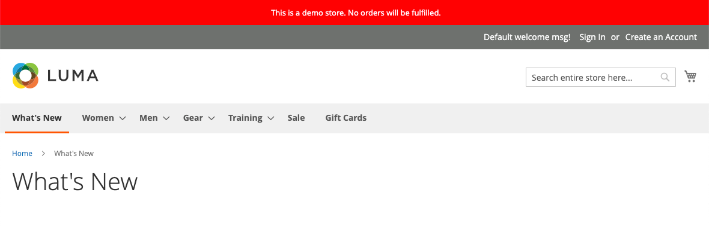

# Marca da loja

Uma das primeiras coisas que você deseja fazer é [alterar o logotipo](#upload-your-logo) no cabeçalho e [carregar um favicon](#add-a-favicon) para o navegador. Em seguida, você deve [adicionar a mensagem de boas-vindas](#change-the-welcome-message) e [atualizar o aviso de direitos autorais](#change-the-copyright-notice) no rodapé. Essas tarefas são alguns elementos de design simples que você pode realizar imediatamente. Enquanto sua loja está em desenvolvimento, você pode [ativar o aviso de demonstração da loja](#set-the-store-demo-notice) e removê-lo quando estiver pronto para iniciar.

{width="600" zoomable="yes"}

## Carregar seu logotipo

O tamanho e a localização do logotipo no cabeçalho são determinados pelo tema da loja. Seu logotipo pode ser salvo como um tipo de arquivo GIF, PNG ou JPG (JPEG) e carregado a partir do administrador da loja.

{width="600"}

A imagem do logotipo reside no seguinte local no servidor. Qualquer arquivo de imagem com o nome `logo.svg` é usado como o logotipo de tema padrão.

Caminho completo - `app/design/frontend/[vendor]/[theme]/web/images/logo.svg`

Caminho relativo - `images/logo.svg`

Se você não souber o tamanho do logotipo ou de outras imagens usadas no tema, abra a página em um navegador, clique com o botão direito do mouse na imagem e inspecione o elemento.

>[!NOTE]
>
>Além do logotipo no cabeçalho, seu logotipo também aparece em [modelos de email](../systems/email-templates.md#prepare-your-email-logo) e em [faturas de PDF](../stores-purchase/sales-documents.md) e outros documentos de vendas. Os logotipos usados para modelos de email e faturas têm requisitos de tamanho diferentes e devem ser carregados separadamente.

Formatos de arquivo de logotipo suportados:

| Formato de arquivo | Descrição |
|--- |--- |
| PNG | (Portable Network Graphics) Essa alternativa mais recente para o formato GIF suporta até 16 milhões de cores (24 bits). O formato de compactação sem perdas produz uma imagem bitmap de alta qualidade com texto nítido, mas um tamanho de arquivo maior do que alguns formatos. O formato PNG é compatível com camadas transparentes e foi projetado para visualização e transmissão online. |
| GIF | (Graphics Interchange Format) Um formato de bitmap antigo e amplamente compatível que é limitado a 256 cores (8 bits). O formato GIF suporta animações simples e camadas transparentes. |
| JPG (JPEG) | (Joint Photographic Expert Group) Um formato de bitmap compactado usado pela maioria das câmeras digitais. A compactação com perdas causa alguma perda de dados, que às vezes é perceptível como pontos embaçados no texto. |

{style="table-layout:auto"}

1. Na barra lateral _Admin_, vá para **[!UICONTROL Content]** > _[!UICONTROL Design]_>**[!UICONTROL Configuration]**.

   {width="700"}

1. Localize a exibição de armazenamento que você deseja configurar e clique em **[!UICONTROL Edit]** na coluna _[!UICONTROL Action]_.

1. Expandir  a seção **[!UICONTROL Header]**.

   {width="600"}

1. Para carregar um novo logotipo, clique em **[!UICONTROL Upload]** e escolha o arquivo no seu sistema.

1. Insira o **[!UICONTROL Logo Image Width]** e **[!UICONTROL Logo Image Height]** em pixels.

1. Para **[!UICONTROL Logo Image Alt]**, insira o texto que você deseja que apareça quando alguém passar o mouse sobre a imagem.

1. Quando terminar, clique em **[!UICONTROL Save Configuration]**.

## Adicionar um favicon

_Favicon_ é a abreviação de _ícone favorito_ e se refere ao pequeno ícone na guia de cada página do navegador. Dependendo do navegador, o favicon também aparece na barra de endereços, antes do URL.

Um favicon geralmente tem 16 x 16 pixels ou 32 x 32 pixels de tamanho. [!DNL Commerce] aceita os tipos de arquivos ICO, PNG, APNG, GIF e JPG (JPEG), embora nem todos os navegadores sejam compatíveis com esses formatos. O formato de arquivo mais amplamente suportado para usar em um favicon é ICO. Você pode usar outros tipos de arquivo de imagem, mas o formato pode não ser compatível com todos os navegadores. Há muitas ferramentas gratuitas disponíveis on-line que você pode usar para gerar uma imagem ICO ou converter uma imagem para esse formato.

{width="600"}

[!DNL Commerce] oferece suporte aos seguintes formatos de arquivo como favicon:

| Formato de arquivo | Descrição |
|--- |--- |
| ICO | Este formato de arquivo de imagem foi projetado para imagens de ícones de computadores de pequeno porte. Usado principalmente no sistema operacional Microsoft® Windows, o formato ICO pode conter imagens de até 256 x 256 pixels e 16 milhões de cores (24 bits) com 8 bits de transparência. |
| PNG | (Portable Network Graphics) Essa alternativa mais recente para o formato GIF suporta até 16 milhões de cores (24 bits). O formato de compactação sem perdas produz uma imagem bitmap de alta qualidade com texto nítido, mas um tamanho de arquivo maior do que alguns formatos. O formato PNG é compatível com camadas transparentes e foi projetado para visualização e transmissão online. |
| APNG | (Animated Portable Network Graphics) Um formato de arquivo semelhante ao PNG que suporta animação simples. |
| GIF | (Graphics Interchange Format) Um formato de bitmap antigo e amplamente compatível que é limitado a 256 cores (8 bits). O formato GIF suporta animações simples e camadas transparentes. |
| JPG (JPEG) | (Joint Photographic Expert Group) Um formato de bitmap compactado usado pela maioria das câmeras digitais. A compactação com perdas causa alguma perda de dados, que às vezes é perceptível como pontos embaçados no texto. |

{style="table-layout:auto"}

### Etapa 1: criar um favicon

1. Usando o editor de imagens de sua escolha, crie uma imagem gráfica do seu logotipo 16 x 16 ou 32 x 32.

1. (Opcional) Use uma das ferramentas online disponíveis para converter o arquivo para o formato .ico e salve-o no computador.

### Etapa 2: Fazer upload do favicon para sua loja

1. Na barra lateral _Admin_, vá para **[!UICONTROL Content]** > _[!UICONTROL Design]_>**[!UICONTROL Configuration]**.

1. Na grade, localize o modo de exibição de armazenamento que você deseja configurar e clique em **[!UICONTROL Edit]** na coluna _[!UICONTROL Action]_.

1. Em _[!UICONTROL Other Settings]_, expanda  a seção **[!UICONTROL HTML Head]**.

   {width="600"}

1. Para remover o favicon atual, clique no ícone _Excluir_ () no canto inferior esquerdo da imagem.

1. Clique em **[!UICONTROL Upload]** e abra o arquivo favicon preparado.

   {width="400"}

1. Quando terminar, clique em **[!UICONTROL Save Configuration]**.

### Etapa 3: atualizar o cache

1. Quando solicitado a atualizar o cache, clique no link **[!UICONTROL Cache Management]** na mensagem na parte superior do espaço de trabalho.

1. Na lista, marque a caixa de seleção **[!UICONTROL Page Cache]** marcada como `Invalidated`.

1. Defina **[!UICONTROL Actions]** como `Refresh` e clique em **[!UICONTROL Submit]**.

1. Para exibir o novo favicon, retorne à loja e atualize o navegador.

## Alterar a mensagem de boas-vindas

A mensagem de boas-vindas no cabeçalho é expandida para incluir o nome do cliente que está conectado. Antes de iniciar a loja, altere o texto padrão _Bem-vindo_ para cada exibição de loja.

{width="600"}

1. Na barra lateral _Admin_, vá para **[!UICONTROL Content]** > _[!UICONTROL Design]_>**[!UICONTROL Configuration]**.

1. Na grade, localize o modo de exibição de armazenamento que você deseja configurar e clique em **[!UICONTROL Edit]** na coluna _[!UICONTROL Action]_.

1. Em _[!UICONTROL Other Settings]_, expanda  a seção **[!UICONTROL Header]**.

1. Para **[!UICONTROL Welcome Text]**, insira o texto da mensagem de boas-vindas que você deseja que apareça no cabeçalho do armazenamento.

   {width="600"}

1. Quando terminar, clique em **[!UICONTROL Save Configuration]**.

1. Quando solicitado a atualizar o Cache de Página, clique no link **[!UICONTROL Cache Management]** na parte superior do espaço de trabalho e siga as instruções para atualizar o cache.

## Alterar o aviso de copyright

A loja exibe um aviso de copyright no rodapé de cada página. Como prática recomendada, o aviso de copyright deve incluir o ano atual e identificar sua empresa como o proprietário legal do conteúdo no site.

{width="600"}

O código de caractere `&copy;` é usado para inserir o símbolo de copyright, conforme mostrado nos exemplos a seguir:

- Exemplo de formato longo

  `Copyright &copy; 2013-present Luma, Inc. All rights reserved.`

- Exemplo de formato curto

  `&copy; 2021 Luma, Inc. All rights reserved.`

**_Para atualizar o aviso de direitos autorais:_**

1. Na barra lateral _Admin_, vá para **[!UICONTROL Content]** > _[!UICONTROL Design]_>**[!UICONTROL Configuration]**.

1. Na grade, localize o modo de exibição de armazenamento que você deseja configurar e clique em **[!UICONTROL Edit]** na coluna _[!UICONTROL Action]_.

1. Em _Outras Configurações_, expanda a seção **[!UICONTROL Footer]**.

   {width="600"}

1. Para **[!UICONTROL Copyright]**, insira o aviso de direitos autorais que você deseja exibir no rodapé de cada página.

   Use o código de caractere `&copy;` para inserir um símbolo de copyright.

1. Quando terminar, clique em **[!UICONTROL Save Configuration]**.

## Definir o aviso de demonstração da loja

Se sua loja estiver online, mas ainda em construção, você pode exibir um aviso de demonstração da loja na parte superior da página para que as pessoas saibam que a loja ainda não está aberta para negócios. Quando estiver pronto para _ativar_, basta remover a mensagem. É semelhante a virar o sinal pendurado na janela de _Fechado_ para _Aberto_. O formato do aviso de demonstração é determinado pelo tema da sua loja.

{width="600"}

1. Na barra lateral _Admin_, vá para **[!UICONTROL Content]** > _[!UICONTROL Design]_>**[!UICONTROL Configuration]**.

1. Na grade, localize o modo de exibição de armazenamento que você deseja configurar e clique em **[!UICONTROL Edit]** na coluna _[!UICONTROL Action]_.

1. Em _[!UICONTROL Other Settings]_, expanda  a seção **[!UICONTROL HTML Head]**.

   {width="600"}

1. Role para baixo até a parte inferior e defina o **[!UICONTROL Display Demo Store Notice]** de acordo com sua preferência.

1. Quando terminar, clique em **[!UICONTROL Save Configuration]**.

1. Se for solicitado que você atualize o cache, clique em **[!UICONTROL Cache Management]** na mensagem do sistema e siga as instruções para atualizar o cache.
