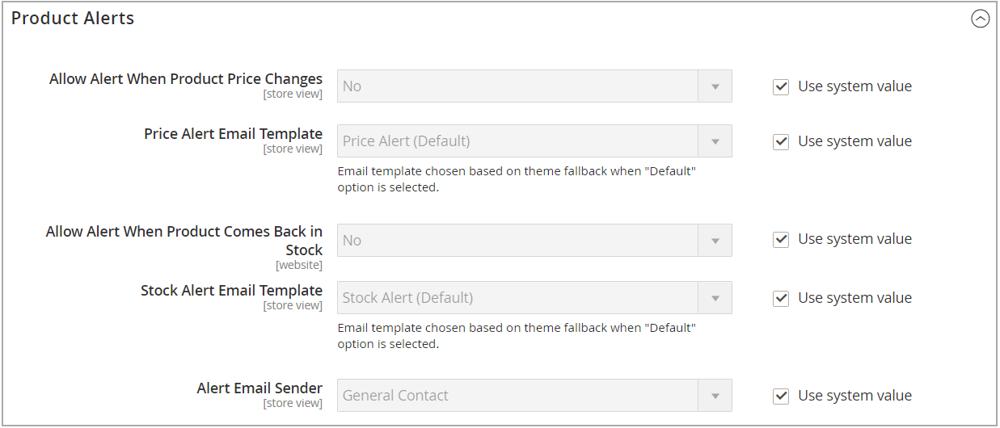

# Alertas de produto

Os clientes podem assinar dois tipos de alertas por email - alertas de alteração de preço e alertas no estoque. Para cada tipo de alerta, você pode determinar se os clientes podem se inscrever, selecionar o modelo de email usado e identificar o remetente do email.

{width="600" zoomable="yes"}

## Alertas de alteração de preço

Quando os alertas de alteração de preço estiverem ativados, uma _Avise-me quando o preço cair_ é exibido em cada página do produto. Os clientes podem clicar no link para assinar alertas relacionados ao produto. Os convidados serão solicitados a abrir uma conta em sua loja. Sempre que o preço muda ou o produto fica especial, todos que assinaram o alerta recebem um alerta por email.

## Alertas no estoque

O alerta em estoque cria um link chamado _Notificar quando este produto estiver em estoque_ para cada produto que estiver esgotado. Os clientes podem clicar no link para assinar o alerta. Quando o produto estiver de volta ao estoque, os clientes receberão uma notificação por email informando que o produto está disponível. Os produtos com alertas têm um _Alertas de produto_ no painel Informações do produto, que lista os clientes que assinaram um alerta.

{width="600" zoomable="yes"}

## Configurar alertas do produto

1. No _Admin_ barra lateral, vá para **[!UICONTROL Stores]** > _[!UICONTROL Settings]_>**[!UICONTROL Configuration]**.

1. No painel esquerdo, expanda **[!UICONTROL Catalog]** e escolha **[!UICONTROL Catalog]** por baixo.

1. Clique para expandir o _[!UICONTROL Product Alerts]_e faça o seguinte:

   {width="600" zoomable="yes"}

   - Para oferecer alertas de alteração de preço aos clientes, defina **[!UICONTROL Allow Alert When Product Price Changes]** para `Yes`.

   - Definir **[!UICONTROL Price Alert Email Template]** ao modelo que deseja usar para as notificações de alerta de preço.

   - Para oferecer alertas quando produtos indisponíveis forem disponibilizados novamente, defina **[!UICONTROL Allow Alert When Product Comes Back in Stock]** para `Yes`.

     >[!NOTE]
     >
     >A variável _Notificar quando este produto estiver em estoque_ A mensagem é exibida somente quando **[!UICONTROL Display Out of Stock Products]** está definida como `Yes` (na Configuração em [!UICONTROL Catalog] > [!UICONTROL Inventory]).

   - Definir **[!UICONTROL Stock Alert Email Template]** ao modelo que deseja usar para alertas de estoque de produtos.

   - Definir **[!UICONTROL Alert Email Sender]** para o [armazenar contato](../getting-started/store-details.md#store-email-addresses){target="_blank"} that you want to appear as the sender of the email alert. Learn more about [store email addresses](../configuration-reference/general/store-email-addresses.md){target="_blank"} no guia do usuário principal.

1. Quando terminar, clique em **[!UICONTROL Save Config]**.

## Configurar modelos de email de alertas do produto

Em seguida, configure, adicione ou modifique o template de email para seu alerta de preço. Talvez você queira editar as configurações de alerta de preço após criar modelos adicionais.

Para obter informações mais detalhadas sobre o uso de mensagens de email, consulte [Modelos de mensagem](../systems/email-template-custom.md#message-templates) no _Guia de sistemas do administrador_.

1. No _Admin_ barra lateral, vá para **[!UICONTROL Marketing]** > _[!UICONTROL Communications]_>**[!UICONTROL Email Templates]**.

1. Clique em **[!UICONTROL Add New Template]**.

1. Em _Carregar modelo padrão_, escolha o **[!UICONTROL Template]** que deseja personalizar.

   Você pode escolher o modelo de alerta incluído com o seu tema. Ou você pode selecionar o `Price Alert` ou `Stock Alert` modelos em _[!UICONTROL Magento_PriceAlert]_.

1. Clique em **[!UICONTROL Load Template]**.

1. Insira um **[!UICONTROL Template Name]**.

   Você pode selecionar esse nome no campo _Alertas de preço_ configuração.

1. Leia o conteúdo existente e faça as alterações necessárias para o seguinte:

   | Campo | Descrição |
   | ----- | ----- |
   | [!UICONTROL Template Subject] | Esse texto é exibido na linha de assunto de um email. |
   | [!UICONTROL Template Content] | Esse texto é exibido no conteúdo completo do email enviado. |

1. Para adicionar informações geradas de [!DNL Commerce] dados, use o **[!UICONTROL Insert Variable]** opção para usar uma lista de variáveis disponíveis.

1. Clique em **[!UICONTROL Save Template]**.

## Configurações de execução de alerta do produto

Essas configurações permitem selecionar com que frequência [!DNL Commerce] O verifica se há alterações que exigem o envio de alertas. Você também pode selecionar o recipient, remetente e modelo para emails enviados se o envio de alertas falhar.

{width="600" zoomable="yes"}

1. No _Admin_ barra lateral, vá para **[!UICONTROL Stores]** > _[!UICONTROL Settings]_>**[!UICONTROL Configuration]**.

1. No painel esquerdo, expanda **[!UICONTROL Catalog]** e escolha **[!UICONTROL Catalog]** por baixo.

1. Expandir  o **[!UICONTROL Product Alerts Run Settings]** seção.

1. Para determinar com que frequência os alertas de produto são enviados, defina **[!UICONTROL Frequency]** a um dos seguintes:

   - `Daily`
   - `Weekly`
   - `Monthly`

1. Para determinar a hora do dia em que os alertas de produto são enviados, defina **[!UICONTROL Start Time]** à hora, aos minutos e ao segundo.

   >[!NOTE]
   >
   >Os alertas de produtos são enviados pelo consumidor &quot;product_alert&quot;.

1. Para **[!UICONTROL Error Email Recipient]**, insira o email da pessoa a ser contatada se ocorrer um erro.

1. Para o **[!UICONTROL Error Email Sender]**, selecione a identidade de armazenamento que aparece como o remetente da notificação de erro.

1. Definir **[!UICONTROL Error Email Template]** ao template de email transacional a ser usado para a notificação de erro.

1. Quando terminar, clique em **[!UICONTROL Save Config]**.
