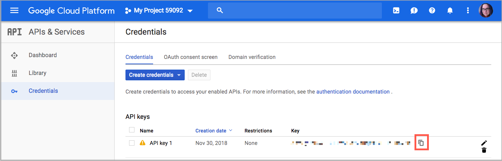

# Configurar o algoritmo de prioridade de distância

O Algoritmo de Prioridade de Distância compara o local do endereço de destino da entrega com os locais de origem para determinar a origem mais próxima para atender às entregas. A distância pode ser determinada pela distância física ou pelo tempo gasto viajando de um local para outro, usando dados do banco de dados ou direções de direção, caminhada ou bicicleta. Use este [Algoritmo de Seleção do Source](selection-reservations.md) para recomendar a origem mais próxima dos endereços de destino de envio.

>[!NOTE]
>
>Se você estiver usando o Algoritmo de Prioridade de Distância, é recomendável inserir o endereço completo e as coordenadas GPS para suas [fontes](sources-add.md).

Você tem duas opções para calcular a distância e o tempo para encontrar a origem mais próxima para o preenchimento de entrega:

- **Google MAP** - Usa os serviços da [Plataforma Google Maps][1] para calcular a distância e o tempo entre o endereço de destino da remessa e os locais de origem. Essa opção usa a latitude e a longitude (coordenadas GPS) da fonte e pode usar o endereço, dependendo do modo de cálculo. Uma chave de API do Google é necessária com a [API de geocodificação][2] e a [API de matriz de distância][3] habilitadas, e você pode incorrer em encargos por meio do Google.

- **Cálculo Offline** - Calcula a distância usando dados geocodificados baixados e importados usando códigos postais e coordenadas GPS para determinar a origem mais próxima do endereço de destino da remessa. Para configurar essa opção, pode ser necessária a assistência do desenvolvedor para inicialmente baixar e importar geocodes usando as instruções de linha de comando.

>[!NOTE]
>
>Para sites de várias lojas com vários países, configure o [destino de imposto padrão](../stores-purchase/tax-class.md#default-tax-destination){target="_blank"} para cada país.

## Usar o Google Maps

Você não precisa de uma conta do Google para começar. O processo inclui a criação de conta e projeto do Google, se necessário. Essa opção requer uma conta de faturamento e um método de pagamento adicionados à sua conta do Google para concluir as configurações e usar o algoritmo.
No entanto, o algoritmo baseado em distância do Google MAP é recomendado como mais avançado e preciso em comparação ao Cálculo offline.

### Etapa 1: criar a chave de API do Google

A chave é da [Plataforma Google Maps][1] e deve ter a [API de geocodificação][2] e a [API de Matriz de Distância][3] habilitadas. Para obter detalhes, consulte [Configurando o Algoritmo de Prioridade de Distância](distance-priority-algorithm.md).

1. Visite a [Plataforma Google Maps][1] e clique em **[!UICONTROL Get Started]**.

1. Para habilitar a plataforma, selecione **[!UICONTROL Maps, Routes, and Places]** e clique em **[!UICONTROL Continue]**.

   {width="350" zoomable="yes"}

1. Faça logon com uma conta da Google ou crie uma conta.

1. Configurar um projeto:

   - Selecione um projeto ou insira um novo nome de projeto.

   - Para aceitar os termos, selecione `Yes`.

   - Clique em **[!UICONTROL Next]**.

1. Insira uma conta de faturamento ou crie uma. Você pode ignorar e adicionar uma conta de faturamento mais tarde.

   É necessária uma conta de cobrança para usar este serviço.

1. Para abrir e configurar suas opções da Google Cloud Platform, clique em **[!UICONTROL Console]**.

   - Abra o projeto.

   - Expanda o menu e clique em **[!UICONTROL APIs & Services]** > **[!UICONTROL Library]**.

     {width="350" zoomable="yes"}

   - Pesquise por [API de geocodificação][2] e [API de matriz de distância][3]. Selecione e ative cada serviço.

1. Expanda o menu, clique em **[!UICONTROL APIs & Services]** > **[!UICONTROL Credentials]** e copie a Chave de API do Google.

   {width="350" zoomable="yes"}

### Etapa 2: configurar o Provedor do Google MAP

1. Na barra lateral _Admin_, vá para **[!UICONTROL Stores]** > _[!UICONTROL Settings]_>**[!UICONTROL Configuration]**.

1. No painel esquerdo, expanda **[!UICONTROL Catalog]** e escolha **[!UICONTROL Inventory]**.

1. Expanda  a seção _[!UICONTROL Distance Provider for Distance Based SSA]_e defina **[!UICONTROL Provider]**como `Google MAP`.

   {width="350" zoomable="yes"}

1. Expanda  a seção _[!UICONTROL Google Distance Provider]_e defina as configurações:

   - Para **[!UICONTROL Google API Key]**, insira a chave copiada da sua conta do Google.

   - Para **[!UICONTROL Computation mode]**, selecione uma configuração.

     >[!NOTE]
     >
     >Ao usar esse algoritmo para envio, se as rotas e os dados não retornarem para o modo Computação selecionado (direção, ciclismo ou caminhada) para um envio, o SSA assumirá como padrão o uso da Prioridade Source. É recomendável definir a [prioridade para fontes por estoque](stocks-prioritize-sources.md).

     | Opção | Descrição |
     | ----- | ----- |
     | `Driving` | (Padrão) Solicita trajetos de direção padrão usando a rede rodoviária. |
     | `Walking` | Solicita trajetos pedestres usando caminhos e calçadas de pedestres (quando disponíveis). |
     | `Bicycling` | Solicita trajetos de bicicleta usando caminhos de bicicleta e ruas preferenciais (quando disponível). O [Distance Matrix Service][4] só está disponível nos EUA e em algumas cidades canadenses. |

   - Para **[!UICONTROL Value]**, selecione um tipo de valor:

     | Opção | Descrição |
     | ----- | ----- |
     | `Distance` | (Padrão) Retorna a distância entre pontos em métricas (quilômetros e metros) ou imperiais (milhas e pés). |
     | `Time to Destination` | Retorna o tempo necessário para viajar dos locais de origem ao endereço de entrega em horas e minutos. |

   {width="350" zoomable="yes"}

1. Quando terminar, clique em **[!UICONTROL Save Config]**.

## Usar cálculo offline

Os cálculos offline usam códigos de país para determinar a distância entre o destino da entrega e os endereços de origem. Esta opção pode exigir a assistência do desenvolvedor para configurar o. Use um comando da CLI [!DNL Inventory Management] para baixar e importar dados de [geonames.org][5].

>[!NOTE]
>
>Os geocodes importados de [geonames.org][5] têm limitações para alguns países, como Canadá e Irlanda. Consulte [Arquivos de código postal de GeoNames][6] para obter mais informações.

### Etapa 1: baixar e importar geocodes

Configuração completa da linha de comando para baixar e importar países geocodes para serem enviados e para os quais os locais de origem estão localizados. Esta etapa pode exigir ajuda do desenvolvedor para tarefas de linha de comando. Consulte [Importar geocodes](cli.md#import-geocodes).

Conclua esses comandos sempre que desejar adicionar mais geocódigos.

### Etapa 2: Definir o cálculo

1. Na barra lateral _Admin_, vá para **[!UICONTROL Stores]** > _[!UICONTROL Settings]_>**[!UICONTROL Configuration]**.

1. No painel esquerdo, expanda **[!UICONTROL Catalog]** e escolha **[!UICONTROL Inventory]**.

1. Expandir  a seção _[!UICONTROL Distance Provider for Distance Based SSA]_.

1. Desmarque a caixa de seleção **[!UICONTROL Use system value]** e defina **[!UICONTROL Provider]** como `Offline Calculation`.

   {width="350" zoomable="yes"}

1. Quando terminar, clique em **[!UICONTROL Save Config]**.

[1]: https://cloud.google.com/maps-platform/
[2]: https://developers.google.com/maps/documentation/geocoding/start
[3]: https://developers.google.com/maps/documentation/distance-matrix/start
[4]: https://developers.google.com/maps/documentation/javascript/distancematrix#travel_modes
[5]: https://www.geonames.org/
[6]: https://download.geonames.org/export/zip/readme.txt
