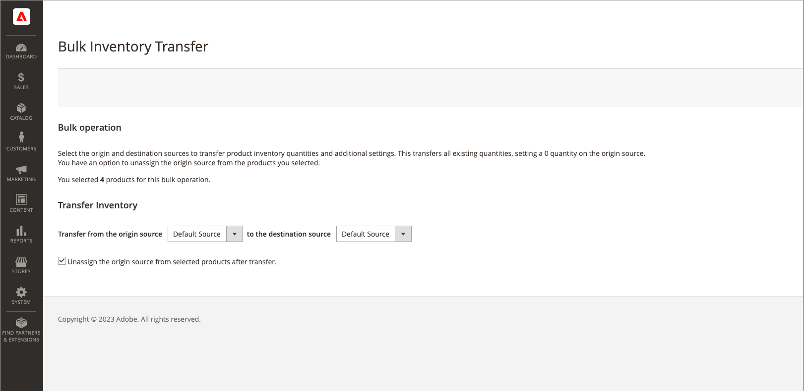

# Transferir inventário para origem

Dependendo das necessidades comerciais e do status do local, os comerciantes de várias origens geralmente transferem o inventário de produtos de um local de origem para outro. Por exemplo, você pode fechar um local de depósito ou não enviar mais produtos específicos de um local, movendo todas as operações desses produtos para um novo local.

Essa opção permite selecionar um ou mais produtos, a origem de origem para transferir o inventário e a origem de destino para receber quantidades:

- As quantidades de estoque, o Status do Item do Source (Em Estoque/Fora de Estoque) e a Quantidade de Notificação para a origem selecionada são movidos por produto.

- Se um produto não tiver essa origem, ele será ignorado.

- Todo o inventário de produtos da origem é movido. Você não pode transferir uma quantidade parcial.

>[!NOTE]
>
>Se as origens e os destinos estiverem em estoques diferentes, isso afetará a Quantidade Venável agregada e as reservas de ordens em andamento.

Também é possível cancelar a atribuição da origem ao transferir quantidades de inventário.

{{$include /help/_includes/unassign-source.md}}

1. Na barra lateral _Admin_, vá para **[!UICONTROL Catalog]** > **[!UICONTROL Products]**.

1. Selecione os produtos para os quais deseja modificar origens.

   Procure ou pesquise para encontrar produtos e marcar as caixas de seleção para transferência.

1. Clique no menu **[!UICONTROL Actions]** na parte superior e escolha **[!UICONTROL Transfer Inventory to Source]**.

1. Clique em **[!UICONTROL OK]** no diálogo de confirmação.

1. Para transferir produtos para um novo destino, selecione a origem (_[!UICONTROL from]_).

1. para transferir produtos para um novo destino, selecione a origem de destino (_[!UICONTROL to]_).

1. Para remover a origem dos produtos, marque a caixa de seleção opcional **[!UICONTROL Unassign from origin source after transfer]**.

   {width="600" zoomable="yes"}

1. Clique em **[!UICONTROL Transfer Inventory]**.

   Todas as quantidades de produtos são deduzidas da origem e adicionadas à origem de destino. A Quantidade e a Quantidade Venável são atualizadas automaticamente.

<!-- Last updated from includes: 2022-08-30 15:36:09 -->
