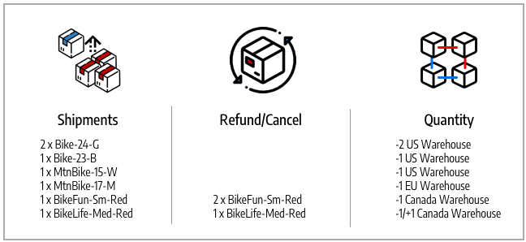

# Status do pedido e reservas

[!DNL Inventory Management] dá suporte a faturamento, pagamentos, remessa e cancelamentos parciais e completos por pedido. À medida que você gerencia uma ordem por meio de processamento, faturamento, remessa e potencialmente reembolsos, [!DNL Commerce] insere ou altera automaticamente as reservas para atualizar a quantidade vendável de um estoque (ou canal de vendas) e a quantidade de estoque disponível por origem. Não é necessário acessar ou inserir reservas ativamente. Concluir ações para atender, cancelar ou reembolsar um pedido faz isso por você.

Essas reservas sempre ajustam sua quantidade vendida, com quantias positivas ou negativas para aumentar ou diminuir quantidades. O resultado é uma atualização do estoque disponível e das quantidades comercializáveis para obter a disponibilidade atualizada do produto.

Para obter informações específicas sobre pedidos e remessas, consulte [Gerenciando Pedidos e Remessas](shipments.md).

## Opções de gerenciamento de pedidos

Dependendo do status do inventário e das solicitações do cliente, você pode atualizar ordens com pagamentos e cancelamentos parciais, entregas parciais de várias origens ou para ordens pendentes, ou avisos de crédito para restituir produtos devolvidos.

### Entregas

Depois de faturar ordens, envie entregas parciais ou completas até preencher toda a ordem. Cada remessa converte a reserva, deduzindo a quantia da quantidade do produto por origem. As compensações de reserva são informadas para atualizar a quantidade vendável do seu estoque. Se você enviar entregas parciais, cada entrega deduzirá essa quantia da quantidade e das reservas do produto. Todas as reservas de produtos não entregues permanecem em vigor até que também sejam entregues, de modo que a sua quantia de venda esteja atualizada e para lhe dar controle sobre o inventário de produtos e suportar várias entregas de origem e backorders.

### Pedidos cancelados

Se um cliente cancelar sua ordem antes da entrega (parcial ou total), uma nova reserva será informada para retornar a quantia do inventário para a quantidade vendável. As reservas efetivamente se cancelam mutuamente, sem deduzir a quantidade de qualquer fonte. Outros clientes podem comprar ativamente essas quantidades de produtos por meio das estoques e canais de vendas associados.

### Ordens reembolsadas

Se um cliente solicitar um reembolso, emita o aviso de crédito para as quantias parciais ou totais do produto. Ao receber os produtos devolvidos, informe um aviso de crédito para fornecer os fundos e atualizar as quantias do produto. Ao selecionar a opção Retornar ao Estoque, [!DNL Commerce] adiciona quantidades de volta aos produtos e origens que enviaram os pedidos e as compensações de reserva para atualizar as quantidades disponíveis para o estoque associado.

## Tipos de ordem

Pedidos simples começam com um carrinho de compras, continuam o pagamento e terminam com um delivery satisfeito. Nesses pedidos, o [!DNL Inventory Management] processa facilmente as reservas em relação à disponibilidade (ou quantidade comercializável) no carrinho e no check-out e deduz do estoque disponível na entrega.

{width="600" zoomable="yes"}

Uma ordem mais complicada pode ter cancelamentos parciais, remessas parciais e restituições. Nessas situações, as reservas afetam o inventário disponível para adicionar quantidades para cancelamentos e reembolsos e diminuir quantidades quando solicitadas e entregues.

{width="600" zoomable="yes"}

As reservas de disponibilidade e as alterações de inventário ocorrem com base no status da ordem.

## Status e reservas

As tabelas a seguir detalham a ordem e o status do aviso de crédito com alterações de reserva inseridas por [!DNL Commerce] para gerenciar o inventário.

| Status do pedido | Descrição | Reserva para Quantidade Venável |
|--|--|--|
| [!UICONTROL Open] | Novo e enviado recentemente, sem processamento | A reserva é salva quando o pedido é enviado para o estoque. |
| [!UICONTROL Canceled] | Cancelado total ou parcialmente antes do pagamento | A compensação de reserva é inserida para retornar a quantidade parcial ou total de volta à quantidade disponível em estoque. |
| [!UICONTROL On Hold] | Pagamento e remessa não processados ou faturados | A reserva permanece em vigor. |
| [!UICONTROL Suspected Fraud] | Não processado devido a fraude | Se aprovada ou em revisão, a reserva permanece em vigor. Se for recusada, a reserva permanecerá em vigor até que o comerciante decida aprovar ou cancelar. Se cancelada, a compensação da reserva é inserida para retornar a quantidade total de volta à quantidade disponível em estoque. |
| [!UICONTROL Pending] | Aguardando pagamento | A reserva permanece em vigor. |
| [!UICONTROL Processing] | Processamento de pagamento, não recebido | A reserva permanece em vigor. |
| [!UICONTROL Pending Payment] | Pagamento não recebido | A reserva permanece em vigor. |
| [!UICONTROL Payment Review] | Pagamento sendo revisado para processamento e conclusão | A reserva permanece em vigor. |
| [!UICONTROL Complete] | Pago e enviado na íntegra | O valor da reserva é deduzido da quantidade do produto para a fonte selecionada quando faturado parcial ou totalmente. A compensação da reserva é inserida para atualizar a quantidade total vendável. |
| [!UICONTROL Closed] | Reembolsado ou arquivado | Se arquivado, não há alteração nas quantidades. Se for reembolsado total ou parcialmente, a compensação da reserva será informada e convertida para adicionar novamente as quantidades do produto por origem e a quantidade comercializável por estoque. |

| Status do Aviso de Crédito | Descrição | Reserva para Quantidade Venável |
|--|--|--|
| [!UICONTROL Open] | O reembolso é devido, não concluído | Não há alteração nas reservas. |
| [!UICONTROL Refunded] | Concluído, fundos devolvidos | Se for reembolsado parcial ou integralmente, a compensação da reserva será informada e convertida para adicionar novamente as quantidades do produto por origem e a quantidade comercializável por estoque. |

## Exemplo de ordem complexa

Blake Sanders pede bicicletas e roupas para suas férias em família e diversão. Eles veem grandes vendas em sua loja de Biking Adventures com ações e fontes que abrangem os Estados Unidos, Canadá e Europa.

Eles compram duas grandes bicicletas de parque para seus filhos pequenos, uma bicicleta BMX para seus adolescentes, uma bicicleta de montanha para eles mesmos e uma bicicleta moderna alemã cross-country para seus cônjuges. A loja tinha uma venda de camisas bonitinhas, então eles compraram algumas para toda a família combinar. Consulte a lista de compras de férias abaixo, os SKUs correspondentes e as reservas inseridas nas quantidades de estoque vendável.

{width="600" zoomable="yes"}

Eles mostram à família o que encontraram, mas fazem algumas mudanças. Antes de o pagamento ser concluído, eles cancelam dois dos SKUs de 33 BikeFun (as crianças não gostavam deles). Este é um cancelamento parcial devido a pagamento pendente, portanto, nenhum aviso de crédito é necessário. Para atualizar, [!DNL Commerce] adiciona de volta ao estoque de quantidade vendável do Canadá. O pedido é pago, e todos os produtos são enviados, chegando a tempo de férias. [!DNL Commerce] atualiza a quantidade vendável e as quantidades de origem dos depósitos de remessa dos produtos remetidos.

Mas a camisa não se encaixava bem na esposa. Blake pede um reembolso e manda de volta sua camisa. A criação do memorando de crédito adiciona uma camisa 54-BikeLife de volta ao armazém de ações e transporte do Canadá.

- **Produtos enviados** - Com produtos comprados e enviados, a [!DNL Commerce] atualiza o inventário. As compensações de reserva são convertidas em deduções de quantidade em estoque da origem entregue. As atualizações de quantidade disponível para estoque.

- **Produtos cancelados** - Ao cancelar o estoque, o [!DNL Commerce] remove a reserva desse produto. A compensação de reserva é inserida no nível do estoque para adicionar novamente as quantidades comercializáveis para o cancelamento parcial de duas camisetas. Isso não afeta a quantidade do inventário no nível da origem.

- **Produto de Aviso de Crédito/Reembolsado** - Ao devolver o estoque, ele deve ser adicionado novamente às quantidades. Ao emitir o aviso de crédito, você pode optar por retornar ao estoque. [!DNL Commerce] adiciona novamente a quantidade em estoque à origem entregue do produto. As compensações de reserva são inseridas para limpar quaisquer reservas restantes. A quantidade disponível é recalculada em relação à quantidade atualizada.

{width="600" zoomable="yes"}
