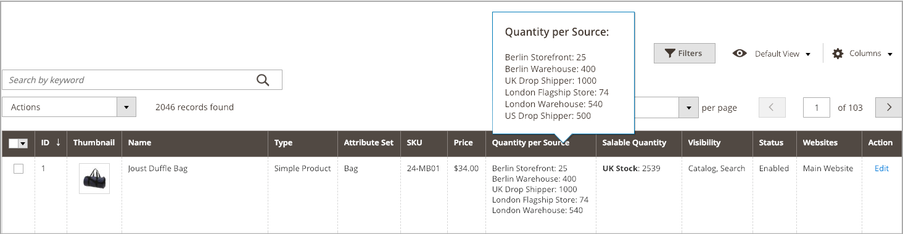

# Atribuir quantidades por produto

Depois de adicionar [origens](sources-assign-per-product.md), atualize as quantidades de estoque do seu produto. Esses valores rastreiam os valores de estoque disponível e em estoque.

Para ocultar o estoque de uma origem das remessas sem remover a origem, defina _[!UICONTROL Source Item Status]_como `Out of Stock`. As opções SSA e remessa acessam apenas as fontes listadas como `In Stock` com a quantidade de estoque disponível.

Todas as quantidades e origens atualizadas são exibidas na grade de produtos.

## Atualizar quantidades

1. Na barra lateral _Admin_, vá para **[!UICONTROL Catalog]** > **[!UICONTROL Products]**.

1. Localize e abra um produto no modo de edição.

1. Expandir  a seção **[!UICONTROL Sources]**.

1. Defina **[!UICONTROL Source Item Status]** como `In Stock`.

1. para atualizar a quantidade de estoque disponível, insira um valor para **[!UICONTROL Qty]**.

1. Para definir uma notificação para quantidades de inventário, siga um destes procedimentos:

   - Quantidade de Notificação Personalizada - Desmarque a caixa de seleção **[!UICONTROL Use Default]** e insira uma quantidade em **[!UICONTROL Notify Qty]**.
   - Quantidade de Notificação Padrão - Marque a caixa de seleção **[!UICONTROL Use Default]**. [!DNL Commerce] verifica e usa a configuração em _[!UICONTROL Advanced Inventory]_ou na configuração de repositório global.

   {width="350" zoomable="yes"}

1. Siga um destes procedimentos para salvar:

   - Clique em **[!UICONTROL Save]**.

   - No menu **[!UICONTROL Save]** (), escolha **[!UICONTROL Save & Close]**.

A Grade de Produtos é atualizada com uma lista de todas as origens e quantidades relacionadas. Para produtos com mais de cinco origens atribuídas, passe o mouse sobre a coluna _[!UICONTROL Quantity per Source]_para ver a lista completa.

{width="600" zoomable="yes"}
