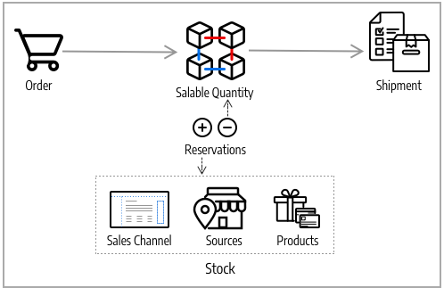

# Algoritmos e reservas do Source

O coração do [!DNL Inventory Management] rastreia todos os produtos disponíveis virtualmente e disponíveis em seus depósitos e lojas. Os sistemas Source Selection Algorithm and Reservations são executados em segundo plano, mantendo suas quantidades comercializáveis atualizadas, check-out livre de colisões e opções de envio recomendadas.

>[!NOTE]
>
>Consulte a [documentação do desenvolvedor](https://developer.adobe.com/commerce/php/development/framework/inventory-management/) para obter informações sobre como trabalhar de forma programática com o sistema [!DNL Inventory Management].

## Algoritmo de seleção Source

O Source Selection Algorithm (SSA) analisa e determina a melhor correspondência para origens e entregas usando a ordem de prioridade de origens configuradas em um estoque. Durante a entrega da ordem, o algoritmo fornece uma lista recomendada de origens, quantidades disponíveis e quantias a serem deduzidas de acordo com o algoritmo selecionado. [!DNL Inventory Management] fornece um algoritmo de Prioridade e dá suporte a extensões para novas opções.

Com vários locais de origem, clientes globais e transportadoras com várias opções de envio e taxas, conhecer seu inventário real disponível e encontrar a melhor opção de envio pode ser difícil. O SSA faz o trabalho para você, desde rastrear quantidades de inventário comercializáveis em todas as origens até calcular e fazer recomendações para entregas.

**Rastrear Estoque** - Usando estoques e origens, o SSA verifica o canal de vendas das solicitações de produtos recebidas e determina o estoque disponível:

- Calcula a quantidade venável virtual agregada de todas as origens atribuídas por estoque: agrega Quantidade - Limite esgotado por origem
- Subtrai o valor do Limite esgotado da quantidade vendável para proteger contra venda excessiva
- Reserva quantidades de estoque no envio da ordem, deduzindo do estoque no processamento e na entrega da ordem
- Oferece suporte a backorders com opções aprimoradas para limites negativos

**Gerenciar Remessas** - O algoritmo ajuda quando você processa e envia pedidos. Você pode executar o algoritmo para obter recomendações sobre as melhores fontes para o envio do produto ou substituir as seleções para:

- Entregar entregas parciais, enviar somente alguns produtos de locais específicos e concluir o pedido completo posteriormente
- Entregar toda a ordem de uma origem
- Divida as entregas em várias origens em quantias diferentes, mantendo um estoque balanceado em todos os depósitos e lojas

O SSA é extensível para suporte de terceiros e algoritmos personalizados para recomendar remessas econômicas.

>[!NOTE]
>
>O SSA funciona de forma diferente para produtos virtuais e baixáveis, o que pode não incorrer em custos de envio. Nesses casos, o sistema executa o algoritmo implicitamente ao criar NFFs e sempre usa os resultados sugeridos. Não é possível ajustar esses resultados para produtos Virtuais e para Produtos Baixáveis.

### Algoritmo de prioridade do Source

Os estoques personalizados incluem uma lista atribuída de fontes para vender e enviar o inventário de produtos disponível por meio de sua loja. O Algoritmo de prioridade do Source usa a ordem das origens atribuídas no estoque para recomendar deduções de produto por origem ao faturar e enviar o pedido.

Quando executado, o algoritmo:

- Funciona pela ordem configurada de fontes no nível de estoque, começando na parte superior
- Recomenda uma quantidade para entrega e origem por produto com base na ordem na lista, na quantidade disponível e na quantidade solicitada
- Continua na lista até que a remessa do pedido seja preenchida
- Ignora fontes desabilitadas se encontradas na lista

Para configurar, atribuir e solicitar origens a um estoque personalizado. Consulte [Priorizando fontes para um estoque](stocks-prioritize-sources.md).

O exemplo a seguir detalha as origens mapeadas em ordem, a quantidade disponível e a origem e a quantia recomendadas para dedução e entrega. A fonte superior é um Drop Shipper no Reino Unido com uma quantidade disponível de 240.

{width="600" zoomable="yes"}

### Algoritmo de prioridade de distância

O Algoritmo de Prioridade de Distância compara o local do endereço de destino da entrega com os locais de origem para determinar a origem mais próxima para atender às entregas. A distância pode ser determinada pela distância física ou pelo tempo gasto viajando de um local para outro, usando locais de bancos de dados importados ou direções do Google (dirigir, caminhar ou andar de bicicleta).

Você tem duas opções para calcular a distância e o tempo para encontrar a origem mais próxima para o preenchimento de entrega:

- **Google MAP** - Usa os serviços do [Google Maps Platform](https://cloud.google.com/maps-platform/) para calcular a distância e o tempo entre o endereço de destino da remessa e os locais de origem (endereço e coordenadas GPS). Essa opção usa a latitude e a longitude da origem. Uma chave da API do Google é necessária com a [API de geocodificação](https://developers.google.com/maps/documentation/geocoding/start) e a [API de matriz de distância](https://developers.google.com/maps/documentation/distance-matrix/start) habilitadas. Essa opção requer um plano de faturamento da Google e pode gerar cobranças por meio do Google.

- **Cálculo Offline** - Calcula a distância usando dados geocode baixados e importados para determinar a origem mais próxima do endereço de destino da remessa. Essa opção usa os códigos de país do endereço e da origem da entrega. Para configurar essa opção, pode ser necessária a assistência do desenvolvedor para inicialmente baixar e importar geocodes usando uma linha de comando.

Para configurar, selecione as configurações e conclua as etapas adicionais, como a chave da API do Google ou o download dos dados de envio. Consulte [Configurar o algoritmo de prioridade de distância](distance-priority-algorithm.md).

### Algoritmos personalizados

O [!DNL Commerce] oferece suporte ao desenvolvimento personalizado e a extensões para adicionar algoritmos alternativos para priorizar fontes. Por exemplo, você pode ter um algoritmo de prioridade com base na geografia e outro com base na despesa de estoque ou um atributo do cliente. Quando o custo do estoque muda, sua implementação pode alterar facilmente os algoritmos para garantir o custo mais baixo.

## Reservas

Em vez de deduzir ou adicionar imediatamente quantidades de inventário de produtos, as reservas retêm as quantias de inventário até que as ordens sejam enviadas ou canceladas. As reservas funcionam totalmente no backend para atualizar automaticamente sua quantidade vendida no nível de estoque.

>[!NOTE]
>
>[!BADGE Somente PaaS]{type=Informative url="https://experienceleague.adobe.com/pt-br/docs/commerce/user-guides/product-solutions" tooltip="Aplica-se somente a projetos do Adobe Commerce na nuvem (infraestrutura do PaaS gerenciada pela Adobe) e a projetos locais."} O recurso de reserva requer que o consumidor da fila de mensagens `inventory.reservations.updateSalabilityStatus` seja executado continuamente. Para verificar se está em execução, use o comando `bin/magento queue:consumers:list`. Se o consumidor da fila de mensagens não estiver listado, inicie-o: `bin/magento queue:consumers:start inventory.reservations.updateSalabilityStatus`.

### Reservas de ordem

As reservas colocam retenções em quantidades de inventário deduzidas da quantidade vendável ao submeter uma ordem. As reservas estão no nível de estoque, contando com as quantidades até que a ordem seja faturada e entregue, cancelada, etc. Ao entregar a ordem, você pode usar as recomendações do SSA ou informar manualmente deduções de quantidade por origem. Quando remetidas, as reservas são automaticamente liberadas e a quantidade deduzida. A quantidade disponível recalcula o estoque com uma quantidade atualizada e quaisquer valores de reserva restantes no sistema.

O diagrama a seguir ajuda a definir o processo de reservas durante uma ordem e até a entrega.

{width="600" zoomable="yes"}

Um cliente envia um pedido. [!DNL Commerce] verifica a quantidade disponível de estoque atual. Se houver estoque suficiente disponível no nível do estoque, uma reserva insere uma retenção temporária para o SKU do produto (para esse estoque) e recalcula a quantidade vendável.

Depois de faturar o pedido, você determina as quantias de produto a serem deduzidas e enviadas de suas origens. A remessa é processada e enviada de uma ou mais origens selecionadas para o cliente. As quantidades são automaticamente deduzidas da quantidade de estoque de origem e as reservas são limpas. Para obter detalhes completos e exemplos, consulte [Sobre o Status do Pedido e Reservas](order-status.md).

## Cálculos de reserva

O sistema cria uma reserva para cada produto quando os seguintes eventos ocorrem:

- Um cliente ou comerciante faz uma ordem.
- Um cliente ou comerciante cancela total ou parcialmente uma ordem.
- O comerciante cria uma remessa para um produto físico.
- O comerciante cria uma fatura para um produto virtual ou para download.
- O comerciante emite um aviso de crédito.

As reservas são operações somente de acréscimo, semelhantes a um log de eventos. A reserva inicial recebe um valor de quantidade negativo. Todas as reservas subsequentes criadas durante o processamento da ordem são valores positivos. Quando o pedido estiver concluído, a soma de todas as reservas do produto será 0.

Antes de emitir uma reserva em resposta a um novo pedido, o sistema determina se há itens comercializáveis suficientes para atender ao pedido. As seguintes quantidades são incluídas no cálculo:

- **Quantidade de StockItem**. A quantidade StockItem é a quantidade agregada de estoque de todas as fontes físicas do canal de vendas atual. Considere um exemplo em que a fonte de Baltimore tem 20 unidades de um produto, a fonte de Austin tem 25 unidades do mesmo produto e a fonte de Reno tem 10. Quando todas essas origens estiverem vinculadas ao Estoque A, a contagem de Itens de Estoque para esse produto será 55 (20 + 25 + 10). (Quando os itens são entregues, o Indexador de inventário atualiza as quantidades disponíveis em cada origem.)

- **Reservas pendentes**. O sistema totaliza todas as reservas iniciais que não foram compensadas. Esse número é sempre negativo. Se o cliente A tiver uma reserva para dez itens e o cliente B tiver uma reserva 5 para itens, as reservas pendentes para o produto totalizam -15.

Portanto, o comerciante pode atender a um pedido recebido, desde que o cliente solicite menos de 40 (55 + -15) unidades.

Quando você concluir o processamento de um pedido (Concluído, Cancelado, Fechado), todas as reservas no escopo desse pedido deverão ser resolvidas como `0`. Isso limpa todas as retenções de quantidade vendável.

>[!NOTE]
>
>As configurações Backorders (com Limites de Indisponibilidade) e Notificar para Quantidade Abaixo do Limite também afetam o cálculo de quantidades comercializáveis, mas estão fora do escopo deste tópico. Para obter mais informações sobre essas configurações, consulte [Configurando [!DNL Inventory Management]](./configuration.md).

## Objetos de reserva

Uma reserva contém as seguintes informações:

| Parâmetro | Tipo de dados | Descrição |
| --- | --- | --- |
| `reservation_id` | Integer | Uma ID gerada pelo sistema |
| `stock_id` | Integer | A ID do estoque ao qual o produto está atribuído |
| `sku` | String | O SKU do produto |
| `quantity` | Flutuante | O número de itens nesta reserva |
| `metadata` | String | O tipo de evento, o tipo de objeto e a ID de objeto para esta reserva. Por exemplo, `{"event_type":"order_placed","object_type":"order",| "object_id":"8"}` |

{style="table-layout:auto"}

Os metadados `event_type` podem ter os seguintes valores:

- `order_placed`
- `order_canceled`
- `shipment_created`
- `creditmemo_created`
- `invoice_created`

Atualmente, o tipo de objeto de metadados deve ser `order`, e a ID do objeto é a ID da ordem.

Em versões futuras, pode ser possível criar uma reserva quando um cliente adicionar um item a um carrinho de compras. Cada item pode ser reservado por um período fixo, como 15 minutos, permitindo que o cliente reserve itens enquanto continua a comprar. Quando esse tipo de reserva é ativado, os metadados podem conter tipos adicionais de informações.

## Ciclo de vida da reserva

O exemplo a seguir mostra a sequência de reservas geradas para uma ordem simples.

1. O cliente faz uma ordem de compra para 25 unidades do produto `SKU-1`. A reserva contém as seguintes informações:

   ```text
   reservation_id = 1
   stock_id = 1
   sku = SKU-1
   quantity = -25
   event_type = order_placed
   ```

1. O cliente envia uma fatura referente a 20 itens, cancelando essencialmente 5 das unidades encomendadas.

   ```text
   reservation_id = 2
   stock_id = 1
   sku = SKU-1
   quantity = 5
   event_type = order_canceled
   ```

1. O comerciante envia as 20 unidades compradas.

   ```text
   reservation_id = 3
   stock_id = 1
   sku = `SKU-1`
   quantity = 20
   event_type = shipment_created
   ```

Os três valores `quantity` somam até 0 (-25 + 5 + 20). O sistema não modifica nenhuma reserva existente.

## Removendo reservas processadas

O trabalho cron `inventory_cleanup_reservations` executa consultas SQL para limpar a tabela de banco de dados de reservas. Por padrão, ele é executado diariamente à meia-noite, mas você pode configurar os horários e a frequência. O trabalho cron executa um script que consulta o banco de dados para localizar sequências de reserva completas nas quais a soma dos valores de quantidade é 0. Quando todas as reservas de um determinado produto originadas no mesmo dia (ou outro horário configurado) forem compensadas, o trabalho cron excluirá as reservas de uma só vez.

O trabalho cron `inventory_reservations_cleanup` não é o mesmo que o consumidor da fila de mensagens `inventory.reservations.cleanup`. O consumidor exclui de forma assíncrona as reservas por SKU de produto depois que um produto é removido, enquanto o trabalho cron apaga toda a tabela de reservas. O consumidor é necessário ao habilitar a opção de estoque [**Sincronizar com Catálogo**](../configuration-reference/catalog/inventory.md) na configuração do armazenamento. Consulte [Gerenciar filas de mensagens](https://experienceleague.adobe.com/docs/commerce-operations/configuration-guide/message-queues/manage-message-queues.html?lang=pt-BR) no _Guia de Configuração_.

Muitas vezes, todas as reservas iniciais produzidas em um único dia não podem ser compensadas nesse mesmo dia. Essa situação pode ocorrer quando um cliente faz um pedido antes do início da tarefa cron ou realiza a compra com um método de pagamento offline, como uma transferência bancária. As sequências de reserva compensadas permanecem no banco de dados até que todas sejam compensadas. Essa prática não interfere nos cálculos de reserva, pois o total de cada reserva é 0.

>[!NOTE]
>
>Há comandos CLI que você pode usar para detectar e gerenciar inconsistências de reserva (consulte a [[!DNL Inventory Management] Referência CLI](cli.md)).

### Atualizações de reserva

À medida que as alterações forem concluídas nos pedidos e nos valores do produto, [!DNL Commerce] insere automaticamente as compensações de reserva. Você não precisa informar remunerações por meio do Admin ou do código para atualizar ou limpar essas retenções. As reservas são afetadas apenas por reservas inseridas para colocar uma retenção em uma quantidade ou para limpar um valor de retenção (compensando as reservas).

Elas funcionam da seguinte forma:

- **Pedido enviado** - Quando um pedido é enviado para vários produtos, é inserida uma reserva para esse valor. Por exemplo, pedir cinco mochilas de um site dos EUA insere uma reserva de `-5` para esse SKU e estoque. A quantidade vendável é reduzida em 5.

- **Pedido cancelado** - Quando um pedido é cancelado (total ou parcialmente), uma reserva de compensação entra para limpar esse valor. Por exemplo, cancelar três mochilas insere uma reserva +3 para esse SKU e estoque, limpando a suspensão. A quantidade comercializável é aumentada em 3.

- **Pedido Enviado** - Quando um pedido é enviado (total ou parcialmente), uma reserva de compensação entra para limpar esse valor. Por exemplo, o envio de duas mochilas insere uma reserva +2 para esse SKU e estoque, limpando a suspensão. A quantidade do produto é diretamente reduzida em 2 para a remessa. A quantidade vendável calculada também é atualizada para o valor de estoque reduzido, mas não é mais afetada pela reserva.

{width="600" zoomable="yes"}

Todas as reservas devem ser compensadas por compensações quando os pedidos forem concluídos, os produtos forem cancelados, os avisos de crédito forem emitidos e assim por diante. Se as compensações não cancelarem as reservas, você poderá ter quantidades mantidas em estase (não disponíveis para venda e nunca para envio).

>[!NOTE]
>
>Se você quiser revisar reservas, uma série de opções de linha de comando estará disponível. Só é possível revisar reservas por meio de uma interface de linha de comando. O uso de comandos CLI pode exigir ajuda do desenvolvedor. Consulte [[!DNL Inventory Management] Referência CLI](cli.md).

Se você remover todas as origens de um produto para um estoque com pedidos pendentes, é possível que haja reservas interrompidas.

{{$include /help/_includes/unassign-source.md}}


<!-- Last updated from includes: 2022-08-30 15:36:09 -->
