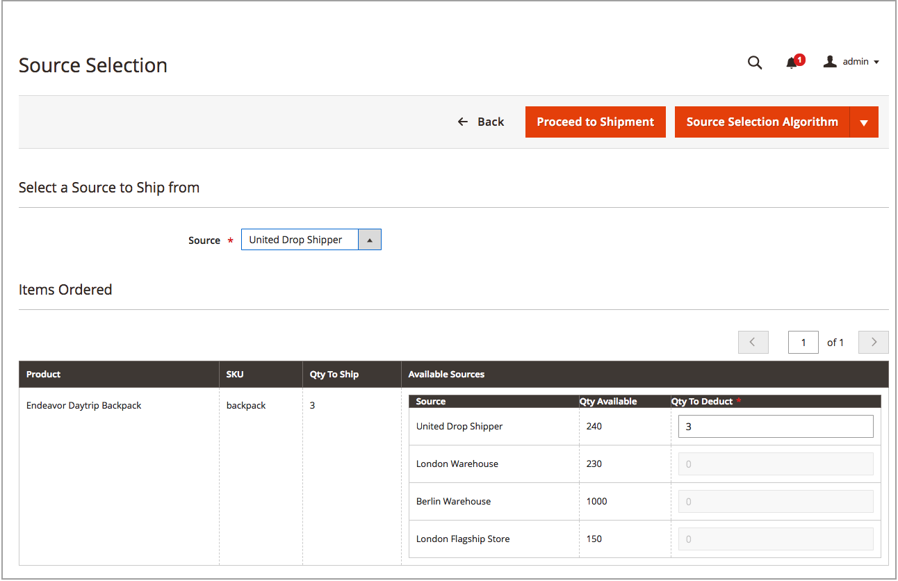

# Criar entregas de várias origens

Com [!DNL Inventory Management], envie uma ou mais remessas conforme o estoque. Para gerar entregas adicionais conforme necessário, repita essas instruções usando quantidades e origens recomendadas ou informadas manualmente. Essas instruções detalham como os comerciantes de várias origens enviam entregas. Comerciantes de origem única enviam remessas sem essas etapas adicionais (consulte [Criar uma remessa](../stores-purchase/shipments.md#create-a-shipment){target="_blank"} no guia do usuário principal).

Ao criar entregas, use o Algoritmo de Seleção do Source para recomendações calculadas. Siga e use essas recomendações ou defina as quantias por origem, gerando entregas personalizadas. Você controla o inventário de saída para cada ordem, definindo as quantias a serem deduzidas, enviando uma ou mais entregas e distribuindo em estoque e backorders, à medida que o inventário estiver disponível. Para cada item de linha na ordem, insira uma quantia a ser deduzida da quantidade de origem.

Você pode enviar entregas parciais para:

- Preencher backorders à medida que o estoque chega

- Saldar deduções de estoque entre origens

À medida que você informa entregas, as quantidades de inventário em estoque deduzem as quantias informadas. Efetivamente, as reservas são convertidas em deduções de quantidade real.

## Criar uma remessa

1. Na barra lateral _Admin_, vá para **[!UICONTROL Sales]** > **[!UICONTROL Orders]**.

1. Localize a ordem e abra-a no modo de exibição.

1. Se o pedido for pago e faturado e estiver pronto para ser enviado, clique em **[!UICONTROL Ship]**.

1. Conclua a Seleção da Source para enviar produtos por origem:

   - Para exibir as recomendações de envio, clique em **[!UICONTROL Source Selection Algorithm]** e selecione um algoritmo.

     | Algoritmo | Descrição |
     |--|--|
     | [Prioridade de Source](source-priority-algorithm.md) | Recomenda remessas de origens de acordo com as ordens de origens atribuídas ao estoque. |
     | [Prioridade de Distância](distance-priority-algorithm.md) | Recomenda entregas de origens mais próximas ao endereço de entrega com base na distância física ou no menor tempo de entrega. |

     >[!IMPORTANT]
     >
     >Ao usar o algoritmo de Prioridade de Distância para remessa e as rotas e os dados não retornam para o [Modo de computação](distance-priority-algorithm.md) selecionado (direção, ciclismo ou caminhada) para uma remessa, o SSA assume como padrão a Prioridade da Source. É recomendável que você também defina a [prioridade para fontes por estoque](stocks-prioritize-sources.md).

   - Para **[!UICONTROL Select a Source to Ship from]**, selecione uma origem para enviar uma remessa.

   - Para cada item de linha, mantenha o valor recomendado ou insira um valor específico no **[!UICONTROL Qty to Deduct]**. Este valor especifica o valor que é deduzido do estoque da origem selecionada.

   - Clique em **[!UICONTROL Proceed to Shipment]**.

     {width="350" zoomable="yes"}

1. Revise a página _[!UICONTROL New Shipment]_e insira quaisquer alterações adicionais, conforme necessário.

   A seção _[!UICONTROL Inventory]_exibe a origem, os produtos enviados, a quantidade total solicitada e a quantidade a ser entregue.

   {width="350" zoomable="yes"}

1. Clique em **[!UICONTROL Submit Shipment]** para concluir.
