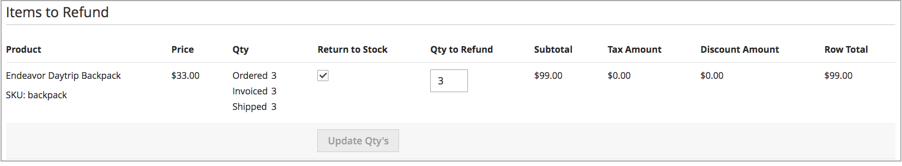

# Gerenciar pedidos e remessas

[!DNL Inventory Management] inclui recursos e opções adicionais para gerenciar quantidades de estoque por meio do processo de remessa. À medida que você revisa e preenche entregas, cancela ordens e emite avisos de crédito, as quantidades do produto comercializável e em estoque são atualizadas automaticamente.

Estas informações incluem especificações para [!DNL Inventory Management]. Para obter informações adicionais, consulte o tópico [Pedidos](../stores-purchase/orders.md){target="_blank"} no _Guia de Experiência de Vendas e Compras_.

## Pedidos

O [!DNL Commerce] oferece suporte a pedidos únicos e pedidos com vários endereços prontos para uso, sem configurações adicionais. À medida que os clientes ou a equipe inserem pedidos, [!DNL Inventory Management] rastreia o estoque usando reservas contra a quantidade vendida, deduzindo da quantidade em estoque os produtos faturados e remetidos.

### Pedidos de vários endereços

Para pedidos com vários endereços, uma série de pedidos únicos é gerada — um para cada endereço de destino inserido. Durante o checkout, os clientes selecionam cada conjunto de produtos associados por endereço durante o checkout, que é gerado como pedidos únicos de acordo com o endereço de destino. Cada pedido inclui os produtos associados por endereço.

[!DNL Commerce] gerencia o estoque dessas ordens com vários endereços exatamente como ordens únicas. Ele permite recomendações ou sobreposições do Source Selection Algorithm durante a entrega, remessas parciais, cancelamento de pedidos e reembolso com atualizações de estoque.

{width="350" zoomable="yes"}

### Reembolsos

Ao inserir um [aviso de crédito](../stores-purchase/credit-memo-create.md){target="_blank"} para emitir um reembolso, você poderá retornar a quantidade do produto para a fonte deduzida. As informações da ordem incluem a origem do estoque que entregou o produto. É recomendável premiar a quantidade do produto devolvido por meio de um aviso de crédito ao receber o produto devolvido.

{width="350" zoomable="yes"}

### Cancelar ordens não entregues

Se um pedido não tiver sido remetido e for cancelado (total ou parcialmente), [!DNL Inventory Management] retornará automaticamente o estoque do produto à quantidade vendável. Até a fatura e a remessa, os produtos comprados são reservados contra a quantidade vendável, não deduzidos da quantidade real. No ponto de faturamento e entrega da ordem, o sistema converte a reserva em uma dedução de inventário.

Nos bastidores, o [!DNL Inventory Management] insere automaticamente uma reserva de compensação removendo a suspensão da quantidade do produto. A quantidade retorna para a quantidade vendida virtual agregada.

## Entregas

Com a [!DNL Inventory Management] habilitada, você pode enviar remessas parciais ou completas de uma ou mais fontes para atender a pedidos. Você controla o inventário de saída para cada ordem, definindo as quantias a serem deduzidas, enviando uma ou mais entregas e distribuindo em estoque e backorders, à medida que o inventário estiver disponível. Para cada item de linha na ordem, insira uma quantia a ser deduzida da quantidade de origem. Gere uma entrega por origem à medida que tiver estoque de estoque, até que toda a ordem seja atendida.

### Remessas parciais

Para comerciantes de várias origens, [!DNL Commerce] gera uma remessa para cada origem selecionada. O workflow geral permite selecionar uma origem, definir a quantidade de produtos a ser deduzida para atender à ordem e prosseguir para a entrega. Quando terminar, crie entregas adicionais para cada origem até que você tenha preenchido a ordem.

Os comerciantes de origem única também podem enviar entregas parciais para suportar backorders ou balancear o inventário à medida que as ordens chegam para itens populares.

### Recommendations e o algoritmo de seleção do Source

O [Algoritmo de Seleção do Source](selection-reservations.md) (SSA) fornece recomendações para remessas parciais e completas. Você pode acessar os Algoritmos de Seleção da Source ao criar NFFs de entrega para uma ordem. Na página Entrega, execute o algoritmo Prioridade ou Prioridade de Distância da Source a qualquer momento para determinar as melhores opções para vincular quantidades solicitadas e origens disponíveis. O sistema oferece suporte à entrega de uma ordem completa a partir de uma origem e à divisão da ordem em várias entregas parciais em várias origens. Você pode acessar essas opções para preenchimento imediato e entregas escalonadas para enviar quantias menores ao longo do tempo.

Para concluir e entregar um pedido, ele deve ter concluído o pagamento e ser faturado. Atualmente, você pode executar novamente o SSA para recomendações e entregar a partir de uma ou mais origens ou sobrepor as recomendações do SSA com origens e quantidades definidas manualmente para preencher a entrega.

- É recomendável executar novamente o SSA para revisar as recomendações para cada entrega.

- Se quiser alterar as seleções, você poderá sobrepor com deduções manuais de origem.

### Remessas e reservas

À medida que as entregas são geradas, as reservas de produtos são liberadas e a quantidade do produto é deduzida. A quantidade disponível por estoque é atualizada com base nos detalhes da remessa. Por exemplo, se você enviar entregas para dez produtos de duas origens, as quantidades dessas origens deduzirão 10 cada. A Quantidade Venável é atualizada automaticamente para estoques associados, fornecendo aos clientes e à equipe as quantidades de produto mais recentes. E as reservas são completamente limpas, não contando mais com a Quantidade Venável.
