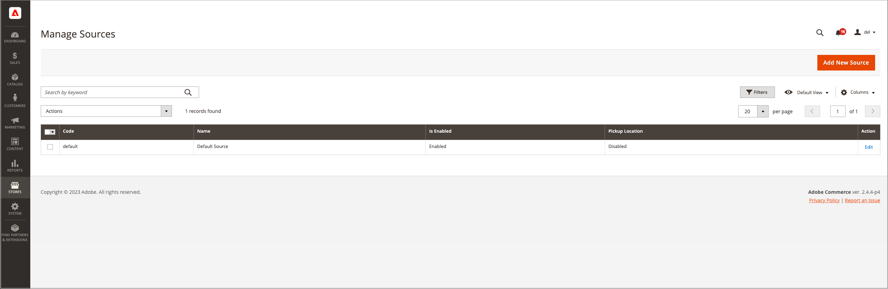

# Adicionar uma origem

Gerencie o inventário e o atendimento de pedidos de vários locais com origens personalizadas. Crie uma origem para cada local, como depósitos, lojas tradicionais, centros de distribuição e entregadores. Atribuir origens e atualizar quantidades por produto

Se estiver editando o Source padrão, você poderá editar todas as configurações, exceto o nome e o código. Recomenda-se que os comerciantes de origem única adicionem informações correspondentes à sua localização.

## Adicionar uma origem de inventário

1. Na barra lateral _Admin_, vá para **[!UICONTROL Stores]** > _[!UICONTROL Inventory]_>**[!UICONTROL Sources]**.

1. Clique em **[!UICONTROL Add New Source]**.

   

1. Expanda  a seção **[!UICONTROL General]** e faça o seguinte:

   - Para identificar a origem do estoque, insira um **[!UICONTROL Name]** exclusivo.

   - Digite um **[!UICONTROL Code]** exclusivo.

     O código oferece suporte a letras maiúsculas e minúsculas, números, traços e sublinhados. O código é um identificador exclusivo usado ao atribuir para dados de estoque e importação/exportação.

   - Se esta origem de inventário estiver pronta para uso, defina **[!UICONTROL Is Enabled]** como `Yes`.

   - Digite um breve **[!UICONTROL Description]** para este local para referência rápida ou detalhes adicionais.

   - Para **[!UICONTROL Latitude]** e **[!UICONTROL Longitude]**, insira as coordenadas do GPS (Global Positioning System) do local das instalações.

     Para localizar as coordenadas do GPS com o [Google Maps][1], digite o endereço na caixa de pesquisa. Clique com o botão direito no marcador no mapa e escolha **[!UICONTROL What's here?]**. As coordenadas do GPS aparecem na caixa de detalhes abaixo do endereço da rua.

     

   - Se esta origem de estoque for um local de retirada, defina **[!UICONTROL Use as Pickup Location]** como `Yes`.

     O Source Padrão não pode ser usado como um local de retirada para ordens de retirada na loja.

1. Expanda  a seção **[!UICONTROL Contact Info]** e faça o seguinte:

   - Para **[!UICONTROL Contact Name]**, insira o nome completo do contato principal no local.

   - Digite um endereço **[!UICONTROL Email]** para contatar a localização.

   - Para **[!UICONTROL Phone]**, insira o código de área e o número de telefone.

   - Para **[!UICONTROL Fax]**, insira o código de área e o número de telefone do fax, se disponível.

     

1. Expanda  a seção **[!UICONTROL Address Data]** e faça o seguinte:

   - Escolha o **[!UICONTROL Country]**.

   - Para **[!UICONTROL State/Province]**, insira a abreviação padrão do estado ou província.

   - Insira o **[!UICONTROL City]**.

   - Insira o endereço físico **[!UICONTROL Street]**.

   - Para **[!UICONTROL Postcode]**, insira o CEP ou código postal.

     

1. Se você definir a origem como um local de retirada na etapa anterior, expanda  na seção **[!UICONTROL Pickup Location]** e forneça informações descritivas sobre a localização:

   - Insira o **[!UICONTROL Frontend Name]** do local de retirada.

   - Insira um **[!UICONTROL Frontend Description]** do local de retirada. Use essa caixa de texto para exibir horas de armazenamento, o local relativo a outros pontos de referência ou outras informações úteis que ajudam o cliente a selecionar o local de retirada correto.

     

   Para obter mais informações sobre como configurar notificações por email ao usar uma origem como um local de retirada, consulte [Emails de Vendas](../configuration-reference/sales/sales-emails.md) no _Guia de Referência de Configuração_.

1. Para salvar seu trabalho, siga um destes procedimentos:

   - Para salvar seu trabalho e continuar editando, clique em **[!UICONTROL Save & Continue]**.

   - Para salvar seu trabalho e retornar à página Gerenciar Fontes, clique na seta para baixo () e escolha **[!UICONTROL Save & Close]**.

   - Para salvar seu trabalho no registro de origem atual e inserir uma nova origem, escolha **[!UICONTROL Save & New]**.

## Barra de botões

| Botão | Descrição |
|--|--|
| [!UICONTROL Back] | Retorna à página Gerenciar fontes. |
| [!UICONTROL Reset] | Restaura todos os campos no formulário aos seus valores no momento do último salvamento. |
| [!UICONTROL Save & Continue] | Salva todas as alterações e mantém o formulário aberto para edição adicional. Clique na seta para baixo para ver opções adicionais: **[!UICONTROL Save & Close]**- Salva alterações no registro atual, fecha o formulário e retorna à página Gerenciar Fontes. **[!UICONTROL Save & New]** - Salva alterações, fecha o registro atual e abre um novo formulário em branco. |

## Descrições dos campos

| Campo | Descrição |
|--|--|
| **[!UICONTROL General]** | |
| [!UICONTROL Name] | (Obrigatório) Um nome exclusivo que identifica a origem do inventário para os usuários administradores. |
| [!UICONTROL Code] | (Obrigatório) Um código alfanumérico exclusivo que é usado pelo sistema para identificar a origem do inventário. Insira o código em caracteres maiúsculos ou minúsculos e/ou números, sem espaços. Se necessário, um hífen ou sublinhado pode ser usado em vez de um espaço. O código não pode ser editado após a criação da fonte. É uma ID exclusiva usada ao atribuir origens a estoques e exportar e/ou importar dados do produto. |
| [!UICONTROL Is Enabled] | Determina se a origem do estoque está disponível para uso. Opções: Sim / Não |
| [!UICONTROL Description] | Uma breve descrição do local de origem do inventário. Inclua detalhes úteis para seus usuários administradores. |
| [!UICONTROL Latitude] | Especifica a coordenada de latitude da fonte de inventário para GPS. Insira o valor como um número, precedido por um sinal de mais ou menos, conforme necessário. O símbolo de grau e as letras não são permitidos. Por exemplo: Latitude 32.7555 |
| [!UICONTROL Longitude] | Especifica a coordenada de longitude da fonte de inventário para GPS. Insira o valor como um número, precedido por um sinal de mais ou menos, conforme necessário. O símbolo de grau e as letras não são permitidos. Por exemplo: `-97.3308` |
| **[!UICONTROL Contact Info]** | |
| [!UICONTROL Contact Name] | O nome do contato principal no local de origem do estoque. |
| [!UICONTROL Email] | O email do contato principal. |
| [!UICONTROL Phone] | O código de área e o número de telefone do contato principal, usando o formato de sua preferência. Por exemplo: `(123) 456-7890` ou `123-456-7890` |
| [!UICONTROL Fax] | O código de área e o número de fax do contato principal. |
| **[!UICONTROL Address Data]** | |
| [!UICONTROL Country] | (Obrigatório) O país onde a origem do inventário está localizada. |
| [!UICONTROL State/Province] | O estado ou província onde a origem do inventário está localizada. |
| [!UICONTROL City] | A cidade onde a origem do inventário está localizada. |
| [!UICONTROL Street] | O endereço da origem do estoque. |
| [!UICONTROL Postcode] | (Obrigatório) O CEP ou código postal da origem do estoque. |
| **[!UICONTROL Pickup Location]** | |
| [!UICONTROL Frontend Name] | O nome do local de retirada da origem que é exibido na loja. |
| [!UICONTROL Frontend Description] | A descrição do local de retirada da origem que é exibida na loja. Ele pode conter imagens anexadas. |

[1]: https://www.google.com/maps
