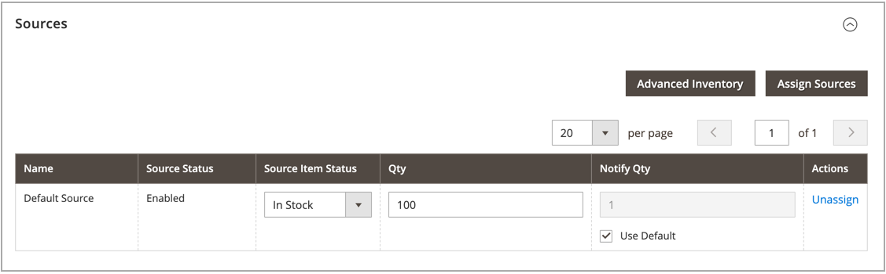

# Atribuir fontes por produto

Antes de modificar quantidades e configurações, você deve atribuir [origens](sources-manage.md) aos produtos.

{{$include /help/_includes/unassign-source.md}}

## Atribuir origens a um produto

1. Na barra lateral _Admin_, vá para **[!UICONTROL Catalog]** > **[!UICONTROL Products]**.

1. Abra um produto no modo _Editar_.

1. Expandir  a seção **[!UICONTROL Sources]**.

   Esta seção permite modificar a origem, atualizar quantidades de inventário e muito mais.

   >[!NOTE]
   >
   >Atualmente, somente produtos simples, configuráveis, virtuais, para download e agrupados são compatíveis com várias fontes. Os produtos do pacote podem ser criados e gerenciados somente com o Source padrão e o Stock.

   {width="600" zoomable="yes"}

1. Para adicionar uma origem, clique em **[!UICONTROL Assign Sources]**.

1. Na página _[!UICONTROL Assign Sources]_, marque a caixa de seleção ao lado de cada origem que você deseja atribuir ao produto.

   {width="600" zoomable="yes"}

1. Clique em **[!UICONTROL Done]** para adicionar as fontes.

1. Siga um destes procedimentos para salvar:

   - Clique em **[!UICONTROL Save]**.
   - No menu _[!UICONTROL Save]_(), escolha **[!UICONTROL Save & Close]**.

Depois de atribuir origens, atualize a [quantidade em estoque](quantities-assign-per-product.md) para cada origem de produto.

<!-- Last updated from includes: 2022-08-30 15:36:09 -->
