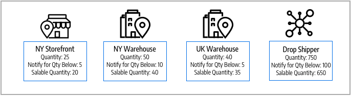

# Estoques e fontes

Gerencie o estoque, independentemente do local do depósito, do tipo de produto ou serviço ou do canal de vendas. Atenda a pedidos e entregue produtos de vários depósitos, lojas tradicionais, centros de distribuição e entrega direta para concluir ordens com foco no inventário balanceado, custos de entrega e muito mais.

Essas descrições incluem produtos, fontes e estoques para uma empresa de bicicletas com vários locais de remessa e sites nos Estados Unidos e na Europa.

## Origens

[Origens](sources-manage.md) são os locais físicos onde o inventário de produtos é gerenciado e enviado para atendimento de pedidos ou onde os serviços estão disponíveis. Esses locais podem incluir depósitos, lojas tradicionais, centros de distribuição e carregadores. [!DNL Commerce] O usa as quantidades e as quantidades comercializáveis por estoque e gerencia automaticamente os valores do inventário para os produtos e pedidos gerenciados. Se você tiver uma fonte, será considerado em _de uma única fonte_ modo. Se você tiver várias fontes, será considerado em _várias origens_ modo.

Uma origem pode ter prioridade no escopo de estoque em um depósito, mas não necessariamente em todos os depósitos, pois a origem pode ser reutilizada em diferentes estoques. O número de estoques e fontes aumenta a complexidade para determinar o melhor depósito ou loja para atender a um pedido. Por exemplo, você pode ter um número limitado de produtos disponíveis em seus locais tradicionais com um inventário extenso em seus depósitos e serviços em locais-chave com disponibilidade limitada.

Neste exemplo, o comerciante tem uma mountain bike disponível para remessa a partir de lojas, armazéns e um drop shipper.

{width="600" zoomable="yes"}

## Estoques

[Estoques](stocks-manage.md) representa um inventário agregado virtual de produtos disponíveis para venda em seus canais de vendas (sites). Cada estoque mapeia seus canais de vendas com origens para inventários disponíveis e quantidades comercializáveis. Dependendo da configuração do site, o estoque pode ser atribuído a um ou mais canais e fontes de vendas.

Os Sales Channel representam entidades que vendem seu inventário, incluindo sites, visualizações de lojas, grupos de clientes B2B e assim por diante. Os canais de vendas só podem ser associados a um Estoque. Cada canal de vendas só pode ter um único estoque atribuído a ele, e um único estoque pode ser atribuído a vários sites. Por meio do estoque, você pode modificar a priorização das origens usadas nas ordens de entrega e pelo [Algoritmo de seleção de origem](selection-reservations.md).

Você começa com um Estoque padrão atribuído com a Origem padrão e seu site, melhor usado por comerciantes de origem única. Somente a Origem padrão pode ser atribuída a esse estoque. Comerciantes de várias origens criam estoques personalizados para fontes e sites personalizados, conforme necessário.

{width="600" zoomable="yes"}

## Quantidades do produto

Quantidade é o número de produtos no inventário ativo que estão disponíveis para compra. A quantidade de produtos aumenta e diminui quando você conclui remessas ou ajusta o inventário. A adição de produtos ao carrinho não afeta essa quantidade. A Quantidade Venável rastreia a disponibilidade do produto para um canal de vendas e também usa esse valor para determinar o estoque disponível para compra. Dependendo do número de origens, você verá e gerenciará a quantidade do produto para uma das seguintes opções:

- **Quantidade** - Para os comerciantes de uma única fonte, a _[!UICONTROL Quantity]_coluna e valor controlam a quantidade de estoque disponível.
- **Quantidade por Origem** - Para os comerciantes de várias _[!UICONTROL Quantity per Source]_A coluna e os valores controlam o estoque disponível por localização. Se você adicionar várias origens, esse valor substituirá a Quantidade e listará cada origem e quantidade atribuída.

As reservas rastreiam solicitações de estoque para todo o processo de compras — adicionar produtos ao carrinho, concluir o check-out e gerenciar reembolsos. Para estoque e estoque disponíveis, as reservas reservam valores de estoque por ordem por meio do processo de finalização, subtraídos da quantidade vendável. As reservas são convertidas em deduções de quantidade ao faturar e enviar produtos.

A Quantidade Venável calcula o inventário virtual de produtos (ou disponibilidade), usando limites configurados, valores reservados ou vendidos e quantidades por origem. Para cada unidade populacional, [!DNL Commerce] acessa todas as origens atribuídas e agrega quantidades de produtos associadas. Com esse valor base, ele subtrai todos os valores de reserva e o _[!UICONTROL Notify for Quantity Below]_limite.

{width="600" zoomable="yes"}

## Configurações de inventário

Cada produto, origem e estoque inclui várias opções para configurar o para sua loja no nível global, de origem, de estoque e de produto. Para obter uma lista completa dessas opções, consulte [Configuração do Inventory management](configuration.md).

Estas são opções importantes para compreender o para [!DNL Inventory Management]:

- **[!UICONTROL Out-of-Stock Threshold]** - Define um valor para subtrair da Quantidade Venável. Se você ativar Backorders, esse valor não será deduzido da Quantidade Venável.
- **[!UICONTROL Backorders]** - Determina se os produtos podem ser vendidos além de um estoque zero, salvando ordens até serem reabastecidas. Quando os backorders estão ativados, configurando o [!UICONTROL Out-of-Stock Threshold] é recomendada.

>[!NOTE]
>
>O valor de Limite esgotado suporta valores negativos e positivos. Se você habilitar Backorders, defina esse valor como um valor negativo para o número máximo de produtos que podem ter backorder antes que o produto seja realmente considerado indisponível.

## Demonstração do Inventory management

Assista a este vídeo para saber mais sobre fontes e ações da Inventory management:

>[!VIDEO](https://video.tv.adobe.com/v/343748?quality=12)
