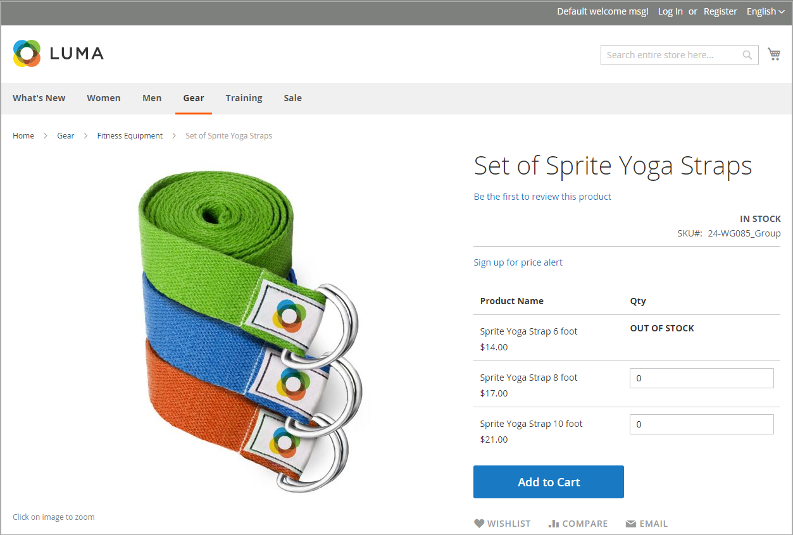
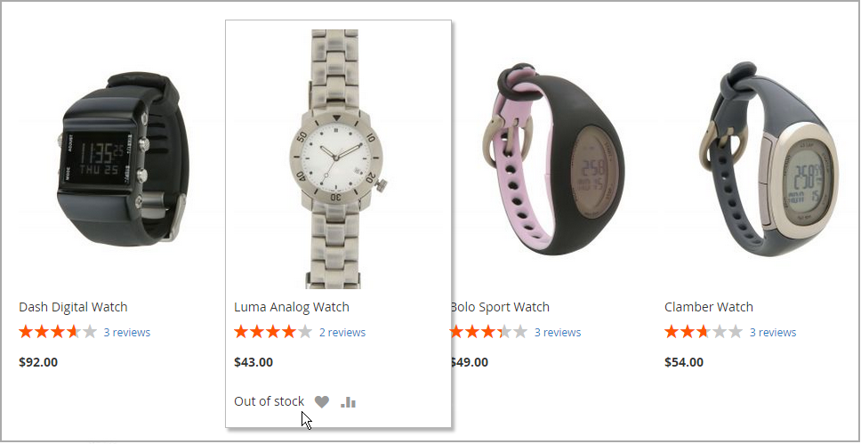

# Cenários de mensagem de estoque

Você pode usar uma combinação de definições de configuração para controlar as mensagens de disponibilidade de estoque nas páginas de produtos e nas listagens de produtos nas páginas de catálogo.

{width="600" zoomable="yes"}

## Mensagens de estoque de página do produto

Há várias variações de mensagens disponíveis para a página do produto, dependendo da combinação das configurações Gerenciar estoque e Disponibilidade do estoque.

### Exemplo 1: mostrar mensagem de disponibilidade

#### Cenário 1

Essa combinação de configurações faz com que a mensagem de disponibilidade apareça na página do produto, de acordo com a disponibilidade de estoque de cada produto.

| Opções de estoque | Configuração | Mensagem |
|--|--|--|
| [!UICONTROL Display product availability in stock in the frontend] | `Yes` | |
| [!UICONTROL Manage Stock] | `Yes` | |
| [!UICONTROL Stock Availability] | `In Stock` | _[!UICONTROL Availability: In Stock]_ |
| | `Out of Stock` | _[!UICONTROL Availability: Out of Stock]_ |

#### Cenário 2

Quando o estoque não é gerenciado para um produto, essa combinação de configurações pode ser usada para exibir a mensagem de disponibilidade na página do produto.

| Opções de estoque | Configuração | Mensagem |
|--|--|--|
| [!UICONTROL Display product availability in stock in the frontend] | `Yes` |  |
| [!UICONTROL Manage Stock] | `No` | _[!UICONTROL Availability: In Stock]_ |

### Exemplo 2: ocultar mensagem de disponibilidade

#### Cenário 1

Essa combinação de configurações e definições de produto impede que a mensagem de disponibilidade apareça na página do produto.

| Opções de estoque | Configuração | Mensagem |
|--|--|--|
| [!UICONTROL Display product availability in stock in the frontend] | `No` |  |
| [!UICONTROL Manage Stock] | `Yes` |  |
| [!UICONTROL Stock Availability] | `In Stock` | Nenhum |
|  | `Out of Stock` | Nenhum |

#### Cenário 2

Quando o estoque não é gerenciado para um produto, essa combinação de configurações e definições do produto impede que a mensagem de disponibilidade apareça na página do produto.

| Opções de estoque | Configuração | Mensagem |
|--|--|--|
| [!UICONTROL Display product availability in stock in the frontend] | `No` |  |
| [!UICONTROL Manage Stock] | `No` | Nenhum |

## Mensagens de estoque de página de catálogo

As seguintes opções de exibição são possíveis para a categoria e as listas de resultados da pesquisa, dependendo da disponibilidade do produto e das definições de configuração.

{width="600" zoomable="yes"}

### Exemplo 1: mostrar produto com a mensagem &quot;Produto esgotado&quot;

Essa combinação de definições de configuração inclui produtos indisponíveis na categoria e nas listas de resultados de pesquisa, e exibe uma mensagem de &quot;indisponível&quot;.

| Opções de estoque | Configuração | Mensagem |
|--|--|--|
| [!UICONTROL Display Out of Stock Products] | `Yes` |  |
| [!UICONTROL Display product availability in stock in the frontend] | `Yes` | _[!UICONTROL Out of stock]_ |
| [!UICONTROL Display Out of Stock Products] | `Yes` |  |
| [!UICONTROL Display product availability in stock in the frontend] | `No` | Nenhum |

### Exemplo 2: mostrar produto sem mensagem &quot;esgotado&quot;

Essa combinação de definições de configuração inclui produtos indisponíveis na categoria e nas listas de resultados de pesquisa, mas não exibe uma mensagem.

| Opções de estoque | Configuração | Mensagem |
|--|--|--|
| [!UICONTROL Display Out of Stock Products] | `Yes` | Nenhum |
| [!UICONTROL Display product availability in stock in the frontend] | `No` |  |

### Exemplo 3: ocultar o produto até que ele esteja novamente em estoque

Essa configuração omite totalmente os produtos indisponíveis da categoria e das listas de resultados de pesquisa até que estejam de volta ao estoque.

| Opções de estoque | Configuração | Mensagem |
|--|--|--|
| [!UICONTROL Display Out of Stock Products] | `No` | Nenhum |
