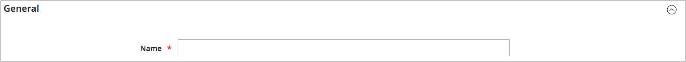
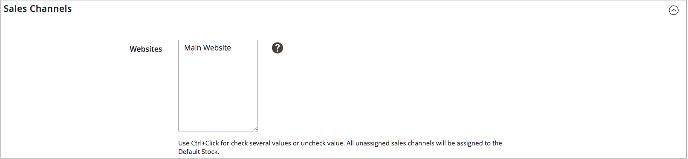
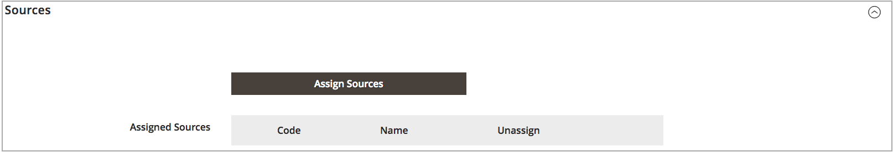
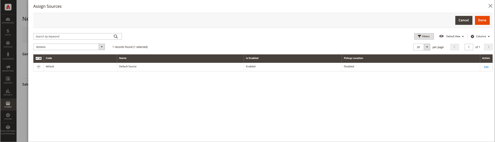

# Adicionar um estoque

Os estoques mapeiam suas fontes para canais de vendas (ou sites), fornecendo um link direto para quantidades comercializáveis e inventários de produtos.

Ao criar um estoque personalizado, você atribui sites e fontes. As origens podem incluir origens ativadas e desativadas. Por exemplo, você pode adicionar um depósito ao estoque, preparando-se para abrir o local para gerenciar estoque e concluir remessas.

Depois de adicionar origens, você deve priorizar a ordem das origens de cima (primeiro) para baixo (último). Esse pedido afeta as recomendações durante o envio do pedido.

{width="600" zoomable="yes"}

## Adicionar o estoque de estoque

1. Na barra lateral _Admin_, vá para **[!UICONTROL Stores]** > _[!UICONTROL Inventory]_>**[!UICONTROL Stock]**.

1. Clique em **[!UICONTROL Add New Stock]**.

1. Expanda  a seção **[!UICONTROL General]** e insira um **[!UICONTROL Name]** exclusivo para identificar o novo estoque.

   {width="350" zoomable="yes"}

1. Expanda  a seção **[!UICONTROL Sales Channels]** e selecione o **[!UICONTROL Websites]** onde esse estoque está disponível.

   Para uma instalação multissite, mantenha pressionada a tecla Ctrl (PC) ou a tecla Command (Mac) e clique em cada site.

   >[!NOTE]
   >
   >Se você selecionar um site ou canal de vendas atribuído a outro estoque, ele será desatribuído desse estoque. Todos os Canais de vendas não atribuídos a um estoque personalizado são atribuídos ao Estoque padrão.

   {width="350" zoomable="yes"}

1. Expanda  a seção **[!UICONTROL Sources]** e faça o seguinte para qualquer estoque diferente do padrão:

   - Clique em **[!UICONTROL Assign Sources]**.

   {width="350" zoomable="yes"}

   - Marque as caixas de seleção para todas as origens que você deseja atribuir ao estoque.

   >[!IMPORTANT]
   >
   >Se você atribuir a mesma origem a vários estoques, poderá resultar em venda excessiva dos produtos atribuídos a essa origem.

   - Clique em **[!UICONTROL Done]**.

     As fontes adicionadas são exibidas em Fontes atribuídas.

     {width="600" zoomable="yes"}

1. Use o  para arrastar e soltar as fontes em uma prioridade de cima (primeiro) para baixo (último).

   A ordem de origem é importante ao enviar ordens.

   {width="600" zoomable="yes"}

1. No menu _[!UICONTROL Save]_(), escolha **[!UICONTROL Save & Close]**.

## Descrições dos campos

| Campo | Descrição |
|--|--|
| **[!UICONTROL General]** | |
| [!UICONTROL Name] | Nome do estoque. Por exemplo: `UK Stock`, `US Stock` |
| **[!UICONTROL Sales Channels]** | |
| [!UICONTROL Websites] | Define o [escopo](../getting-started/websites-stores-views.md#scope-settings) do estoque atribuindo o estoque a sites específicos como _canais de vendas_. Selecione um ou mais sites por estoque. Cada site só pode ser atribuído a um estoque. |
| **[!UICONTROL Sources]** | |
| [!UICONTROL Assign Sources] | Atribui origens de estoque a esse estoque. As fontes personalizadas não podem ser atribuídas ao Estoque padrão. |
| [!UICONTROL Assigned Sources] | Lista de fontes atribuídas. Arraste e solte as fontes usando o  em uma ordem priorizada para atendimento e remessa de pedidos.  **[!UICONTROL Code]**- Identificação de código exclusivo para a origem. **[!UICONTROL Name]** - Descrição de nome da origem. **[!UICONTROL Unassign]**- Remova a origem atribuída do estoque usando o . |
