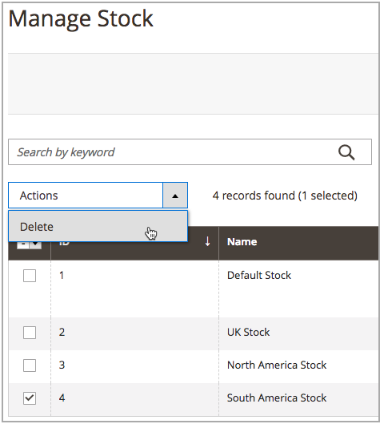

# Excluir estoques

Quando você exclui o estoque, todos os sites atribuídos são atribuídos ao Estoque padrão. Recomenda-se reatribuir sites a outros estoques antes da exclusão.

>[!IMPORTANT]
>
>Excluir um [estoque](stocks-manage.md) pode afetar as quantidades comercializáveis e os pedidos não processados de um canal de vendas. Se você continuar usando um canal de vendas, adicione o canal de vendas a outro estoque existente ou novo.

1. Na barra lateral _Admin_, vá para **[!UICONTROL Stores]** > _[!UICONTROL Inventory]_>**[!UICONTROL Stocks]**.

1. Selecione um ou mais estoques a serem excluídos.

   Procure ou pesquise e marque caixas de seleção para os estoques que deseja excluir.

1. No menu **[!UICONTROL Actions]**, selecione **[!UICONTROL Delete]**.

   {width="350" zoomable="yes"}

1. No diálogo de confirmação, clique em **[!UICONTROL OK]**.

   O estoque é excluído e todos os canais de vendas atribuídos são desmapeados.

   {width="350" zoomable="yes"}
