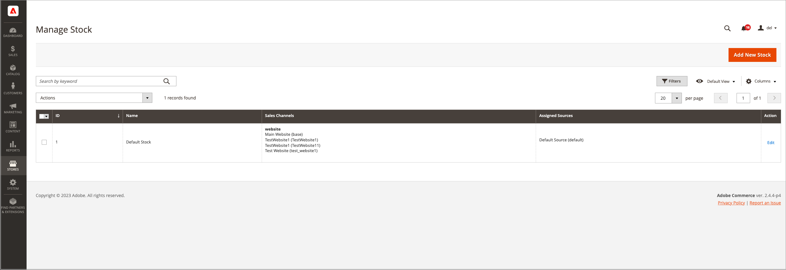

# Gerenciar estoque

O Stock representa um inventário agregado virtual de produtos para fontes de seus canais de vendas (sites). Dependendo da configuração do site, o estoque pode ser atribuído a um ou mais canais de vendas. Cada canal de vendas só pode ter um único estoque atribuído a ele, e um único estoque pode ser atribuído a vários canais de vendas. Por meio do estoque, você pode modificar a priorização das fontes usadas à medida que os pedidos chegam por meio de um canal de vendas.

Você começa com um Estoque padrão que não pode ser removido ou desativado. Você pode adicionar outros canais de vendas somente ao estoque. A única origem atribuída é a Origem padrão. Esse estoque é usado por comerciantes de origem única, integrações de terceiros e produtos importados.

Sales Channel representam entidades que vendem seu inventário. Por padrão, [!DNL Commerce] O fornece os sites da loja como canais de vendas. Os canais de vendas podem ser estendidos para oferecer suporte a canais adicionais, como grupos de clientes B2B e visualizações de loja. Cada canal de vendas pode ser associado a apenas um Stock.

- **Suporte para Sales Channel** - Atualmente, os canais de vendas incluem sites prontos para uso. Você pode estender canais de vendas para incluir opções personalizadas, como grupos de clientes B2B e exibições de loja. Cada canal de vendas só pode ter um único estoque atribuído a ele. Um único estoque pode ser atribuído a vários canais de vendas.
- **Mapear para fontes** - Cada estoque pode ter uma ou mais fontes habilitadas ou desabilitadas atribuídas, calculando o estoque agregado virtual por produto.
- **Atendimento de Pedido Prioritário** - O algoritmo de prioridade pronta para uso do algoritmo de seleção de origem usa a lista de origem do estoque de cima para baixo ao atender pedidos.

O diagrama a seguir ajuda a definir como um Stock funciona em relação às Origens e Sales Channel para um comerciante de uma Loja de Bicicletas.

{width="600" zoomable="yes"}

## Exemplo de ações para uma mountain bike e loja

Todos os armazenamentos começam com um Estoque padrão. Deve permanecer `Enabled` pelos seguintes motivos:

- Ele é usado ao importar novos produtos, atribuindo automaticamente os produtos à fonte padrão e ao estoque para acesso imediato a [!DNL Inventory Management].
- Não é possível adicionar outras fontes além da Fonte padrão a esse estoque.
- Ela é necessária e usada por comerciantes de origem única, produtos de pacote e produtos agrupados.

Para comerciantes de várias origens, crie e configure estoques para melhor se adequar às suas lojas e ao atendimento de pedidos. Quando você atribui um novo estoque a um canal de vendas, qualquer estoque pré-existente nesse canal de vendas se torna não atribuído.

Para uma instalação com várias lojas, o Estoque padrão é atribuído inicialmente ao [Site principal](../stores-purchase/stores.md#add-websites){target="_blank"} e armazenamento padrão. O estoque e as quantidades corretos são exibidos para produtos habilitados e desabilitados na **[!UICONTROL Products]** exibição de grade.

{width="600" zoomable="yes"}

## Barra de botões

| Botão | Descrição |
|--|--|
| [!UICONTROL Add New Stock] | Abre a _[!UICONTROL New Stock]_formulário usado para inserir um novo estoque de estoque para mapear o estoque para o canal de vendas. |

## Descrições da coluna Gerenciar estoque

| Coluna | Descrição |
|--|--|
| [!UICONTROL ID] | ID numérica exclusiva gerada para a entrada de estoque. |
| [!UICONTROL Name] | Nome exclusivo que identifica o estoque de estoque. |
| [!UICONTROL Sales Channels] | Define o escopo do estoque atribuindo o estoque a sites específicos como _canais de vendas_. |
| [!UICONTROL Assigned sources] | Fontes atribuídas ao estoque que fornecem todas as quantidades de produtos. |
| [!UICONTROL Action] | **[!UICONTROL Edit]** - Abre o registro de estoque de estoque no modo de edição. |
