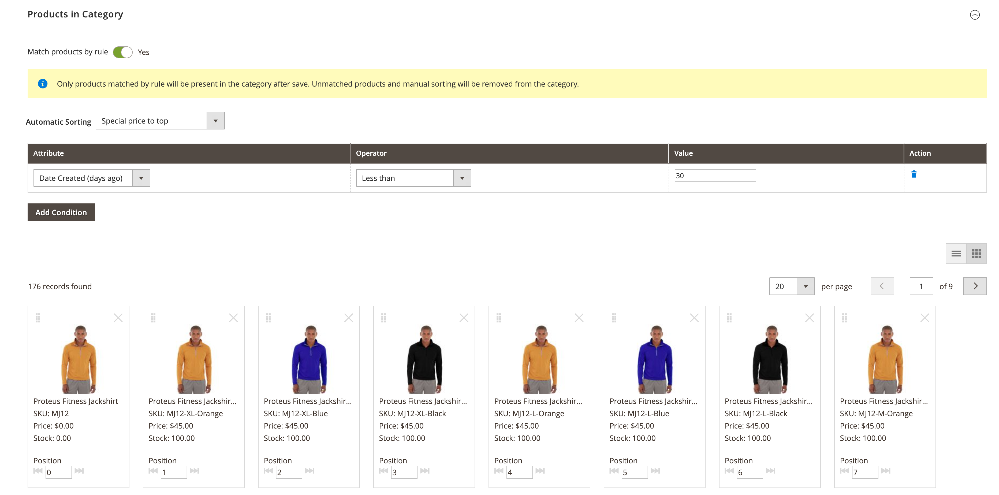

# Regras de categoria para merchandising

{{ee-feature}}

As regras de categoria alteram dinamicamente a seleção de produtos de acordo com um conjunto de condições. Cada categoria pode ter apenas uma regra de categoria, embora a única regra possa ter várias condições. Por exemplo, é possível criar uma regra de categoria para uma marca específica. Os produtos da mesma marca são adicionados automaticamente à lista, mesmo se não estiverem atribuídos à mesma categoria. É possível adicionar quantas condições forem necessárias à expressão para descrever os produtos que deseja incluir.

>[!TIP]
>
>Durante a configuração da regra de categoria, os produtos estão _classificados_, _correspondentes_, _atribuídos_ e _não atribuídos_ de acordo com essa regra **_somente_** quando essa categoria é salva. Por exemplo, se você adicionar um produto ao catálogo e quiser atribuí-lo de acordo com a regra, **deverá salvar novamente cada categoria** definida para corresponder a produtos por regra. Além disso, se o status do estoque de qualquer produto for alterado para `In Stock` ou `Out of Stock` e os produtos da categoria tiverem de ser _classificados_ de acordo com a regra **[!UICONTROL Automatic Sorting]**, você deve clicar em **[!UICONTROL Save Category]**.

Cada condição consiste em um atributo, valor e operador lógico. Somente atributos com a propriedade _[[!UICONTROL Use in Product Listing]](../catalog/attribute-product-create.md)_definida como `Yes` podem ser usados em regras de categoria. Você deve definir essa propriedade para o atributo se quiser usar um atributo que não esteja incluído nas listagens de produtos. Embora os atributos de Data não sejam suportados, você pode usar os atributos Data de criação ou Data de modificação para definir uma data ou um intervalo de datas. Por exemplo, para incluir apenas produtos criados na semana passada, defina &quot;Data de criação&quot; como um valor de `<7`.

>[!NOTE]
>
>Configure cada atributo usado na regra como um [_atributo inteligente_](smart-attributes-configure.md).

{width="600" zoomable="yes"}

As regras de produto de categoria podem acelerar o processo de atribuição de produtos específicos a categorias, com base nas condições que determinam quais produtos aparecem na categoria. Os atributos &quot;inteligentes&quot; que podem ser usados com regras de produto de categoria são especificados na configuração do [Visual Merchandiser](visual-merchandiser.md).

>[!NOTE]
>
>Tenha cuidado ao aplicar uma regra de produto de categoria, pois todos os produtos que não atendem à condição são removidos da categoria. Por exemplo, se você criar uma regra que inclua apenas tampas de tanque roxas, todas as outras tampas de tanque serão removidas da categoria.

## Etapa 1: configurar os atributos _smart_

1. Para cada atributo que deve ser usado na regra, verifique se a propriedade de vitrine do [[!UICONTROL Use in Product Listing]](../catalog/product-attributes.md) está definida como `Yes`.

   >[!NOTE]
   >
   >Certifique-se de que o atributo selecionado NÃO seja um _[!UICONTROL Input Type]_&#x200B;de várias seleções.

1. Conclua a [configuração](smart-attributes-configure.md) para identificar cada atributo _inteligente_ a ser usado com o Visual Merchandiser.

## Etapa 2: criar a regra de categoria

1. Na árvore de categorias, abra a categoria a ser editada.

1. Na seção **[!UICONTROL Products in Category]**, defina **[!UICONTROL Match products by rule]** como `Yes`.

   As opções de classificação e condição automáticas são exibidas.

1. Clique em **[!UICONTROL Add Condition]**.

1. Escolha o **[!UICONTROL Attribute]** que é a base da condição.

1. Defina **[!UICONTROL Operator]** como um dos seguintes:

   - `Equal`
   - `Not equal`
   - `Greater than`
   - `Greater than or equal to`
   - `Less than`
   - `Less than or equal to`
   - `Contains`

1. Insira o **[!UICONTROL Value]** que deve ser correspondido.

   {width="500"}

1. Repita esse processo para cada atributo necessário para descrever as condições a serem atendidas.

   Por exemplo, para corresponder a produtos que foram criados entre sete e 30 dias atrás, faça o seguinte:

   - Defina **[!UICONTROL Date Created]** como `Less than 30`.

   - Defina **[!UICONTROL Logic]** como `AND`.

     >[!NOTE]
     >
     >Quando você escolhe `AND`, a regra se aplica a produtos em que todas as condições são atendidas. Quando você escolhe `OR`, ele se aplica a produtos em que pelo menos uma condição é atendida.

   - Defina **[!UICONTROL Date Modified]** como `Greater than 7`.

1. Para aplicar automaticamente uma ordem de classificação à lista de produtos gerada dinamicamente, defina **[!UICONTROL Automatic Sorting]**.

   {width="600" zoomable="yes"}

   As opções de ordem de classificação são definidas globalmente e aplicadas com base nas condições atuais. Não é possível definir uma ordem de classificação diferente para o nível de exibição de site, loja ou loja.

   | opção Classificar | Descrição |
   |-----------| -----------|
   | [!UICONTROL Stock quantity] | Classificar com base no estoque, de cima ou de baixo: `Move low stock to top` ou `Move out of stock to bottom` |
   | [!UICONTROL Special price] | Classificar com base no preço, de cima ou de baixo: `Special price to top` ou `Special price to bottom` |
   | [!UICONTROL New Products] | Listar os produtos mais recentes: `Newest products first` |
   | [!UICONTROL Color] | Classificar alfabeticamente por cor: `Sort by color` |
   | [!UICONTROL Product Names] | Classificar por nome em ordem crescente ou decrescente: `Name A - Z` ou `Name Z -A` |
   | [!UICONTROL SKU] | Classificar por SKU em ordem crescente ou decrescente: `SKU: Ascending` ou `SKU: Descending` |
   | [!UICONTROL Price] | Classificar por preço em ordem crescente ou decrescente: `Price: High to low` ou `Price: Low to high` |

   {style="table-layout:auto"}

1. Quando terminar, clique em **[!UICONTROL Save Category]**.

>[!NOTE]
>
>Ao configurar uma regra de categoria, os produtos são correspondidos e atribuídos à regra quando a categoria é salva. Se você adicionar um produto ao catálogo e quiser incluí-lo na regra, será necessário salvar novamente cada categoria definida para corresponder produtos por regra. Isso garante que o novo produto seja incluído.

### Opções de menu

- **[!UICONTROL Match products by rule]** - Determina se a lista de produtos na categoria é gerada dinamicamente por uma regra de categoria. Opções: `Yes` / `No`

- **[!UICONTROL Automatic Sorting]** - Aplica automaticamente uma ordem de classificação à lista de produtos da categoria. Opções: `None`, `Move low stock to top`, `Move low stock to bottom`, `Special price to top`, `Special price to bottom`, `Newest products first`, `Sort by color`, `Name: A - Z`, `Name: Z - A`, `SKU: Ascending`, `SKU: Descending`, `Price: High to Low` e `Price: Low to High`

  >[!NOTE]
  >
  >Se você tiver um produto configurável com produtos secundários, o estoque do produto principal será calculado com base no total combinado de estoques de produtos secundários. Considere um exemplo onde você tenha produtos configuráveis _Proteus Fitness Shirt_ com produtos filho laranja, vermelho e amarelo com diferentes quantidades de estoque de cada um. O estoque do produto principal é calculado com base no total combinado do estoque de produtos secundários laranja, vermelho e amarelo. Com a opção `Move low stock to top`, ele calcula o estoque de produtos principais combinando todo o seu estoque de produtos secundários comercializáveis e o classifica de acordo.

- **[!UICONTROL Add Condition]** - Adiciona outra condição à regra.

- **[!UICONTROL Attribute]** - Determina o atributo usado como base da condição. Opções:

  | Opção | Descrição |
  | ------ | ----------- |
  | `Clone Category ID(s)` | Clona dinamicamente produtos, sem sua classificação e ordem, de várias categorias com base na ID de categoria. |
  | `Color` | Inclui produtos com base na cor. |
  | `Date Created (days ago)` | Inclui produtos com base no número de dias desde que os produtos foram adicionados ao catálogo. |
  | `Date Modified (days ago)` | Inclui produtos com base no número de dias desde a última modificação dos produtos. |
  | `Name` | Inclui produtos com base no nome do produto. |
  | `Price` | Inclui produtos com base no preço. Este atributo não se aplica aos produtos configuráveis porque eles não têm seu próprio preço. |
  | `Quantity` | Inclui produtos com base na quantidade em estoque. |
  | `SKU` | Inclui produtos baseados no SKU. |

  {style="table-layout:auto"}

  >[!NOTE]
  >
  >A quantidade de um produto configurável com opções filho é calculada combinando todas as quantidades de produtos filho dimensionáveis. Considere um exemplo em que você tem um produto configurável _Repositório Básico_ com opções de cor roxa, vermelha e amarela e quantidades diferentes de cada um. Nesse caso, a quantidade do produto principal (Tanque de condicionamento básico) é a quantidade comercializável combinada dos produtos secundários de cor roxa, vermelha e amarela.

- **[!UICONTROL Operator]** - Especifica o operador que é aplicado ao valor do atributo para atender à condição. A menos que um operador seja especificado, `Equal` é usado como padrão. Opções: `Equal`, `Not equal`, `Greater than`, `Greater than or equal to`, `Less than`, `Less than or equal to` e `Contains`

- **[!UICONTROL Value]** - Especifica o valor que o atributo deve ter para atender à condição.

- **[!UICONTROL Logic]** - A coluna Lógica é usada para definir várias condições e aparece somente quando outra condição é adicionada. Os operadores seguem as regras de precedência para MySQL [operadores booleanos](https://dev.mysql.com/doc/refman/8.0/en/operator-precedence.html). Opções: `AND` / `OR`
