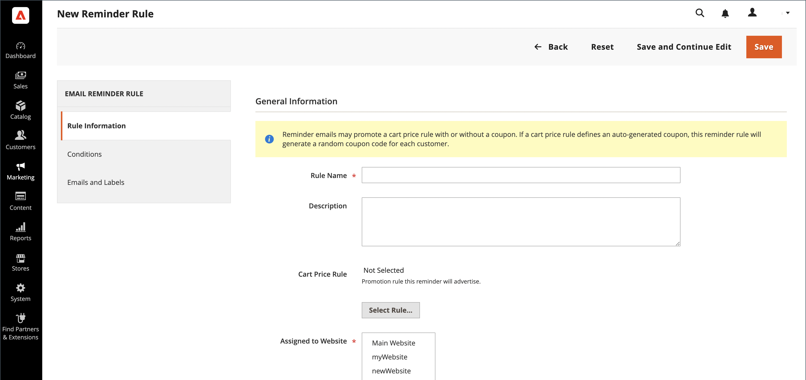

# Criar lembretes de email

Antes de configurar uma regra de lembrete de email, primeiro [configure uma regra de preço do carrinho](price-rules-cart-create.md) para definir a promoção que está sendo oferecida. As condições das regras que acionam um lembrete de email podem ser baseadas nas propriedades do carrinho, nas propriedades da lista de desejos ou em ambas.

>[!NOTE]
>
>Os lembretes de email podem promover uma regra de preço de carrinho com ou sem um cupom. Uma regra de preço do carrinho que define um cupom gerado automaticamente gera um código de cupom aleatório para cada cliente.

1. Na barra lateral _Admin_, vá para **[!UICONTROL Marketing]** > _[!UICONTROL Communications]_>**[!UICONTROL Email Reminder Rules]**.

1. No canto superior direito, clique em **[!UICONTROL Add New Rule]**.

1. Conclua o _[!UICONTROL Rule Information]_&#x200B;da seguinte maneira:

   {width="700" zoomable="yes"}

   - Insira um **[!UICONTROL Rule Name]** para identificar a regra internamente.

   - Insira um breve **[!UICONTROL Description]** da regra.

   - Para escolher a promoção **[!UICONTROL Cart Price Rule]** que este lembrete deve anunciar, clique em **[!UICONTROL Select Rule…]** e selecione a regra.

     {width="600" zoomable="yes"}

   - Para que a regra entre em vigor imediatamente, defina **[!UICONTROL Status]** como `Active`.

   - Para configurar um intervalo de datas para que a regra fique ativa, insira as datas **[!UICONTROL From]** e **[!UICONTROL To]**.

     Você também pode escolher a data no Calendário (  ).

   - Para enviar o lembrete mais de uma vez, insira o número de dias antes da explosão do próximo email no campo **[!UICONTROL Repeat Schedule]**.

1. No painel à esquerda, escolha **[!UICONTROL Conditions]**.

   Pelo menos uma condição deve ser definida para a regra. O processo é semelhante à criação de uma [regra de preço de catálogo.](price-rules-catalog.md)

   {width="600" zoomable="yes"}

   Clique em _Adicionar_ ( ) para exibir a lista de opções e escolha uma das seguintes condições:

   - Lista de desejos
   - Carrinho de compras

   >[!NOTE]
   >
   >Se um cliente tiver mais de um carrinho abandonado correspondente, uma lista de desejos ou uma combinação de ambos, o lembrete de email será acionado apenas uma vez para esse cliente. Para acionar o mesmo lembrete de email novamente, use o campo _[!UICONTROL Repeat Schedule]_&#x200B;para definir o número de dias entre os emails.  
   >
   >O mesmo lembrete de email é **_não acionado novamente_** para o mesmo cliente para os **_novos_** carrinhos abandonados e listas de desejos **_após_** o período _[!UICONTROL Repeat Schedule]_&#x200B;terminou.

   Preencha a condição para descrever o cenário que aciona o lembrete de email.

   {width="600" zoomable="yes"}

1. No painel à esquerda, escolha **[!UICONTROL Emails and Labels]**.

   {width="600" zoomable="yes"}

1. Na seção **[!UICONTROL Email Templates]**, escolha o modelo de email a ser usado para cada site e exibição de loja na sua [hierarquia de loja](../getting-started/websites-stores-views.md).

   Se você não quiser enviar o email de lembrete para os clientes de uma exibição de loja, deixe o valor `Not Selected`.

1. Na seção _Títulos e descrição padrão_, faça o seguinte:

   - Insira o **[!UICONTROL Rule Title for All Store Views]**.

     >[!NOTE]
     >
     >Esse valor pode ser incorporado a modelos de email usando a variável `promotion_name`.

   - Insira o **[!UICONTROL Rule Description for All Store Views]**.

     {width="500" zoomable="yes"}

   - Na seção _[!UICONTROL Titles and Descriptions Per Store View]_, insira o **[!UICONTROL Rule Title]**&#x200B;e **[!UICONTROL Description]**&#x200B;para a_ Exibição de Loja Padrão _. Para várias exibições de loja, insira o título e a descrição apropriados para cada uma.

     >[!NOTE]
     >
     >A descrição pode ser incorporada aos modelos de email usando a variável promotion_description.

     {width="500" zoomable="yes"}

1. Quando terminar, clique em **[!UICONTROL Save]**.

## Condições de acionamento

| Source | Acionador |
|--- |--- |
| [!UICONTROL Wish List] | [!UICONTROL Conditions Combination] [!UICONTROL Sharing] [!UICONTROL Number of Items] [!UICONTROL Items Sub selection] |
| [!UICONTROL Shopping Cart] | [!UICONTROL Conditions Combination] [!UICONTROL Coupon Code] [!UICONTROL Cart Line Items] [!UICONTROL Items Quantity] [!UICONTROL Virtual Only] [!UICONTROL Total Amount] [!UICONTROL Items Subselection] |

{style="table-layout:auto"}

## Descrições dos campos

| Campo | Descrição |
|--- |--- |
| [!UICONTROL Rule Name] | O nome da regra de lembrete automatizado identifica a regra internamente. |
| [!UICONTROL Description] | Uma descrição da regra para referência interna. |
| [!UICONTROL Shopping Cart Price Rule] | A regra do carrinho de compras associada a este lembrete de email. Emails de lembrete podem promover uma regra de preço de carrinho de compras com ou sem cupom. Se uma regra de preço do carrinho de compras incluir um cupom gerado automaticamente, a regra de lembrete gerará um código de cupom exclusivo e aleatório para cada cliente. |
| [!UICONTROL Assigned to Website] | Os sites que recebem email automático de lembrete com base nesta regra. |
| [!UICONTROL Status] | Ativa a regra. Se o status for inativo, todas as outras configurações serão ignoradas e a regra não será acionada. Opções: `Active` / `Inactive` |
| [!UICONTROL From Date] | A data inicial desta regra de lembrete automatizada. Se nenhuma data for especificada, a regra se tornará ativa imediatamente. |
| [!UICONTROL To Date] | A data final desta regra de lembrete automatizada. Se nenhuma data for especificada, a regra se tornará ativa indefinidamente. |
| [!UICONTROL Repeat Schedule] | O número de dias antes da regra ser acionada e o email de lembrete enviado novamente, desde que as condições sejam atendidas. Para acionar a regra mais de uma vez, insira o número de dias antes da explosão do próximo email, separado por vírgula. Por exemplo, insira `7` para que a regra seja acionada novamente sete dias depois; insira `7,14` para que a regra seja acionada em sete dias e novamente 14 dias depois. |
| [!UICONTROL Email Templates] | Determina o modelo de email a ser usado para cada exibição da loja. |
| [!UICONTROL Rule Title for All Store Views] | Determina o título da regra para cada exibição de loja. |
| [!UICONTROL Rule Description for All Store Views] | Determina a descrição da regra para cada exibição de loja. |

{style="table-layout:auto"}
