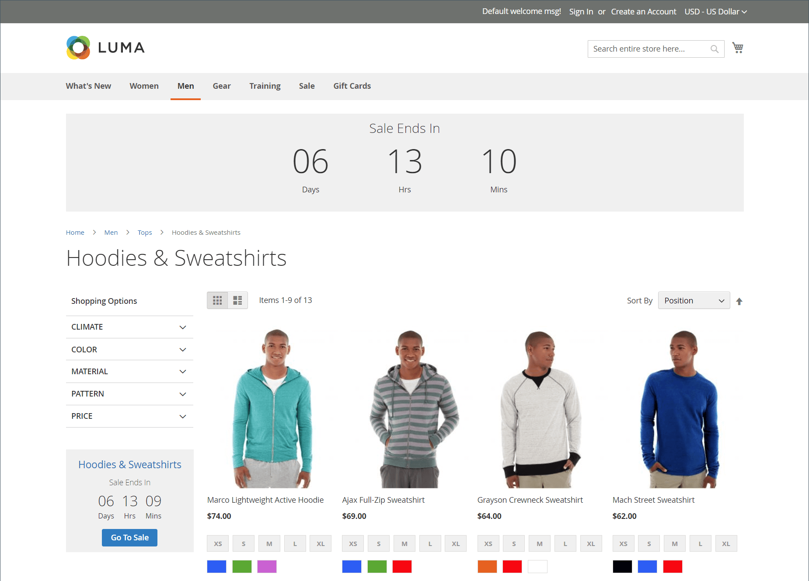

# Vendas e eventos privados

{{ee-feature}}

Vendas privadas e outros eventos de catálogo são uma ótima maneira de usar sua base de clientes existente para gerar burburinho e novos leads ou para descarregar o inventário excedente. Você pode criar vendas por tempo limitado, limitar vendas a membros específicos ou criar uma página de venda privada independente. Você também pode definir convites e detalhes do evento. Aumente a fidelidade da marca e gere um burburinho ao oferecer aos melhores clientes o tratamento para VIP. Ofereça acesso exclusivo a vendas somente para membros ou vendas privadas para aumentar a fidelidade à marca. Você também pode usar essas vendas para liquidar mercadorias em excesso. Os grupos de clientes são úteis na configuração desses tipos de membros apenas e nas vendas do VIP.

{width="700" zoomable="yes"}

## Componentes de gerenciamento de eventos

- **Categorias** - Cada evento está associado a uma [categoria](../catalog/category-create.md) do seu catálogo.

- **Eventos** - As vendas de eventos são baseadas em uma data de início e término. Você pode usar um [ticker de contagem regressiva](#event-ticker) para mostrar o tempo restante.

- **Carrossel de eventos do catálogo** - Quando o [widget de Evento do catálogo](../content-design/widget-event-carousel.md) está habilitado na configuração, ele pode ser colocado nas páginas de armazenamento como uma lista de eventos abertos e futuros, classificados por data de término. Se dois ou mais eventos tiverem a mesma data de término, eles serão classificados com base na ordem especificada na configuração.

- **[!UICONTROL Websites]** - Permissões de categoria baseadas principalmente em [grupos de clientes](../customers/customer-groups.md).

- **Permissões de categoria** - [Permissões de categoria](../catalog/category-permissions.md) oferecem controle total sobre as atividades específicas que podem ocorrer em uma determinada categoria.

- **Restrições de acesso** - Impede o [acesso](event-configure.md#restrict-access) público ao site, redirecionando para uma página de aterrissagem, página de logon ou página de registro.

- **Convites** - As mensagens de email são enviadas com um link para criar uma conta no armazenamento. Você pode restringir a capacidade de criar uma conta apenas àqueles que recebem um [convite](invitations.md).

- **Relatórios de vendas particulares** - Os [Relatórios de Vendas Particulares](../getting-started/private-sales-reports.md) fornecem informações sobre convites enviados, clientes convidados e conversões.

## ticker de evento

O bloco de ticker exibe uma contagem regressiva para eventos abertos, com as datas de início e término para eventos futuros. Se um evento tiver sido fechado, o ticker mostrará as datas de início e término.

{width="700" zoomable="yes"}

Se o ticker da página de categoria estiver ativado para um evento, o bloco de ticker aparecerá na parte superior da listagem de categorias. Se o ticker da página do produto estiver ativado, o bloco de ticker também aparecerá na parte superior da página do produto de qualquer produto associado à categoria.

O ticker de evento pode ser habilitado ao [criar eventos](event-create.md).

{width="700" zoomable="yes"}
