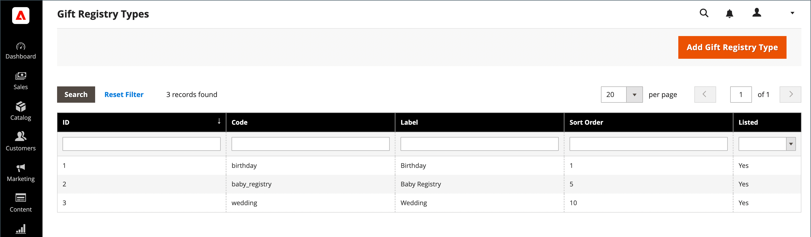
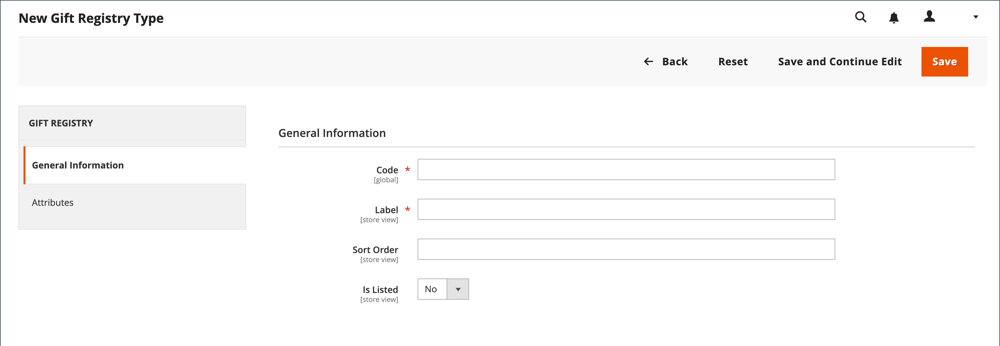

# Configuração do registro de presentes

{{ee-feature}}

Um registro de presentes pode ser criado para qualquer tipo de evento, como um casamento, aniversário, aniversário, novo bebê ou qualquer outra ocasião especial. Por padrão, o Adobe Commerce inclui os seguintes eventos especiais:

- Bebê
- Aniversário
- Casamento

Ao criar um registro, ele se torna uma opção na lista de tipos de registro de presentes na conta do cliente.

Você pode usar um dos três registros de presentes preparados ou criar seu próprio registro personalizado. Cada tipo de registro de presente inclui vários atributos, que são os campos de entrada de dados que um cliente conclui para criar um registro de presente. Os atributos fornecem informações adicionais sobre o evento, a hora e o local, ou qualquer outra informação necessária. Dependendo do tipo de entrada, alguns atributos têm várias opções. Por exemplo, o tipo de registro de presente `Wedding` tem o atributo `Role`, com as opções `Bride`, `Groom` e `Partner`. Para saber mais sobre atributos e tipos de entrada, consulte [Atributos](../customers/attribute-properties.md).

{width="700" zoomable="yes"}

## Usar um registro de presente preparado

1. Na barra lateral _Admin_, vá para **[!UICONTROL Stores]** > _[!UICONTROL Other Settings]_>**[!UICONTROL Gift Registry]**.

   Os registros de aniversário, casamento e bebê estão prontos para serem usados pelos clientes em suas contas.

1. Conclua a [configuração do modelo de email](../systems/email-templates.md#configure-email-templates) para que ela reflita sua marca.

## Criar um registro de presente personalizado

1. Na barra lateral Admin, vá para **[!UICONTROL Stores]** > _[!UICONTROL Other Settings]_>**[!UICONTROL Gift Registry]**.

1. No canto superior direito, clique em **[!UICONTROL Add Gift Registry Type]**.

1. Em **[!UICONTROL General Information]**, conclua o seguinte:

   - Insira um **[!UICONTROL Code]** exclusivo para identificar internamente o registro de presentes.

     O código deve começar com uma letra minúscula. O restante do código pode ser qualquer combinação de letras minúsculas (a-z), números (0-9) e sublinhado (`_`).

   - Para **[!UICONTROL Label]**, insira um nome para o registro de presentes, como você deseja que ele apareça na loja.

     Esta etiqueta é uma opção da lista de tipos de registro de presentes que estão disponíveis para o cliente.

   - Para **[!UICONTROL Sort Order]**, insira um número para determinar a ordem em que este registro de presente aparece quando listado com outros tipos.

   - Para ativar o registro de presentes, defina **[!UICONTROL Is Listed]** como `Yes`.

     {width="600" zoomable="yes"}

1. Examine cada seção do Registro de presentes para determinar o tipo de informação que deseja incluir.

1. No painel esquerdo, escolha **[!UICONTROL Attributes]** e clique em **[!UICONTROL Add Attribute]**.

   {width="600" zoomable="yes"}

1. Para cada atributo, faça o seguinte:

   - Atribua um **[!UICONTROL Code]** exclusivo para identificar o atributo internamente. O código pode ter até 15 caracteres e deve começar com uma letra minúscula. O restante do código pode incluir letras minúsculas(`a`-`z`), números (`0`-`9`) e o caractere de sublinhado (`_`) para separar palavras.

   - Escolha o **[!UICONTROL Input Type]** a ser usado para entrada de dados. Você pode usar um dos tipos personalizados ou estáticos.

   - Se o tipo de entrada tiver várias opções, clique em **[!UICONTROL Add New Option]** e complete as informações para cada opção.

     Alguns tipos de entrada têm propriedades adicionais. Por exemplo, o Local do evento tem propriedades adicionais para tornar o evento pesquisável e está incluído na lista pública de registros de presentes da loja.

      - Defina **[!UICONTROL Attribute Group]** para a seção no registro de presentes em que você deseja que o atributo apareça.

      - Para **[!UICONTROL Label]**, insira um nome para identificar o campo de entrada de dados no Registro.

      - Se o cliente precisar fazer uma seleção ou inserir um valor no campo, defina **[!UICONTROL Is Required]** como `Yes`.

      - Para **[!UICONTROL Sort Order]**, insira um número para determinar a sequência em que esse registro de presente aparece quando listado com outros registros de presente que podem estar disponíveis no armazenamento.

1. Para adicionar outra opção, clique em **Adicionar nova opção**.

   Cada nova opção adicionada aparece em uma nova seção na parte superior. Repita esse processo para o novo atributo.

1. Quando terminar, clique em **[!UICONTROL Save]**.

## Descrições dos campos

### [!UICONTROL General Information]

| Campo | Descrição |
|--- |--- |
| [!UICONTROL Code] | Um nome exclusivo para identificar internamente o tipo de registro de presente. O primeiro caractere do código deve ser uma letra minúscula. O restante do código pode ser qualquer combinação de letras minúsculas (a-z), números (0-9) e o caractere sublinhado (`_`). |
| [!UICONTROL Label] | O nome do tipo de registro de presente que aparece no armazenamento. |
| [!UICONTROL Sort Order] | Determina a sequência na qual esse tipo de registro de presente aparece quando listado com outros tipos. |
| [!UICONTROL Is Listed] | Determina se o tipo de registro de presente está disponível para clientes na loja. Opções: `Yes` / `No`. |

{style="table-layout:auto"}

### [!UICONTROL Attributes]

| Campo | Descrição |
|--- |--- |
| [!UICONTROL Code] | Um nome exclusivo para identificar o atributo internamente. O código pode incluir qualquer combinação de letras minúsculas (a-z), números (0-9) e o caractere sublinhado (`_`). |
| [!UICONTROL Input Type] | Determina o tipo de dados e o controle de entrada associados ao atributo, de acordo com o tipo. |
| [!UICONTROL Attribute Group] | Selecione o grupo onde o atributo está listado no registro de presentes. |
| [!UICONTROL Label] | O nome que identifica o atributo no painel de conta do cliente. |
| [!UICONTROL Is Required] | Indica se o atributo é uma entrada obrigatória. O registro de presentes não pode ser salvo até que todos os atributos necessários sejam concluídos. Opções: `Yes` / `No`. |
| [!UICONTROL Sort Order] | Determina a sequência em que o atributo aparece quando listado com outros atributos. |

{style="table-layout:auto"}

#### [!UICONTROL Input Type Options]

Selecione o tipo de dados e o controle de entrada associados ao atributo.

**_[!UICONTROL Custom Types]_**

| Campo | Descrição |
|--- |--- |
| [!UICONTROL Text] | Exibe o atributo como um campo de texto. |
| [!UICONTROL Select] | Exibe o atributo como uma lista suspensa. Clique em **[!UICONTROL Add New Option]** para adicionar mais condições à lista suspensa: **[!UICONTROL Code]**- Um nome exclusivo para identificar o atributo internamente. **[!UICONTROL Label]** - O nome que identifica o atributo no painel de conta do cliente. **[!UICONTROL Is Default]**- Defina esta opção para selecionar a condição padrão. **[!UICONTROL Delete Option]** - Clique em para excluir a opção. |
| [!UICONTROL Date] | Exibe o atributo como um campo de data. Opções: `Short (3/23/2014)` / `Medium (Mar 23, 1914)` / `Long (March 23, 1914)` / `Full (Sunday, March 23, 2014)` |
| [!UICONTROL Country] | Exibe o atributo como uma lista suspensa de países. Defina **[!UICONTROL Show Region]** como: `Yes` / `No`. |

{style="table-layout:auto"}

**_[!UICONTROL Static Types]_**

| Campo | Descrição |
|--- |--- |
| [!UICONTROL Event Date] | Determina como o atributo de data é usado no armazenamento. Opções:  **[!UICONTROL Searchable]**- Determina se o atributo está disponível para Pesquisa Avançada. Opções: `Yes` / `No`. **[!UICONTROL Is Listed]** - Determina se o evento está incluído na lista de eventos que está disponível na loja. Opções: `Yes` / `No`.  **[!UICONTROL Date Format]**- Determina o formato da data do evento. Opções: `Short (3/23/2014)` / `Medium (Mar 23, 1914)` / `Long (March 23, 1914)` / `Full (Sunday, March 23, 2014)` |
| [!UICONTROL Event Country] | Exibe o atributo como uma lista de países. Opções:  **[!UICONTROL Searchable]**- Determina se o atributo está disponível para Pesquisa Avançada. Opções: `Yes` / `No`. **[!UICONTROL Is Listed]** - Determina se o evento está incluído na lista de eventos que está disponível na loja. Opções: `Yes` / `No`.  **[!UICONTROL Show Region]**- Determina a região do evento. |
| [!UICONTROL Event Location] | O local do evento relacionado ao registro de presentes.  Definir **[!UICONTROL Is Searcheable]** como: `Yes` / `No`  Definir **[!UICONTROL Is Listed]** como: `Yes` / `No` |
| [!UICONTROL Role] | A função que identifica o destinatário do presente. Por exemplo, `Bride`, `Groom` ou `Partner`. **[!UICONTROL Is Searcheable]**- Definido como `Yes`/ `No` ** Está Listado **- Definido como `Yes` / `No` **[!UICONTROL Add New Option]** - Clique para adicionar mais condições ao menu suspenso: **Código** - Um nome exclusivo para identificar o atributo internamente. **[!UICONTROL Label]**- O nome que identifica o atributo no painel de conta do cliente. **[!UICONTROL Is Default]** - Defina esta opção para selecionar a condição padrão. **[!UICONTROL Delete Option]**- Clique em para excluir a opção. |

{style="table-layout:auto"}

#### [!UICONTROL Attribute Group Options]

Selecione o grupo onde o atributo está listado no registro de presentes.

| Campo | Descrição |
|--- |--- |
| [!UICONTROL Event Information] | Agrupa todos os atributos de registro de presente que adicionam as informações sobre o evento de registro de presente, sua hora, local e assim por diante. |
| [!UICONTROL Gift Registry Properties] | Combina todos os atributos que adicionam informações diretamente sobre o registro de presentes. |
| [!UICONTROL Privacy Settings] | Lista os atributos que adicionam informações sobre a privacidade do evento do registro de presentes. |
| [!UICONTROL Recipients Information] | Agrupa os atributos que fornecem informações sobre a pessoa que cria um registro de presente. |
| [!UICONTROL Shipping Address] | Combina os atributos que adicionam informações sobre o endereço de entrega do evento do registro de presentes. |

{style="table-layout:auto"}
