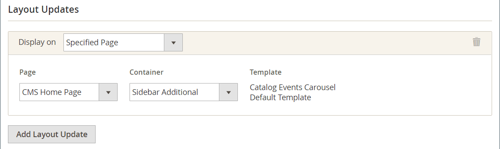
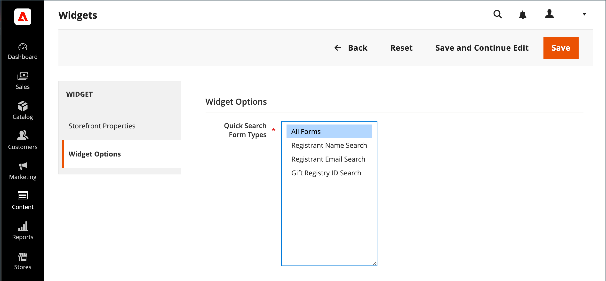

# Adicionar pesquisa de registro de presente

{{ee-feature}}

A ferramenta [Widget](../content-design/widgets.md) pode ser usada para colocar uma caixa de pesquisa do Registro de presente em qualquer lugar da sua loja. Você pode especificar as opções de pesquisa que estarão disponíveis para os clientes, como nome, endereço de email e ID de registro do presente. Quando o cliente clica no botão Pesquisar, os resultados são exibidos na página Pesquisar no Registro de presentes. Se a pesquisa não retornar resultados, o cliente poderá tentar novamente com outros parâmetros.

{width="700" zoomable="yes"}

## Configurar pesquisa de registro de presente

1. Na barra lateral _Admin_, vá para **[!UICONTROL Content]** > _[!UICONTROL Elements]_>**[!UICONTROL Widgets]**.

1. No canto superior direito, clique em **[!UICONTROL Add Widget]**.

1. Escolha a guia **[!UICONTROL Settings]** e faça o seguinte:

   - Defina **[!UICONTROL Type]** como `Gift Registry Search`.

   - Defina **[!UICONTROL Design Theme]** com o tema usado pelo armazenamento.

   - Clique em **[!UICONTROL Continue]**.

   {width="700" zoomable="yes"}

1. Na seção _[!UICONTROL Storefront Properties]_, faça o seguinte:

   - Insira um **[!UICONTROL Widget Title]** para referência interna.

   - Defina **[!UICONTROL Assign to Store Views]** para as exibições de loja onde a Pesquisa do Registro de Presentes deverá estar disponível.

   - Defina **[!UICONTROL Sort Order]** para determinar a ordem em que o bloco de Pesquisa do Registro de Presentes aparece quando há outros blocos atribuídos ao mesmo local na página.

   {width="700" zoomable="yes"}

1. Na seção **[!UICONTROL Layout Updates]**, clique em **[!UICONTROL Add Layout Update]**.

1. Para determinar onde a Pesquisa do Registro de presentes aparece na loja, faça o seguinte:

   - Defina **[!UICONTROL Display On]** para as páginas em sua loja onde deseja que o bloco de Pesquisa do Registro de Presentes apareça.

   - Se aplicável, escolha o **[!UICONTROL Categories]** onde deseja que ele seja exibido.

   - Defina **[!UICONTROL Container]** para o local na página para colocar o bloco de Pesquisa do Registro de Presentes.

   {width="500" zoomable="yes"}

1. No painel esquerdo, escolha **[!UICONTROL Widget Options]**.

1. Para determinar como os visitantes do site podem pesquisar registros de presentes, selecione os seguintes itens que se aplicam:

   - [!UICONTROL All Forms]
   - [!UICONTROL Registrant Name Search]
   - [!UICONTROL Registrant Email Search]
   - [!UICONTROL Gift Registry ID Search]

   {width="700" zoomable="yes"}

1. Quando terminar, clique em **[!UICONTROL Save]**.

1. Quando solicitado a atualizar o cache de páginas, clique no link na mensagem na parte superior do espaço de trabalho e siga as instruções.

## Descrições dos campos

### [!UICONTROL Settings]

| Campo | Descrição |
|--- |--- |
| [!UICONTROL Type] | Identifica `Gift Registry Search` como o tipo de Widget. |
| [!UICONTROL Design Theme] | O tema usado pela loja onde a Pesquisa do Registro de Presentes deve aparecer. |

{style="table-layout:auto"}

### [!UICONTROL Storefront Properties]

| Campo | Descrição |
|--- |--- |
| [!UICONTROL Widget Title] | Um nome para referência interna. |
| [!UICONTROL Assign to Store Views] | Identifica as exibições de loja onde a Pesquisa do Registro de Presentes deve estar disponível. |
| [!UICONTROL Sort Order] | Indica a ordem em que o bloco Pesquisa do Registro de Presentes será exibido se houver outros blocos atribuídos para serem exibidos no mesmo local. |

{style="table-layout:auto"}

### [!UICONTROL Layout Updates]

| Campo | Descrição |
|--- |--- |
| [!UICONTROL Display On] | Indique as páginas específicas ou os tipos de páginas em que o bloco de pesquisa do Registro de presentes é exibido. |
| [!UICONTROL Categories] | Se aplicável, identifica as páginas de categoria em que a Pesquisa no Registro de presentes é exibida. |
| [!UICONTROL Container] | Indica o bloco de layout da página onde a Pesquisa no Registro de presentes é colocada. As opções variam por modelo e tema. |

{style="table-layout:auto"}

### [!UICONTROL Widget Options]

| Campo | Descrição |
|--- |--- |
| [!UICONTROL Quick Search Form Types] | Determina os tipos de pesquisas que podem ser executadas com a Pesquisa do Registro de presentes. Opções: `All Forms` / `Registrant Name Search` /` Registrant Email Search` / `Gift Registry ID Search` |

{style="table-layout:auto"}
