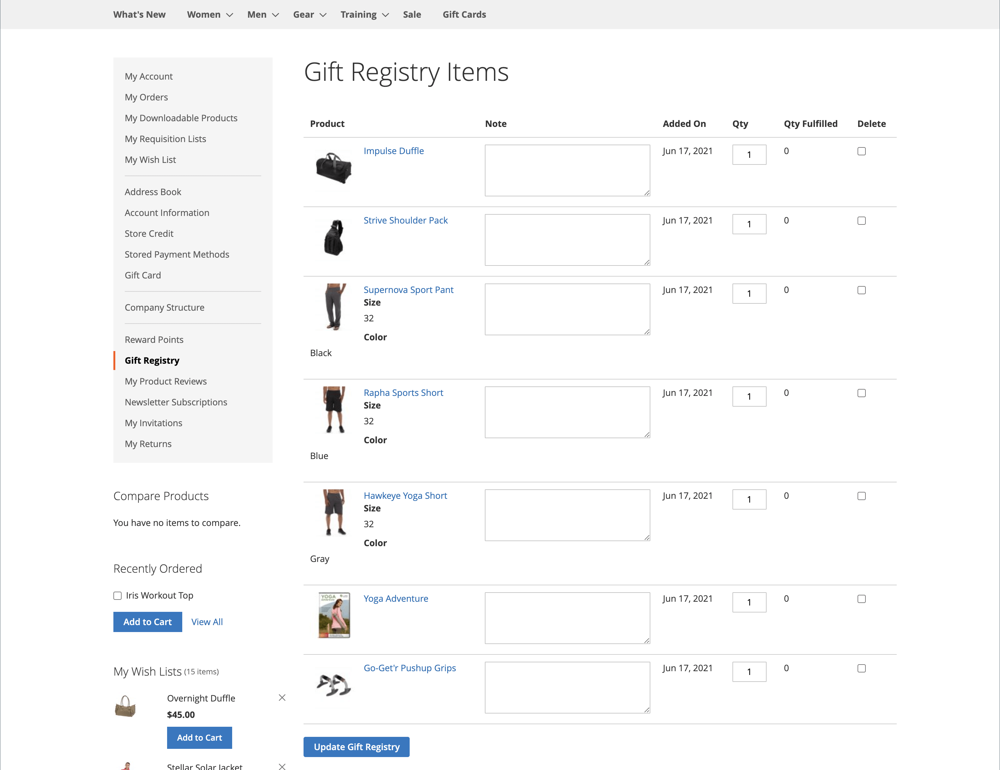

# Experiência da loja no Registro de presentes

{{ee-feature}}

A seção [Registro de presentes](gift-registries.md) da conta do cliente lista os registros de presentes atuais do cliente e o evento associado. Os clientes podem gerenciar os registros atuais e adicionar novos.

{width="700" zoomable="yes"}

## Informações do registro de presentes

Os clientes podem criar e gerenciar registros de presentes em suas contas. Todas as informações associadas a cada tipo de registro estão disponíveis na conta do cliente.

{width="700" zoomable="yes"}

| Seção | Descrição |
|--- |--- |
| [!UICONTROL General Information] | Normalmente, esta seção inclui o nome do evento, uma mensagem ou descrição do evento, configurações de privacidade e status do evento. |
| [!UICONTROL Event Information] | Esta seção inclui a localização e a data do evento. Para um casamento, também pode incluir o número de convidados que cada pessoa pode trazer. |
| [!UICONTROL Gift Registry Details] | Isso pode incluir informações adicionais específicas para a ocasião. |
| [!UICONTROL Registrant Information] | Esta seção inclui o nome e as informações de contato de cada pessoa que receberá a notificação do registro. Para um registro de casamento, o campo Função pode ser incluído para associar o registrante como um amigo da noiva ou do noivo. |
| [!UICONTROL Shipping Address] | Esta seção mostra para onde os presentes devem ser enviados e inclui as informações de que uma transportadora precisa para entregar o pacote. |

{style="table-layout:auto"}

>[!NOTE]
>
>Quando um registro de presente está inativo, a pesquisa e o link não funcionam para o registro. Se o registro for reativado posteriormente, os links permanecerão corrompidos.

## Criar um registro de presente

1. O cliente seleciona **[!UICONTROL Gift Registry]** no painel da conta.

1. Na página _Registro de presentes_, clique em **[!UICONTROL Add New]**.

1. Escolhe um **[!UICONTROL Gift Registry Type]**, como:

   - Aniversário

   - Registro do bebê

   - Casamento

1. Cliques **[!UICONTROL Next]**.

1. Insira as informações necessárias e clique em **[!UICONTROL Save]**.

## Adicionar um produto a um registro

1. O cliente abre o produto que deseja adicionar ao evento de registro de presente.

1. Cliques **[!UICONTROL Add to Cart]**.

1. Clica em **[!UICONTROL View and Edit Cart]** no minicarrinho.

1. Na página Carrinho de Compras, selecione o evento desejado e clique/toque em **[!UICONTROL Add All To Gift Registry]**.

   Os itens são adicionados ao registro de presentes do evento selecionado.

## Compartilhar um registro de presente

1. No painel de contas, o cliente acessa **[!UICONTROL Gift Registry]**.

1. Localiza o evento do Registro que deseja gerenciar e clica em **[!UICONTROL Share]**.

1. Insira as informações necessárias e clique em **[!UICONTROL Share Gift Registry]**.

## Editar um registro de presente

1. No painel de contas, o cliente acessa **[!UICONTROL Gift Registry]**.

1. Localiza o evento do Registro que deseja gerenciar e clica em **[!UICONTROL Edit]**.

1. Altera quaisquer opções conforme necessário.

1. Edita as opções necessárias e clica em **[!UICONTROL Save]**.

## Gerenciar itens do registro de presentes

1. No painel de contas, o cliente acessa **[!UICONTROL Gift Registry]**.

   {width="700" zoomable="yes"}

1. Localiza o evento do Registro, seleciona os itens que deseja gerenciar e clica em **[!DNL Manage Items]**.

1. Altera as opções necessárias, como **[!UICONTROL Note]** e **[!UICONTROL Qty]**.

1. Se necessário, remove um item do registro do presente marcando a caixa de seleção e clicando em **[!UICONTROL Delete]**.

1. Clica em **[!UICONTROL Update Gift Registry]** para salvar as alterações.

## Excluir um registro de presente

1. No painel de contas, o cliente acessa **[!UICONTROL Gift Registry]**.

1. Localiza o evento do Registro que deseja gerenciar e clica em **[!UICONTROL Delete]**.

1. Clica em **[!UICONTROL OK]** para confirmar.
