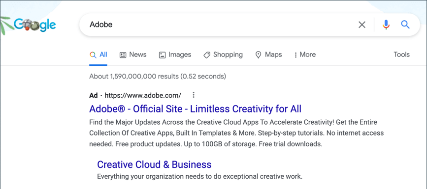
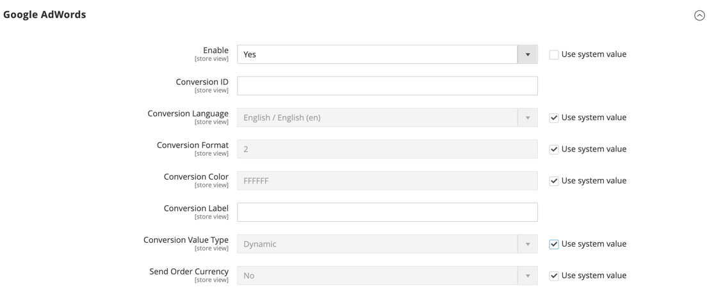

# Google AdWords

O [Google AdWords](https://www.google.com/adwords/) é um serviço que você pode usar para colocar anúncios nos resultados do Google Search e nas páginas de empresas na Rede de Exibição do Google. O painel do AdWords inclui ferramentas para gerenciar campanhas, rastrear respostas e medir resultados.

O rastreamento de conversão mostra o número de cliques em anúncios que resultam em uma venda ou outra ação valiosa. A página _Sucesso_ que aparece para o cliente depois que um pedido é enviado é usada para rastrear conversões porque aparece somente após uma venda. Depois de concluir a configuração do Google AdWords para sua loja, não há necessidade de copiar o script de rastreamento de conversão para a página Sucesso, pois o Commerce já tem as informações necessárias. Para saber mais, consulte a [Ajuda do Google AdWords](https://support.google.com/adwords/answer/6095821).

{width="500"}

## Etapa 1. Criar uma campanha do Google AdWords

1. Visite o [Google AdWords](https://ads.google.com/) e inscreva-se para obter uma conta.

1. Siga as instruções para criar uma campanha.

1. Para configurar o rastreamento de conversão para sua campanha, faça o seguinte:

   - Na guia **[!UICONTROL Tools]** do painel do AdWords, escolha **[!UICONTROL Conversions]** e clique em **[!UICONTROL Conversion]**.

   - Quando solicitado para a origem da conversão, escolha **[!UICONTROL Website]**.

   - Insira um nome para a ação de conversão que você deseja rastrear e clique em **[!UICONTROL Done]**.

   - Clique em **[!UICONTROL Value]** e, se aplicável, atribua um valor à conversão. Por exemplo:

      - Se você fizer $5 em cada venda, escolha `Each time it happens` e atribua um valor de `$5`.
      - Se o valor de cada venda variar, deixe o valor em branco.

     Para concluir, clique em **[!UICONTROL Done]**.

   - Clique em **[!UICONTROL Conversion windows]** e conclua as configurações para determinar por quanto tempo as conversões devem ser rastreadas, a categoria do relatório e o modelo de atribuição.

1. Quando terminar, clique em **[!UICONTROL Save and Continue]**.

## Etapa 2. Obtenha sua tag de conversão

1. Em **[!UICONTROL Install your tag]**, escolha contar conversões em **[!UICONTROL Page load]**.

1. Como opção, você pode adicionar a notificação **[!UICONTROL Google Site Stats]** à página de conversão.

   A notificação aparece no canto inferior com um link para os padrões de segurança e uso de cookies da Google.

1. Para escolher como deseja gerenciar a tag do AdWords, siga um destes procedimentos:

   - Se você planeja adicionar o script ao seu armazenamento, escolha **[!UICONTROL Save instructions and tag]**.
   - Se você planeja que outra pessoa adicione o script ao seu armazenamento, escolha **[!UICONTROL Email instructions and tag]**.

1. Quando terminar, clique em **[!UICONTROL Done]**.

## Etapa 3. Configurar sua loja

{{gtag-api-note}}

1. Na barra lateral _Admin_, vá para **[!UICONTROL Stores]** > _[!UICONTROL Settings]_>**[!UICONTROL Configuration]**.

1. Se estiver configurando o Google AdWords para uma exibição de loja específica, faça o seguinte:

   - No canto superior esquerdo, escolha a **[!UICONTROL Store View]** que deve ser configurada.

   - Quando solicitado a confirmar a alternância de escopo, clique em **[!UICONTROL OK]**.

1. No painel esquerdo, expanda **[!UICONTROL Sales]** e escolha **[!UICONTROL Google API]**.

1. Expanda  a seção **[!UICONTROL Google AdWords]** e faça o seguinte:

   - Defina **[!UICONTROL Enable]** como `Yes`.

   - Digite o **[!UICONTROL Conversion ID]** do seu script do Google AdWords.

   {width="600" zoomable="yes"}

1. Para formatar a notificação de Início do Google Sites, faça o seguinte:

   - Defina **[!UICONTROL Conversion Language]** para o idioma identificado no script do Google AdWords.

   - Insira o **[!UICONTROL Conversion Format]** a ser usado para a notificação de Início de Sites do Google na página de conversão.

      - `1` - Exibe uma notificação em uma linha com um link para obter mais informações sobre o rastreamento do Google.
      - `2` - Exibe uma notificação em duas linhas com um link para obter mais informações sobre o rastreamento do Google.
      - `3` - Não exibe notificações de clientes.

   - Insira o [código hexadecimal](https://www.w3schools.com/colors/colors_picker.asp){:target="_blank"} para o **[!UICONTROL Conversion Color]** que você deseja usar para o rótulo de notificação de Estatísticas de Site do Google.

   - Insira o texto criptografado para o **[!UICONTROL Conversion Label]** que aparece na notificação de Início de Sites do Google.

     Por exemplo: `MlEYCOKBnGoQz6CZoAM`

     **Exemplo de código de marca do Google AdWords**

     ```html
     <!-- Google Code for Back to School Sale Conversion Page -->
     <script type="text/javascript">
     /* <![CDATA[ */
     var google_conversion_id = 999999999;
     var google_conversion_language = "en";
     var google_conversion_format = "3";
     var google_conversion_color = "ffffff";
     var google_conversion_label = "MlEYCOKBnGoQz6CZoAM";
     var google_remarketing_only = false;
     /* ]]> */
     </script>
     
     <script type="text/javascript" src="//www.googleadservices.com/pagead/conversion.js">
     </script>
     <noscript>
     <div style="display:inline;">
     
     
     </noscript>
     ```

1. Defina **[!UICONTROL Conversion Value Type]** como um dos seguintes:

   - `Dynamic` - Determina que ocorreu uma conversão com base no valor dinâmico do Valor do pedido.
   - `Constant` - Determina que ocorreu uma conversão com base em um valor específico inserido.

   Para um tipo de valor de conversão _Constante_, insira uma **[!UICONTROL Value]** específica para a _[!UICONTROL Order Amount]_&#x200B;para qualificar como uma conversão.

1. Quando terminar, clique em **[!UICONTROL Save Config]**.

## Etapa 4. Verificar a configuração

Em poucas horas, o status de rastreamento no painel do Google AdWords muda de `Unverified` para `No recent conversions` ou `Recording conversions`. Quando alguém clica em seu anúncio e faz uma compra, a conversão é exibida na página Ações de conversão do painel e do relatório de campanha.
