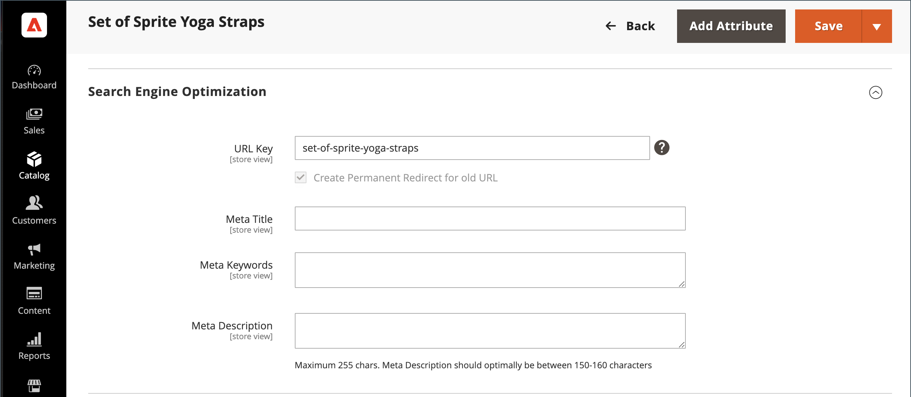
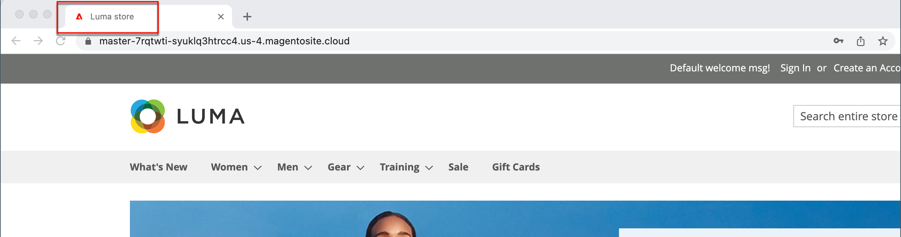

# Metadados

Sua loja está carregada com locais onde você pode inserir metadados ricos em palavras-chave para melhorar a maneira como os mecanismos de pesquisa indexam seu site. Ao configurar sua loja, você pode inserir metadados preliminares, com a intenção de terminá-los posteriormente. Com o tempo, você pode ajustar os metadados para direcionar os padrões de compra e as preferências dos clientes.

{width="700" zoomable="yes"}

## Metatítulo

O metatítulo é exibido na barra de título e na guia do navegador e nas listagens de resultados de pesquisa. O metatítulo deve ser exclusivo da página e ter menos de 70 caracteres.

{width="600"}

## Palavras-chave do Meta

Embora alguns mecanismos de pesquisa ignorem metapalavras-chave, outros continuam a usá-las. A prática recomendada atual é incorporar palavras-chave de alto valor no metatítulo e na metadescrição.

{width="500"}

## Metadescrição

As meta descrições fornecem uma breve visão geral da página para listagens de resultados de pesquisa. Idealmente, uma meta descrição deve ter entre 150 e 160 caracteres de comprimento, embora o campo aceite até 255 caracteres.

## Rich snippets

Os snippets avançados fornecem informações detalhadas para a listagem de resultados de pesquisa e outros aplicativos. Por padrão, a marcação de dados estruturados baseada no padrão [schema.org][1] é adicionada ao modelo de produto da loja. Como resultado, mais informações estão disponíveis para que os mecanismos de pesquisa as incluam como _trechos avançados_ nas listagens de produtos.

## Meta tag canônica

Alguns mecanismos de pesquisa penalizam sites que têm vários URLs que apontam para o mesmo conteúdo. A meta tag canônica informa aos mecanismos de pesquisa qual página indexar quando vários URLs tiverem conteúdo idêntico ou semelhante. O uso da meta tag canônica pode melhorar a classificação do site e agregar exibições de página. A meta tag canônica é colocada no bloco `<head>` de uma página de produto ou categoria. Ele fornece um link para o URL de sua preferência, portanto, os mecanismos de pesquisa dão a ele um peso maior.

### Exemplo 1: o caminho de categoria cria URLs duplicados

Por exemplo, se o catálogo estiver configurado para incluir o caminho da categoria nos URLs do produto, a loja gerará vários URLs que apontam para a mesma página do produto.

    http://mystore.com/gear/bags/driven-backpack.html
    http://mystore.com/driven-backpack.html

### Exemplo 2: URL completo da página de categoria

Quando metatags canônicas para categorias são ativadas, a página de categoria da loja inclui um URL canônico para o URL de categoria completo:

    http://mystore.com/gear/bags/

### Exemplo 3: URL completo da página do produto

Quando as metatags canônicas dos produtos são ativadas, a página do produto inclui um URL canônico para o nome-do-domínio/chave-de-url-do-produto, pois as chaves de URL do produto são globalmente exclusivas.

    http://mystore.com/driven-backpack.html

Se você também incluir o caminho da categoria nos URLs do produto, o URL canônico permanecerá nome-do-domínio/chave-do-URL-do-produto. No entanto, o produto também pode ser acessado usando o URL completo, que inclui a categoria. Por exemplo, se a chave de URL do produto for `driven-backpack` e estiver atribuída à categoria Engrenagem > Sacos, o produto poderá ser acessado usando qualquer uma das URLs.

Você pode evitar ser penalizado por mecanismos de pesquisa omitindo a categoria do URL ou usando a meta tag canônica para direcionar mecanismos de pesquisa para indexação por produto ou categoria. Como prática recomendada, é recomendável ativar metatags canônicas para categorias e produtos.

### Ativar a meta tag canônica

1. Na barra lateral _Admin_, vá para **[!UICONTROL Stores]** > _[!UICONTROL Settings]_>**[!UICONTROL Configuration]**.

1. No painel esquerdo, expanda **[!UICONTROL Catalog]** e escolha **[!UICONTROL Catalog]** abaixo de.

1. Expanda  a seção **Otimização do Mecanismo de Pesquisa**.

   Para alterar qualquer valor de campo, primeiro desmarque a caixa de seleção **Usar valor do sistema** depois de cada campo.

   {width="600" zoomable="yes"}

1. Se você quiser que os mecanismos de pesquisa indexem somente páginas de categoria usando o caminho completo da categoria, faça o seguinte:

   - Definir **Usar marca META de Link Canônico para Categorias** a `Yes`.

   - Definir **Usar marca META de Link Canônico para Produtos** para `No`.

1. Se você quiser que os mecanismos de pesquisa indexem páginas de produtos somente usando o formato nome-do-domínio/chave-do-url-do-produto, faça o seguinte:

   - Definir **Usar marca META de Link Canônico para Produtos** para `Yes`.

   - Definir **Usar marca META de Link Canônico para Categorias** a `No`.

1. Quando terminar, clique em **[!UICONTROL Save Config]**.

## Demonstração de metadados

Assista a este vídeo para saber mais sobre o gerenciamento de metadados de SEO:

>[!VIDEO](https://video.tv.adobe.com/v/343750?quality=12)

[1]: https://schema.org/
