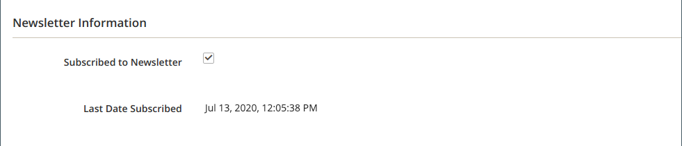

# Gerenciar assinantes do informativo

Como prática recomendada, você deve gerenciar a lista de assinaturas regularmente e processar todas as solicitações para cancelar a inscrição. Em algumas jurisdições, é exigido por lei que os pedidos de cancelamento de subscrição sejam processados em um período específico.

É possível gerenciar facilmente os assinantes usando uma lista simples de assinaturas ativas. Quando um cliente envia uma solicitação de cancelamento de assinatura, você pode simplesmente aplicar uma ação _Cancelar assinatura_ a uma ou mais assinaturas selecionadas.

Em configurações de site único com várias exibições de loja, uma assinatura de conta de cliente pode ser associada a uma exibição de loja específica.

Em configurações de vários sites e vários sites com um [escopo de conta de cliente](../customers/customer-account-scope.md) global, uma conta de cliente pode assinar boletins informativos para vários sites/lojas. Nesse caso, talvez você queira editar a conta do cliente para gerenciar um grupo de assinaturas ou cancelar uma assinatura para um site/loja específico para atender a uma solicitação.

Se quiser usar um serviço de terceiros para enviar informativos, é possível exportar a lista de assinaturas como um arquivo CSV ou XML.

## Gerenciar assinaturas de um cliente

1. Na barra lateral _Admin_, vá para **[!UICONTROL Customers]** > **[!UICONTROL All Customers]**.

1. Encontre o cliente na grade e clique em **[!UICONTROL Edit]** na coluna _[!UICONTROL Action]_.

1. Clique em **[!UICONTROL Newsletter]** no painel esquerdo.

1. Modifique as assinaturas do cliente de acordo com a configuração do site/loja.

   Para uma única configuração de site/loja, basta marcar ou desmarcar a caixa de seleção **[!UICONTROL Subscribed to Newsletter]**.

   {width="500" zoomable="yes"}

   Para uma configuração de um único site/várias lojas, você pode marcar ou desmarcar a caixa de seleção **[!UICONTROL Subscribed to Newsletter]** e definir **[!UICONTROL Subscribed on Store View]** para a exibição de loja correta para a assinatura.

   {width="500" zoomable="yes"}

   Para uma configuração de vários sites/várias lojas com um escopo de conta de cliente global, a página exibe o status de assinatura de todos os sites. Você pode marcar ou desmarcar a caixa de seleção **[!UICONTROL Subscribed]** e/ou alterar a **[!UICONTROL Store View]** da assinatura.

   {width="500" zoomable="yes"}

1. Clique em **[!UICONTROL Save Customer]**.

## Cancelar uma assinatura na lista de assinantes

1. Na barra lateral _Admin_, vá para **[!UICONTROL Marketing]** > _[!UICONTROL Communications]_>**[!UICONTROL Newsletter Subscribers]**.

   Para uma configuração de vários sites, em que alguns clientes têm assinaturas para mais de um site, cada assinatura é exibida como um item de linha na grade.

1. Localize o assinante na grade e marque a caixa de seleção na primeira coluna.

   >[!NOTE]
   >
   >Para um cancelamento de subscrição em massa, marque a caixa de seleção de cada assinante que deseja cancelar.

1. Defina o controle _[!UICONTROL Action]_como **[!UICONTROL Unsubscribe]**e clique em **[!UICONTROL Submit]**.

   {width="600" zoomable="yes"}

   O status do registro muda para `Unsubscribed`.

## Exportar a lista de assinantes

1. Na lista _[!UICONTROL Newsletter Subscribers]_, use os controles de filtro para incluir apenas registros com um_ Status _de `Subscribed` e para o modo de exibição de site, loja ou loja apropriado.

1. Defina o controle **[!UICONTROL Export to]** como um dos seguintes:

   - `CSV`
   - `XML`

1. Clique em **[!UICONTROL Export]**, procure o prompt na parte inferior da tela e salve o arquivo.

   {width="600" zoomable="yes"}

## Deletar um assinante da lista de assinantes

1. Na barra lateral _Admin_, vá para **[!UICONTROL Marketing]** > _[!UICONTROL Communications]_>**[!UICONTROL Newsletter Subscribers]**.

1. Localize o assinante na grade e marque a caixa de seleção na primeira coluna.

1. Defina o controle _[!UICONTROL Action]_como **[!UICONTROL Delete]**e clique em **[!UICONTROL Submit]**.

1. Quando for solicitada a confirmação, clique em **[!UICONTROL OK]**.
