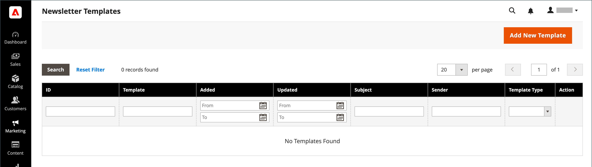

# Modelos de informativo

Você pode criar quantos modelos de informativo forem necessários para diferentes fins. Você pode enviar uma atualização semanal do produto, um informativo mensal ou um informativo anual de feriados. Os modelos de boletim informativo podem ser preparados com a marcação HTML ou como texto simples. Ao contrário do HTML, os informativos em texto sem formatação não contêm imagens, rich text ou links formatados. Na grade, a coluna Tipo de modelo indica se um modelo é HTML ou texto.

{width="700" zoomable="yes"}

## Criar um modelo de informativo

1. Na barra lateral Admin, vá para **[!UICONTROL Marketing]** > _[!UICONTROL Communications]_>**[!UICONTROL Newsletter Template]**.

1. Para adicionar um modelo, clique em **[!UICONTROL Add New Template]**.

1. Conclua as configurações do modelo:

   - Para **[!UICONTROL Template Name]**, insira o nome para referência interna.

   - Para **[!UICONTROL Template Subject]**, descreva a finalidade do informativo.

   - Para **[!UICONTROL Sender Name]**, insira o nome da pessoa que deverá aparecer como remetente do informativo.

   - Para **[!UICONTROL Sender Email]**, insira o endereço de email do remetente do informativo.

   {width="600" zoomable="yes"}

   - Para **[!UICONTROL Template Content]**, clique em **[!UICONTROL Show / Hide Editor]** para exibir o editor do WYSIWYG e atualizar o conteúdo conforme necessário.

     Para saber mais, consulte [Usando o Editor](../content-design/editor.md).

     >[!NOTE]
     >
     >Não remova o link de cancelamento de inscrição na parte inferior do conteúdo do modelo. Em algumas jurisdições, o vínculo é exigido por lei.

   - Para **[!UICONTROL Template Styles]**, insira as declarações de CSS necessárias para formatar o conteúdo.

1. Clique em **[!UICONTROL Preview Template]** para ver sua aparência e fazer as alterações necessárias.

1. Quando terminar, clique em **[!UICONTROL Save Template]**.

   Depois de salvar um modelo, **[!UICONTROL Save As]** aparece na próxima vez que você editar o modelo. Ele pode ser usado para salvar variações do modelo sem substituir o original.

## Converter o modelo em texto simples

1. Na parte superior da página, clique em **[!UICONTROL Convert to Plain Text]** e em **[!UICONTROL OK]** quando solicitado.

1. Para visualizar a versão em texto sem formatação do modelo, clique em **[!UICONTROL Preview Template]**.

   A visualização é aberta em uma nova guia do navegador.

1. Para salvar a versão de texto simples, clique em **[!UICONTROL Save Template]**.

## Restaurar o HTML

1. Na parte superior da página, clique em **[!UICONTROL Return HTML Version]**.  

1. Para visualizar a versão HTML do modelo, clique em **[!UICONTROL Preview Template]**.

   A visualização é aberta em uma nova guia do navegador.

1. Para salvar a versão do HTML, clique em **[!UICONTROL Save Template]**.

## Excluir um modelo de informativo

1. Na barra lateral _Admin_, vá para **[!UICONTROL Marketing]** > _[!UICONTROL Communications]_>**[!UICONTROL Newsletter Template]**.

1. Localize o modelo de boletim informativo a ser excluído e abra-o no modo de edição.

1. Na barra de menus, clique no botão **[!UICONTROL Delete Template]**.

1. Para confirmar a ação, clique em **[!UICONTROL OK]**.

## Colunas de grade

| Coluna | Descrição |
|--- |--- |
| [!UICONTROL ID] | Um identificador numérico exclusivo atribuído a cada modelo de boletim informativo |
| [!UICONTROL Template] | O nome da entidade do modelo |
| [!UICONTROL Added] | A data em que a entidade de modelo foi criada |
| [!UICONTROL Updated] | A data em que a entidade de modelo foi atualizada pela última vez |
| [!UICONTROL Subject] | Assunto do modelo do informativo |
| [!UICONTROL Sender] | Informações de contato do remetente |
| [!UICONTROL Template Type] | O tipo de modelo: `html` ou `text` |
| [!UICONTROL Actions] | **[!UICONTROL Preview]**: abre uma janela separada para visualizar o modelo  **[!UICONTROL Queue Newsletter]**: coloca o modelo de boletim informativo na fila de envio. |

{style="table-layout:auto"}
