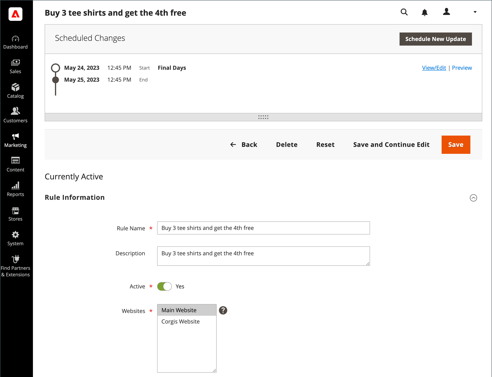

# Alterações agendadas para regras de preço do carrinho

{{ee-feature}}

As regras de preço do carrinho podem ser aplicadas de acordo com a programação como parte de uma campanha e agrupadas com outras alterações de conteúdo. Você pode criar uma campanha com base em alterações programadas em uma regra de preço ou aplicar as alterações a uma campanha existente.

>[!NOTE]
>
>Os campos [!UICONTROL From] e [!UICONTROL To] foram removidos do Adobe Commerce  e não podem ser modificados diretamente na regra de preço do carrinho. Você deve criar uma atualização agendada para essas ativações.

{width="700" zoomable="yes"}

>[!NOTE]
>
>Todas as atualizações programadas são aplicadas consecutivamente. Isso significa que qualquer entidade pode ter apenas uma atualização agendada em um ponto do tempo. Qualquer atualização agendada é aplicada a todas as exibições de loja dentro de seu período de tempo. Como resultado, uma entidade não pode ter atualizações agendadas diferentes para exibições de loja diferentes ao mesmo tempo. Todos os valores de atributo de entidade em todas as exibições de armazenamento, que não são afetados pela atualização agendada atual, são obtidos dos valores padrão, e não da atualização agendada anterior.

Se houver várias regras de preço em execução na mesma campanha, a configuração _[!UICONTROL Priority]_da regra de preço determinará qual regra tem prioridade. Para saber mais, consulte [Preparo de conteúdo](../content-design/content-staging.md).

>[!NOTE]
>
>Se uma campanha ativa for criada inicialmente sem uma data de término, a campanha não poderá ser editada posteriormente para incluir uma data de término. Nesse caso, é necessário criar uma campanha duplicada e inserir a data final necessária.

>[!NOTE]
>
>Se uma campanha estiver vinculada a mais de uma regra de preço do carrinho, ela só poderá ser editada no [Painel de Preparo de Conteúdo](../content-design/content-staging-dashboard.md).

Lembre-se dos seguintes avisos:

- Se uma campanha que inclui uma regra de preço for criada inicialmente sem uma data final, a campanha não poderá ser editada posteriormente para incluir uma data final. É recomendável adicionar uma data de término ao criar a campanha ou criar uma versão duplicada da campanha existente e adicionar a data de término à duplicação, conforme necessário.
- Ao usar uma atualização agendada para habilitar uma regra de preço de carrinho com uma data final, defina a regra como desabilitada inicialmente. As regras que já estão ativas não respeitam a data final.
- Os cupons não estão conectados às regras de preço do carrinho. Uma Atualização Agendada não fornece acesso aos campos _[!UICONTROL Coupon]_,_[!UICONTROL Coupon Code]_, _[!UICONTROL Uses per Coupon]_e_[!UICONTROL Uses per Customer]_ na guia _[!UICONTROL Rule Information]_. Além disso, todas as configurações da guia_[!UICONTROL Manage Coupon Codes]_ não estão disponíveis.

>[!IMPORTANT]
>
>As campanhas **[!UICONTROL Start Date]** e **[!UICONTROL End Date]** devem ser definidas usando o fuso horário padrão **_3} do Administrador, que é convertido do fuso horário local de cada site._** Considere um exemplo em que você tem vários sites em fusos horários diferentes, mas deseja iniciar a campanha com base em um fuso horário dos EUA. Nesse caso, você precisa agendar uma atualização separada para cada fuso horário local e definir **[!UICONTROL Start Date]** e **[!UICONTROL End Date]** convertidos de cada fuso horário de site local para o fuso horário padrão do Administrador.
